# Process user task orchestration

## Description

A quickstart project shows very typical user task orchestration. It comes with two tasks assigned
to human actors via groups assignments - `managers`. So essentially anyone who is a member of that
group can act on the tasks. Though this example applies four eye principle which essentially means
that user who approved first task cannot approve second one. So there must be always at least two
distinct manager involved.

> **_NOTE:_** This example uses keycloak authentication to enable security only in the consoles and not in runtime.

This example shows

* working with user tasks
* four eye principle with user tasks


<p align="center"></p>

* Diagram Properties (top)
<p align="center"></p>

* Diagram Properties (bottom)
<p align="center"></p>

* First Line Approval (top)
<p align="center">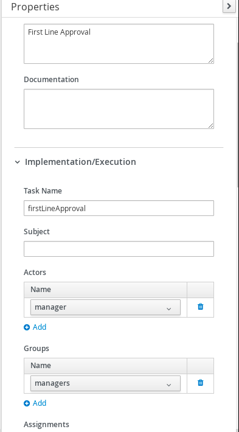</p>

* First Line Approval (bottom)
<p align="center"></p>

* First Line Approval (Assignments)
<p align="center">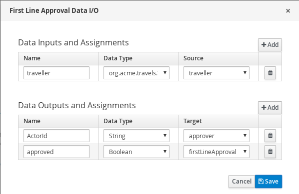</p>

* Second Line Approval
<p align="center"></p>

* Second Line Approval (Assignments)
<p align="center">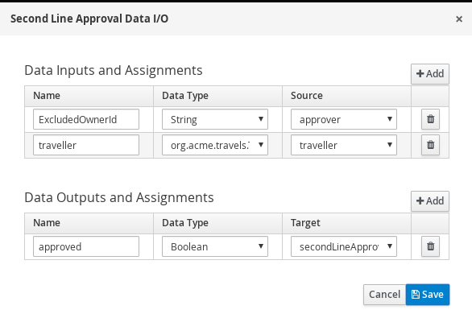</p>

## Build and run

### Prerequisites

You will need:
  - Java 11+ installed
  - Environment variable JAVA_HOME set accordingly
  - Maven 3.8.6+ installed
### Starting the Kogito and Infrastructure Services

This quickstart provides a docker compose template that starts all the required services. This setup ensures that all services are connected with a default configuration.

<p align="center">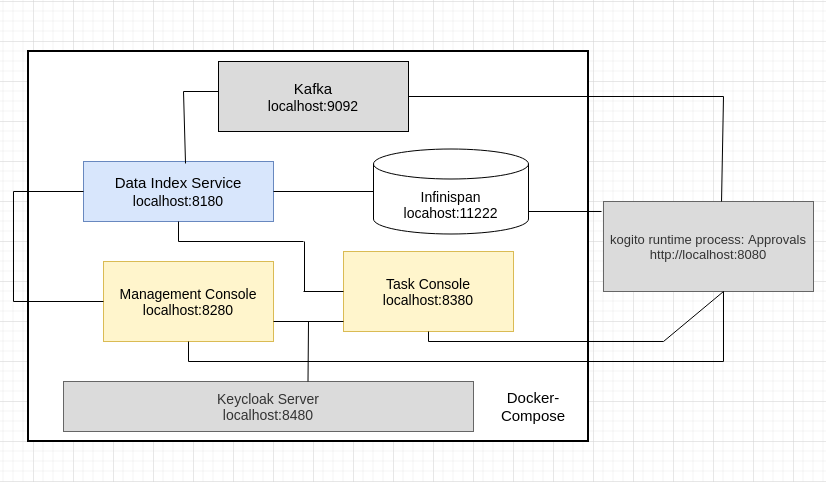</p>

You should start all the services before you execute any of the **Approvals** example, to do that please execute:

For Linux and MacOS:

1. Open a Terminal
2. Go to the process-usertasks-springboot-with-console folder at kogito-examples

```bash
cd <path_to_process-usertasks-springboot-with-console>/docker-compose
```

3. Run the ```startServices.sh``` script

```bash
sh ./startServices.sh
```

Once all services bootstrap, the following ports will be assigned on your local machine:

- Infinispan: 11222
- Kafka: 9092
- Data Index: 8180
- Management Console: 8280
- Task Console: 8380
- Keycloak: 8480 
- process-usertasks-springboot-with-console: 8080

> **_NOTE:_**  This step requires the project to be compiled, please consider running a ```mvn clean install -Pcontainer``` command on the project root before running the ```startServices.sh``` script for the first time or any time you modify the project. ```-Pcontainer``` will create a local docker image of the example and will be run by docker-compose with all required services.

Once started you can simply stop all services by executing the ```docker-compose stop```.

All created containers can be removed by executing the ```docker-compose rm```.

### Using Keycloak as Authentication Server

In this Quickstart we'll be using [Keycloak](https://www.keycloak.org/) as *Authentication Server*. It will be started as a part of the project *Infrastructure Services*, you can check the configuration on the project [docker-compose.yml](docker-compose/docker-compose.yml) in [docker-compose](docker-compose) folder.

It will install the *Kogito Realm* that comes with a predefined set of users:
| Login         | Password   | Roles               |
| ------------- | ---------- | ------------------- |
|    admin      |   admin    | *admin*, *managers* |
|    alice      |   alice    | *user*              |
|    jdoe       |   jdoe     | *managers*          |

Once Keycloak is started, you should be able to access your *Keycloak Server* at [localhost:8480/auth](http://localhost:8480/auth) with *admin* user.

> **_NOTE:_** If you don't want to run the example inside docker compose. You can stop the service container by running below commands.

    docker stop process-usertasks-springboot-with-console

### Compile and Run in Local Dev Mode

```sh
mvn clean compile spring-boot:run
```


### Package and Run using uberjar

```sh
mvn clean package
```

To run the generated native executable, generated in `target/`, execute

```sh
java -jar target/process-usertasks-springboot-with-console.jar
```

### OpenAPI (Swagger) documentation
[Specification at swagger.io](https://swagger.io/docs/specification/about/)

You can take a look at the [OpenAPI definition](http://localhost:8080/v3/api-docs) - automatically generated and included in this service - to determine all available operations exposed by this service. For easy readability you can visualize the OpenAPI definition file using a UI tool like for example available [Swagger UI](https://editor.swagger.io).

In addition, various clients to interact with this service can be easily generated using this OpenAPI definition.


### Submit a request to start new approval

To make use of this application it is as simple as putting a sending request to `http://localhost:8080/approvals`  with following content

```json
{
    "traveller" : {
        "firstName" : "John",
        "lastName" : "Doe",
        "email" : "jon.doe@example.com",
        "nationality" : "American",
        "address" : {
            "street" : "main street",
            "city" : "Boston",
            "zipCode" : "10005",
            "country" : "US" }
        }
}
```

Complete curl command can be found below:

```sh
curl -X POST -H 'Content-Type:application/json' -H 'Accept:application/json' -d '{"traveller" : { "firstName" : "John", "lastName" : "Doe", "email" : "jon.doe@example.com", "nationality" : "American","address" : { "street" : "main street", "city" : "Boston", "zipCode" : "10005", "country" : "US" }}}' http://localhost:8080/approvals
```

### Show active process instances at Kogito Management Console

To access the Kogito Management Console just open your browser and navigate to ``http://localhost:8280``. You'll be redirected to the *Keycloak* log in page.

<p align="center">
    
</p>

Once there, log in using any of the users specified in the [Using Keycloak as Authentication Server](#using-keycloak-as-authentication-server) 

<p align="center">
    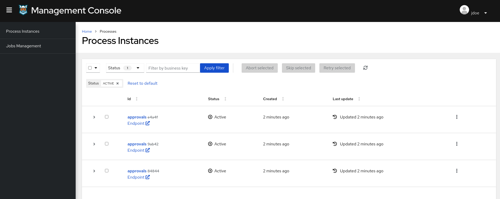
</p>

> **_NOTE:_**  For more information about how to work with Kogito Management Console, please refer to the [Kogito Management Console Documentation](https://docs.jboss.org/kogito/release/latest/html_single/#con-management-console_kogito-developing-process-services) page.

Check the process instance details to see where is the execution path 

<p align="center">
    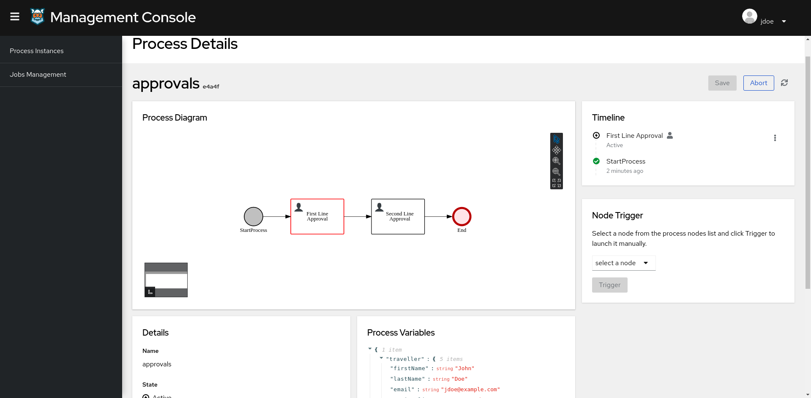
</p>

### Execute 'First Line approval' task at Kogito Task Console

To access the Kogito Task Console just open your browser and navigate to ``http://localhost:8380``. You'll be redirected to the *Keycloak* log in page.

<p align="center">
    
</p>

Ensure you are logged as a user with role manager to be able to see the First Line approval.

<p align="center">
    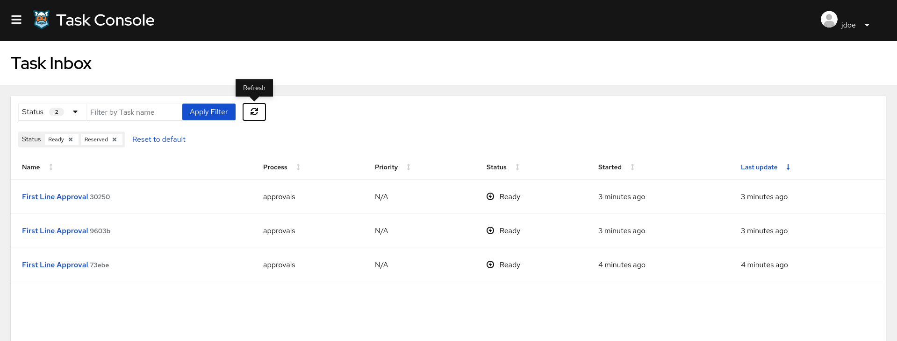
</p>

> **_NOTE:_**  For more information about how to work with Kogito Task Console, please refer to the [Kogito Task Console Documentation](https://docs.jboss.org/kogito/release/latest/html_single/#con-task-console_kogito-developing-process-services) page.

Access to 'First Line approval' task and complete
  
<p align="center">
    
</p>

Check the process instance details at Kogito Management Console to see the execution path reflects the completed task

<p align="center">
    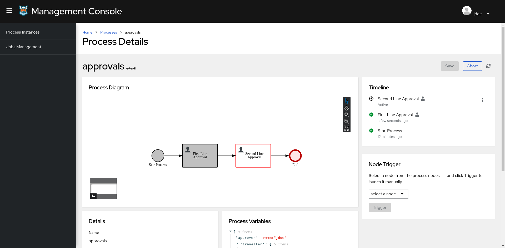
</p>

### Execute 'Second Line approval' task at Kogito Task Console

Access the Kogito Task Console and ensure you are logged as a user with role managers different from the one 
executed the First Line approval to be able to see the Second Line approval 
following the second eye principle.

<p align="center">
    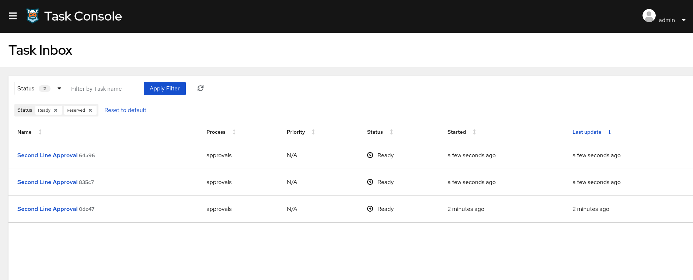
</p>

Access to 'Second Line approval' task and complete
  
<p align="center">
    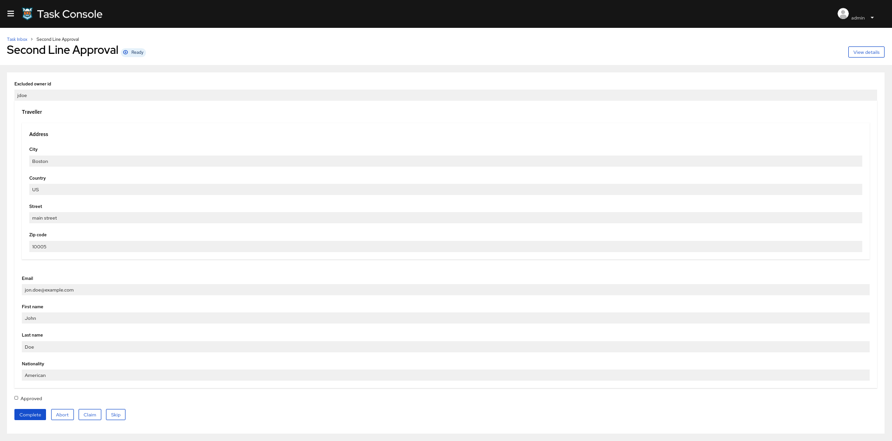
</p>

Check the process instance details at Kogito Management Console, and verify the execution path is reflected in the diagram.

<p align="center">
    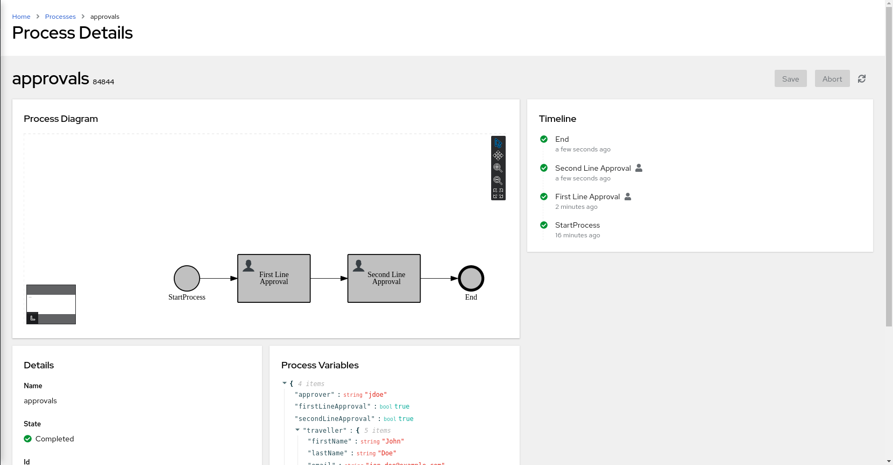
</p>
