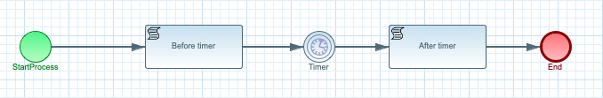
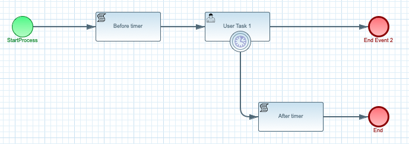

# Kogito timers

## Description

A quickstart project shows use of timer based activities within the process to 
allow a flexible delays before continuing process execution. There are two types
of timers used in this quick start

* intermediate timer event - used as part of the regular process flow to introduce delays
* boundary timer event - used as an option to move process flow through alternative path after expiration time

This example shows

* working with timers (both intermediate and boundary)
* optionally use Job Service that allows to externalize time tracking to separate service and by that offload the runtime service
	
	
Intermediate timer event
<p align="center"></p>

Boundary timer event
<p align="center"></p>

Timer expression is expected to be given in ISO-8601 format e.g. PT30S - wait 30 seconds before expiring. 
This needs to be given when starting process instance as delay attribute of type string. 

## Build and run

### Prerequisites
 
You will need:
  - Java 1.8.0+ installed 
  - Environment variable JAVA_HOME set accordingly
  - Maven 3.5.4+ installed

When using native image compilation, you will also need: 
  - GraalVM 19.1+ installed
  - Environment variable GRAALVM_HOME set accordingly
  - Note that GraalVM native image compilation typically requires other packages (glibc-devel, zlib-devel and gcc) to be installed too, please refer to GraalVM installation documentation for more details.

### Compile and Run in Local Dev Mode

```
mvn clean package quarkus:dev    
```

NOTE: With dev mode of Quarkus you can take advantage of hot reload for business assets like processes, rules, decision tables and java code. No need to redeploy or restart your running application.


### Compile and Run using Local Native Image
Note that this requires GRAALVM_HOME to point to a valid GraalVM installation

```
mvn clean package -Pnative
```
  
To run the generated native executable, generated in `target/`, execute

```
./target/kogito-usertasks-quarkus-{version}-runner
```

### Use the application


### Submit a request to start new timers process

To make use of this application it is as simple as putting a sending request to `http://localhost:8080/timers`  with following content 

```
{
"delay" : "PT30S"
}

```

Complete curl command can be found below:

```
curl -X POST -H 'Content-Type:application/json' -H 'Accept:application/json' -d '{"delay" : "PT30S"}' http://localhost:8080/timers
```

### Show active timer instances

```
curl -H 'Content-Type:application/json' -H 'Accept:application/json' http://localhost:8080/timers
```

### Cancel boundary timer instance 

```
curl -H 'Content-Type:application/json' -H 'Accept:application/json' 'http://localhost:8080/timers/{uuid}'
```

where `{uuid}` is the id of the given timer instance


### Submit a request to start new boundary timers process

To make use of this application it is as simple as putting a sending request to `http://localhost:8080/timersOnTask`  with following content 

```
{
"delay" : "PT30S"
}

```

Complete curl command can be found below:

```
curl -X POST -H 'Content-Type:application/json' -H 'Accept:application/json' -d '{"delay" : "PT30S"}' http://localhost:8080/timersOnTask
```

### Show active boundary timer instances

```
curl -H 'Content-Type:application/json' -H 'Accept:application/json' http://localhost:8080/timersOnTask
```

### Cancel boundary timer instance 

```
curl -H 'Content-Type:application/json' -H 'Accept:application/json' 'http://localhost:8080/timersOnTask/{uuid}'
```

where `{uuid}` is the id of the given timer instance


## Use Kogito Job Service as external timer service

There is additional configuration needed in 

* application.properties
* pom.xml

### Configure application.properties

To allow to use Job Service as timer service there is a need to specify additional properties 

```
kogito.jobs-service.url=http://localhost:8085
kogito.service.url=http://localhost:8080
```

First one is used to direct the Kogito runtime to let it know where is the Kogito Job Service - it needs
to match the location of the Kogito Job Service when starting it - see below.
Second one is used by Kogito Job Service to callback when the timer expires and needs to be pointing to the service host and port

### Configure pom.xml

To be able to use Kogito Job Service as timer service additional dependency needs to be added

```
<dependency>
  <groupId>org.kie.kogito</groupId>
  <artifactId>jobs-management-quarkus-addon</artifactId>
</dependency>
```

### Start Kogito Job Service

You need to download the job service and start it locally

```
java -Dquarkus.http.port=8085 -jar target/jobs-service-{version}-runner.jar
```

In case you'd like to run the job service with enabled persistence then start 
Infinispan server before and then run the job service with following command

```
java -Dquarkus.http.port=8085 -Dkogito.job-service.persistence=infinispan -jar target/jobs-service-{version}-runner.jar
```

in both cases replace `{version}` with actual Kogito version to be used (Job Service is available from 0.6.0)