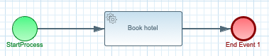
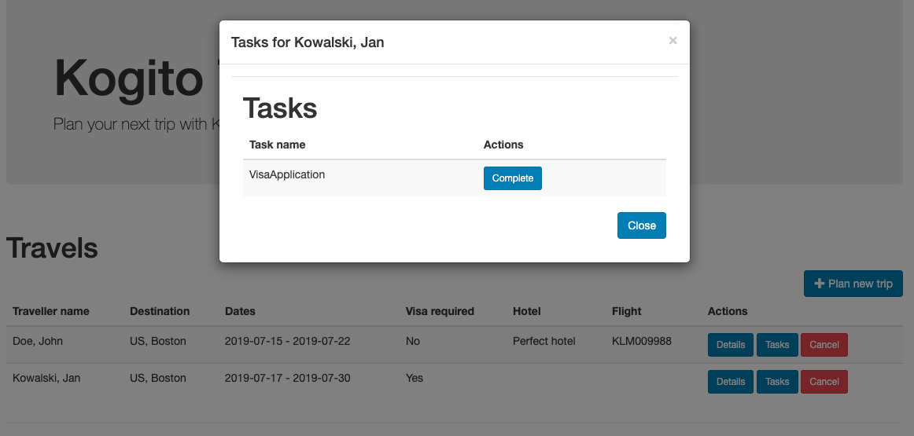

# Kogito Travel Agency


## Description

**Kogito Travel Agency** and **Kogito Visas** communicate completely via events. First **Kogito Travel Agency** sends visa applications 
for those travellers thar require visas to visit given country, next based on visa application evaluation, **Kogito Visas**  sends back 
the response with the visa processing outcome - approved or rejected.


## Activities to perform

* Create project using Quarkus Maven plugin with following extensions
	* Kogito
	* OpenApi
* Import project into Eclipse IDE - requires BPMN modeller plugin installed
* Create data model
	* Traveller
	* Hotel
	* Flight
	* Address
	* Trip
	* VisaApplication
* Create service classes
	* HotelBookingService
	* FlightBookingService
* Create decision logic
	* Visa check
* Create business logic
	* Public business process to deal with complete travel request
	* Private business process to deal with hotel booking
	* Private business process to deal with flight booking
* Create a test case that makes use of processes and decisions
* Configure messaging and events
* Create or import UI components using **Kogito Data Index Service**
* Add metrics support for processes and decisions
* Create dashboard based on metrics
* Connect the **Kogito Management Console** to the  **Kogito Data Index Service**


## Data model

Kogito Travel Agency booking system will be based on following data model

**Traveller**

A person who requests a new travel

**Trip**

Place/Location where the traveller wants to go and dates

**Flight**

Flight that has been booked for the traveller to take him/her to the destination

**Hotel**

Place/Location where the traveller will stay during his/her travel

**Address**

Location that is associated with either traveller or hotel

**Visa Application**

Details requires to apply for visa to travel to particular country

<p align="center"></p>


## Decision logic

The decision logic will be implemented as a decision table. The logic will be responsible for verifying whether a given traveller requires a visa to enter a given country or not. The decision logic reason over the following data/facts

* Destination that the traveller wants to go - country
* Nationality of the traveller
* Length of the stay

The result will be “yes” or “no”.

<p align="center"></p>


## Business logic

Business logic will be based on business processes

Public process that will be responsible for orchestrating complete travel request

<p align="center"></p>

Private process that will be responsible for booking a hotel.

<p align="center"></p>

Private process that will be responsible for booking a flight.

<p align="center"></p>

## Services

There will be services implemented to carry on the hotel and flight booking. Implementation will be a CDI beans that will have hard coded logic to return a booked flight or hotel.

* org.acme.travels.service.HotelBookingService
* org.acme.travels.service.FlightBookingService


# Try out the complete service

## Installing and Running

### Prerequisites

You will need:
  - Java 11+ installed
  - Environment variable JAVA_HOME set accordingly
  - Maven 3.6.2+ installed

When using native image compilation, you will also need:
  - GraalVM 19.3.1+ installed
  - Environment variable GRAALVM_HOME set accordingly
  - Note that GraalVM native image compilation typically requires other packages (glibc-devel, zlib-devel and gcc) to be installed too, please refer to GraalVM installation documentation for more details.

### Infrastructure requirements

#### Infinispan

This application requires an Infinispan server to be available and by default expects it to be on default port and localhost.

You can install Infinispan server by downloading version 11.x from the [official website](https://infinispan.org/download/).

In the section [Persistence in Kogito services](https://docs.jboss.org/kogito/release/latest/html_single/#con-persistence_kogito-developing-process-services) the required 
Infinispan configuration is explained in more detail.

Alternatively, you can use the Docker Compose template, instructions on how to use it are available in the [README](../docker-compose/README.md) file.

#### Apache Kafka

This application requires a [Apache Kafka](https://kafka.apache.org/) installed and following topics created

* `visaapplications` - used to send visa application that are consumed and processed by Kogito Visas service
* `visasresponses` - used to send visa applications that were approved or rejected
* `kogito-processinstances-events` - used to emit events by kogito that can be consumed by data index service and other services
* `kogito-usertaskinstances-events` -used to emit events by kogito that can be consumed by data index service
* `kogito-variables-events` - used to emit events by kogito that can be consumed by data index service

Alternatively, you can use the Docker Compose template, instructions on how to use it are available in the [README](../docker-compose/README.md) file.

### Compile and Run in Local Dev Mode

```
mvn clean package quarkus:dev    
```

NOTE: With dev mode of Quarkus you can take advantage of hot reload for business assets like processes, rules and decision
tables and java code. No need to redeploy or restart your running application.During this workshop we will create a software system for a startup travel agency called Kogito Travel Agency. The first iteration of the system will consist of a set of services that are able to deal with travel requests and the booking of hotels and flights.


### Compile and Run using Local Native Image
Note that this requires GRAALVM_HOME to point to a valid GraalVM installation

```
mvn clean package -Pnative
```

To run the generated native executable, generated in `target/`, execute

```
./target/travels-{version}-runner
```

### Start Kogito Data Index Service

We provide a `startDataIndex.sh` and `startDataIndex.ps1` script in the `scripts` directory of this tutorial. This script will

* Check that the **Kogito Travel Agency** and **Kogito Visas** projects have been compiled and that the required protobuf files are available.
* Copy the protobuf files to a local directory.
* Download the **Kogito Data Index Service Runner** if required.
* Start the **Kogito Data Index Service Runner** with the copied protobuf files.


If you wish to install, configure and start the **Data Index Service** manually, the _runnner_ can be downloaded from [Kogito Data Index Service](https://search.maven.org/artifact/org.kie.kogito/data-index)

This service works with .proto (protobuf) files that define the data model. fter downloading the runner, create a new folder to store the .proto files that will be used by the service,  e.g. `persistence`. Copy the protobuf files from the **Kogito Travel Agency** and **Kogito Visas** application to the `persistence` folder. These files can be found in the `target/classes/persistence` folders of these projects.

To start the **Kogito Data Index Service**, execute the Java runner JAR of the service, providing it the location of the protobuf files:

```
java -jar  -Dkogito.protobuf.folder={full path to proto files folder} data-index-service-0.4.0-runner.jar
```

e.g.

```
java -jar  -Dkogito.protobuf.folder=`pwd`/persistence data-index-service-0.4.0-runner.jar
```


### Start Kogito Management Console

The Kogito Management Console consists of a frontend and backend component. These 2 components can be combined into a single executable runner using the project's Maven build.

To package the frontend and backend together, use the following Maven build command: `mvn clean package -Dui.deps -Dui`
This will:
* Install the required front-end dependencies.
* Build the front-end,
* Compile the back-end.
* Package the front-end and back-end into a single Java runner.

After the build has completed, you can start the Manaagement Console with the following command: `java -jar target/management-console-*-runner.jar`

By default, the **Management Console** will try to connect to the **Data Index Service** at: http://localhost:8180

The UI of the **Management Console** can be accessed at: http://localhost:8280


### Start the Kogito Jobs Service


## Known issues


## User interface

Kogito Travel Agency comes with basic UI that allows to

### plan new trips

<p align="center"></p>

### list currently opened travel requests

<p align="center"></p>

### show details of selected travel request

<p align="center"></p>

### show active tasks of selected travel request

<p align="center"></p>

### perform Human task: visa application

<p align="center"></p>

### cancel selected travel request

To start Kogito Travel Agency UI just point your browser to [http://localhost:8080](http://localhost:8080)

## REST API

Once the service is up and running, you can use the following examples to interact with the service.

### POST /travels

Send travel that requires does not require visa

```sh
curl -H "Content-Type: application/json" -H "Accept: application/json" -X POST http://localhost:8080/travels -d @- << EOF
{
	"traveller" : {
		"firstName" : "John",
		"lastName" : "Doe",
		"email" : "john.doe@example.com",
		"nationality" : "American",
		"address" : {
			"street" : "main street",
			"city" : "Boston",
			"zipCode" : "10005",
			"country" : "US"
		}
	},
	"trip" : {
		"city" : "New York",
		"country" : "US",
		"begin" : "2019-12-10T00:00:00.000+02:00",
		"end" : "2019-12-15T00:00:00.000+02:00"
	}
}
EOF

```

This will directly go to 'ConfirmTravel' user task.

Send travel request that requires does require visa

```sh
curl -H "Content-Type: application/json" -H "Accept: application/json" -X POST http://localhost:8080/travels -d @- << EOF
{
	"traveller" : {
		"firstName" : "Jan",
		"lastName" : "Kowalski",
		"email" : "jan.kowalski@example.com",
		"nationality" : "Polish",
		"address" : {
			"street" : "polna",
			"city" : "Krakow",
			"zipCode" : "32000",
			"country" : "Poland"
		}
	},
	"trip" : {
		"city" : "New York",
		"country" : "US",
		"begin" : "2019-12-10T00:00:00.000+02:00",
		"end" : "2019-12-15T00:00:00.000+02:00"
	}
}
EOF
```

This will stop at 'VisaApplication' user task.

### GET /travels

Returns list of travel requests currently active:

```sh
curl -X GET http://localhost:8080/travels
```

As response an array of travels is returned.

### GET /travels/{id}

Returns travel request with given id (if active):

```sh
curl -X GET http://localhost:8080/travels/{uuid}
```

As response a single travel request is returned if found, otherwise 404 Not Found is returned.

### DELETE /travels/{id}

Cancels travel request with given id

```sh
curl -X DELETE http://localhost:8080/travels/{uuid}
```

### GET /travels/{id}/tasks

Returns currently assigned user tasks for give travel request:

```sh
curl -X GET http://localhost:8080/travels/{uuid}/tasks
```

### GET /travels/{id}/VisaApplication/{taskId}

Returns visa application task information:

```sh
curl -X GET http://localhost:8080/travels/{uuid}/VisaApplication/{task-uuid}
```

### POST /travels/{id}/VisaApplication/{taskId}

Completes visa application task

```sh
curl -H "Content-Type: application/json" -H "Accept: application/json" -X POST http://localhost:8080/travels/{uuid}/VisaApplication/{task-uuid} -d @- << EOF
{
	"visaApplication" : {
		"firstName" : "Jan",
		"lastName" : "Kowalski",
		"nationality" : "Polish",
		"city" : "New York",
		"country" : "US",
		"passportNumber" : "ABC09876",
		"duration" : 25
	}
}
EOF
```

### GET /travels/{id}/ConfirmTravel/{taskId}

Returns travel (hotel, flight) task information required for confirmation:

```sh
curl -X GET http://localhost:8080/travels/{uuid}/ConfirmTravel/{task-uuid}
```

### POST /travels/{id}/ConfirmTravel/{taskId}

Completes confirms travel task - meaning confirms (and completes) the travel request

```sh
curl -H "Content-Type: application/json" -H "Accept: application/json" -X POST http://localhost:8080/travels/{uuid}/ConfirmTravel/{task-uuid} -d '{}'
```

### Querying the technical cache

When running **Kogito Data Index Service** on dev mode, the GraphiQL UI is available at [http://localhost:8180](http://localhost:8180/) and allow to
perform different queries on the model as is explained at [wiki/Data-Index-service](https://github.com/kiegroup/kogito-runtimes/wiki/Data-Index-Service)
