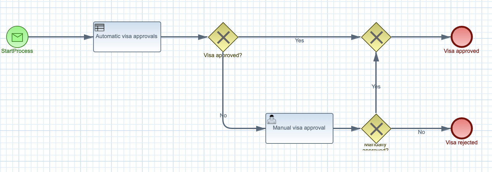
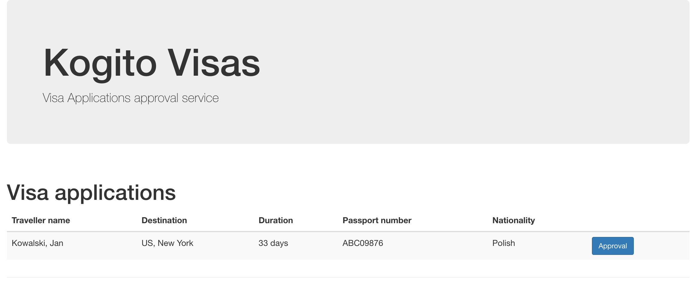
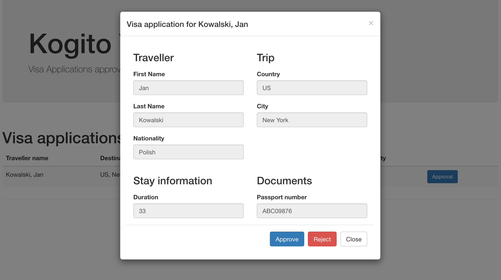

# Kogito Visas

## Description

This is another service of the Kogito Travel Agency application. It's responsible for processing visa applications
that are sent during travel requests. 

In it's current state it simply accepts incoming visa applications from Kafka topic and process them

* automatically if the rules match the visa application details
* manually otherwise

Response is logged into the visa application and the processing ends. Further evolutions of the service
will add additional hanlding to the approved or rejected visa applications.

## Activities to perform

* Create project using Quarkus Maven plugin with following extensions
	* Kogito
	* OpenApi
* Import project into Eclipse IDE - requires BPMN modeller plugin installed
* Create data model	
	* VisaApplication
* Create decision logic
	* Visa approvals
* Create business logic
	* Public business process to deal with visa applications
* Configure messaging and events
* Create or import UI components
* Add custom metrics based on the approved and rejected visa applications
* Create dashboard based on metrics

## Data model

Kogito Travel Agency booking system will be based on following data model

**Visa Application**

A basic visa application information required to process


## Decision logic

The decision logic will be implemented as a set of rules in DRL format. These rules will be responsible for automatic visa application approval


## Business logic

Business logic will be based on business processes

Public process that will be responsible for processing visa application

<p align="center"></p>


# Try out the complete service

## Installing and Running

### Prerequisites

You will need:
  - Java 11+ installed
  - Environment variable JAVA_HOME set accordingly
  - Maven 3.6.2+ installed

When using native image compilation, you will also need:
  - GraalVM 19.3.1+ installed
  - Environment variable GRAALVM_HOME set accordingly
  - Note that GraalVM native image compilation typically requires other packages (glibc-devel, zlib-devel and gcc) to be installed too, please refer to GraalVM installation documentation for more details.

### Infrastructure requirements

#### Infinispan

This application requires an Infinispan server to be available and by default expects it to be on default port and localhost.

You can install Infinispan server by downloading version 11.x from the [official website](https://infinispan.org/download/).

In the section [Persistence in Kogito services](https://docs.jboss.org/kogito/release/latest/html_single/#con-persistence_kogito-developing-process-services) the required 
Infinispan configuration is explained in more detail.

Alternatively, you can use the Docker Compose template, instructions on how to use it are available in the [README](../docker-compose/README.md) file.

#### Apache Kafka

This application requires a [Apache Kafka](https://kafka.apache.org/) installed and following topics created

* `visaapplications` - used to send visa application that are consumed and processed by Kogito Visas service
* `visasresponses` - used to send visa applications that were were approved or rejected
* `kogito-processinstances-events` - used to emit events by kogito that can be consumed by data index service and other services
* `kogito-usertaskinstances-events` -used to emit events by kogito that can be consumed by data index service
* `kogito-variables-events` - used to emit events by kogito that can be consumed by data index service

Alternatively, you can use the Docker Compose template, instructions on how to use it are available in the [README](../docker-compose/README.md) file.

### Compile and Run in Local Dev Mode

```
mvn clean package quarkus:dev    
```

NOTE: With dev mode of Quarkus you can take advantage of hot reload for business assets like processes, rules and decision
tables and java code. No need to redeploy or restart your running application.During this workshop we will create a software system for a startup travel agency called Kogito Travel Agency. The first iteration of the system will consist of a set of services that are able to deal with travel requests and the booking of hotels and flights.


### Compile and Run using Local Native Image
Note that this requires GRAALVM_HOME to point to a valid GraalVM installation

```
mvn clean package -Pnative
```

To run the generated native executable, generated in `target/`, execute

```
./target/visas-{version}-runner
```

### Start Kogito Data Index Service

If you wish to install, configure and start the **Data Index Service** manually, the _runnner_ can be downloaded from [Kogito Data Index Service](https://search.maven.org/artifact/org.kie.kogito/data-index)

After downloading the runner, create a new folder to store the .proto files that will be used by the service. 

This service works with .proto files that define the data model. Once **Kogito Travel Service** is started, /target/classes/persistence/travels.proto is generated and it has to be copied to the new proto files folder.

To start the **Kogito Data Index Service** just past the full path of the proto files folder and execute 

```
java -jar  -Dkogito.protobuf.folder={full path to proto files folder} data-index-service-0.4.0-runner.jar
```

NOTE: If we want to run 'Kogito Travels Service' and 'Kogito Visa Service' using the same Kogito Data Index Service, we will copy both files travels.proto and visaApplications.proto at the same 'kogito.protobuf.folder' that is  passed as parameter, and will start the data index service once.
 
## Known issues


## User interface

Kogito Visas comes with basic UI that allows to


### list currently opened visa applications

<p align="center"></p>


### approve/reject selected visa application

<p align="center"></p>

To start Kogito Travel Agency UI just point your browser to [http://localhost:8090](http://localhost:8090)

## REST API

Once the service is up and running, you can use the following examples to interact with the service.


### GET /visaApplications

Returns list of travel requests currently active:

```sh
curl -X GET http://localhost:8090/visaApplications
```

As response an array of travels is returned.

### GET /visaApplications/{id}

Returns travel request with given id (if active):

```sh
curl -X GET http://localhost:8090/visaApplications/{uuid}
```

As response a single travel request is returned if found, otherwise 404 Not Found is returned.

### DELETE /visaApplications/{id}

Cancels travel request with given id

```sh
curl -X DELETE http://localhost:8090/visaApplications/{uuid}
```

### GET /visaApplications/{id}/tasks

Returns currently assigned user tasks for give travel request:

```sh
curl -X GET http://localhost:8090/visaApplications/{uuid}/tasks
```

### GET /visaApplications/{id}/ApplicationApproval/{taskId}

Returns visa application task information:

```sh
curl -X GET http://localhost:8090/visaApplications/{uuid}/ApplicationApproval/{task-uuid}
```

### POST /visaApplications/{id}/ApplicationApproval/{taskId}

Completes visa application task

```sh
curl -H "Content-Type: application/json" -H "Accept: application/json" -X POST http://localhost:8090/visaApplications/435aa429-5ddb-4480-9219-ad9c51bbf885/ApplicationApproval/98796868-d94e-4363-8e8f-6a1d31cbbff6 -d @- << EOF
{
	"application" : {
		"firstName" : "Jan",
		"lastName" : "Kowalski",
		"nationality" : "Polish",
		"city" : "New York",
		"country" : "US",
		"passportNumber" : "ABC09876",
		"duration" : 25,
		"approved" : true
	}
}
EOF
```

### Querying the technical cache

When running **Kogito Data Index Service** on dev mode, the GraphiQL UI is available at [http://localhost:8180](http://localhost:8180/) and allow to
perform different queries on the model as is explained at [wiki/Data-Index-service](https://github.com/kiegroup/kogito-runtimes/wiki/Data-Index-Service)
