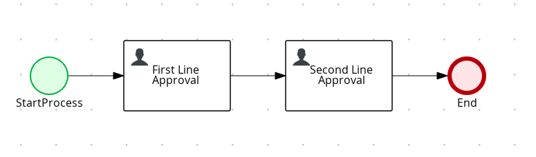
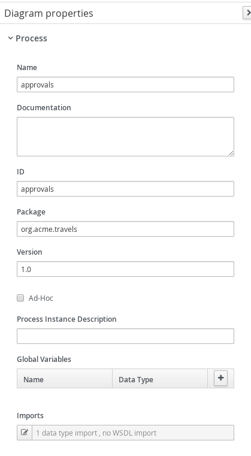
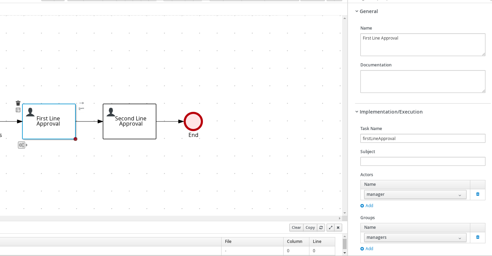
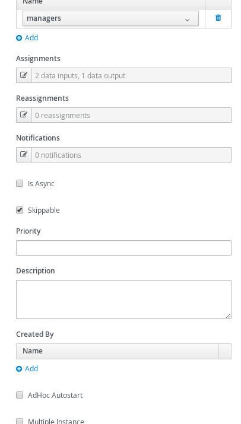
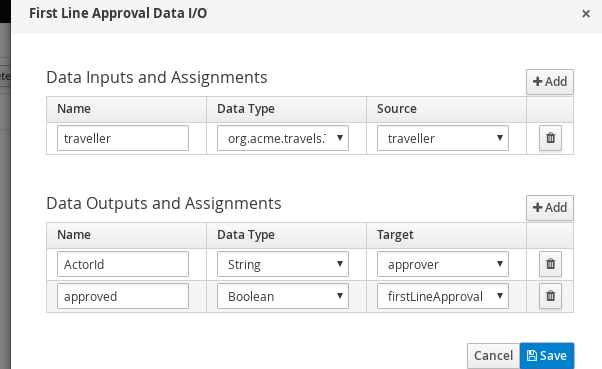
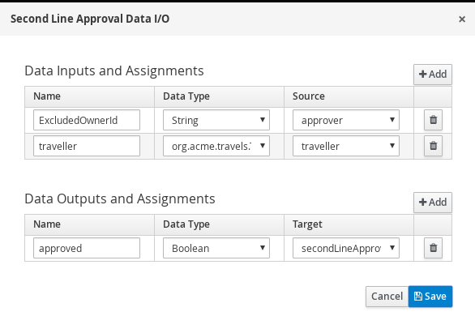
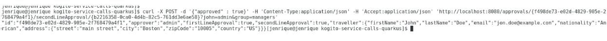

# Kogito user task orchestration with custom life cycle

## Description

A quickstart project shows very typical user task orchestration. It comes with two tasks assigned
to human actors via groups assignments - `managers`. So essentially anyone who is a member of that 
group can act on the tasks. Though this example applies four eye principle which essentially means 
that user who approved first task cannot approve second one. So there must be always at least two 
distinct manager involved.

This example shows

* working with user tasks
* four eye principle with user tasks
	
* Diagram	
<p align="center"></p>
	
Diagram Properties
<p align="center"></p>

* Diagram Properties
<p align="center"></p>

* Diagram Properties
<p align="center"></p>

* First Line Approval
<p align="center"></p>

* First Line Approval
<p align="center"></p>

* First Line Approval
<p align="center"></p>

* Second Line Approval
<p align="center"></p>

* Second Line Approval
<p align="center"></p>

In addition this quickstart also shows how to use custom life cycle for user tasks that uses custom life cycle phases
compared to those supported by default.

- Start
- Complete - extended the default one that allows only to complete started tasks

To learn more about this look at the following classes

- `org.acme.travels.config.CustomWorkItemHandlerConfig` - responsible for registering work item handler to deal with user tasks
- `org.acme.travels.usertasks.CustomHumanTaskLifeCycle` - defines actual the life cycle for user tasks
- `org.acme.travels.usertasks.Start` - new life cycle phase
- `org.acme.travels.usertasks.CompleteStartedOnly` - extended Complete life cycle phase to allow only started tasks and reuse all other logic 


## Build and run

### Prerequisites
 
You will need:
  - Java 1.8.0+ installed 
  - Environment variable JAVA_HOME set accordingly
  - Maven 3.5.4+ installed

When using native image compilation, you will also need: 
  - GraalVM 19.1+ installed
  - Environment variable GRAALVM_HOME set accordingly
  - Note that GraalVM native image compilation typically requires other packages (glibc-devel, zlib-devel and gcc) to be installed too, please refer to GraalVM installation documentation for more details.

### Compile and Run in Local Dev Mode

```
mvn clean package quarkus:dev    
```

NOTE: With dev mode of Quarkus you can take advantage of hot reload for business assets like processes, rules, decision tables and java code. No need to redeploy or restart your running application.


### Compile and Run using Local Native Image
Note that this requires GRAALVM_HOME to point to a valid GraalVM installation

```
mvn clean package -Pnative
```
  
To run the generated native executable, generated in `target/`, execute

```
./target/kogito-usertasks-quarkus-{version}-runner
```

### Use the application

Examine OpenAPI via swagger UI at [http://localhost:8080/swagger-ui](http://localhost:8080/swagger-ui)


### Submit a request to start new approval

To make use of this application it is as simple as putting a sending request to `http://localhost:8080/approvals`  with following content 

```
{
"traveller" : { 
  "firstName" : "John", 
  "lastName" : "Doe", 
  "email" : "jon.doe@example.com", 
  "nationality" : "American",
  "address" : { 
  	"street" : "main street", 
  	"city" : "Boston", 
  	"zipCode" : "10005", 
  	"country" : "US" }
  }
}

```

Complete curl command can be found below:

```
curl -X POST -H 'Content-Type:application/json' -H 'Accept:application/json' -d '{"traveller" : { "firstName" : "John", "lastName" : "Doe", "email" : "jon.doe@example.com", "nationality" : "American","address" : { "street" : "main street", "city" : "Boston", "zipCode" : "10005", "country" : "US" }}}' http://localhost:8080/approvals
```

### Show active approvals

```
curl -H 'Content-Type:application/json' -H 'Accept:application/json' http://localhost:8080/approvals
```

### Show tasks 

```
curl -H 'Content-Type:application/json' -H 'Accept:application/json' 'http://localhost:8080/approvals/{uuid}/tasks?user=admin&group=managers'
```

where `{uuid}` is the id of the given approval instance


### Start first line approval task

```
curl -X POST -d '{"approved" : true}' -H 'Content-Type:application/json' -H 'Accept:application/json' 'http://localhost:8080/approvals/{uuid}/firstLineApproval/{tuuid}?phase=start&john=admin&group=managers'

```

where `{uuid}` is the id of the given approval instance and `{tuuid}` is the id of the task instance


### Complete first line approval task

```
curl -X POST -d '{"approved" : true}' -H 'Content-Type:application/json' -H 'Accept:application/json' 'http://localhost:8080/approvals/{uuid}/firstLineApproval/{tuuid}?user=admin&group=managers'
```

where `{uuid}` is the id of the given approval instance and `{tuuid}` is the id of the task instance

### Show tasks 

```
curl -H 'Content-Type:application/json' -H 'Accept:application/json' 'http://localhost:8080/approvals/{uuid}/tasks?user=admin&group=managers'
```

where `{uuid}` is the id of the given approval instance

This should return empty response as the admin user was the first approver and by that can't be assigned to another one.

Repeating the request with another user will return task

```
curl -H 'Content-Type:application/json' -H 'Accept:application/json' 'http://localhost:8080/approvals/{uuid}/tasks?john=admin&group=managers'
```

### Start second line approval task

```
curl -X POST -d '{"approved" : true}' -H 'Content-Type:application/json' -H 'Accept:application/json' 'http://localhost:8080/approvals/{uuid}/secondLineApproval/{tuuid}?phase=start&john=admin&group=managers'

```

where `{uuid}` is the id of the given approval instance and `{tuuid}` is the id of the task instance


### Complete second line approval task

```
curl -X POST -d '{"approved" : true}' -H 'Content-Type:application/json' -H 'Accept:application/json' 'http://localhost:8080/approvals/{uuid}/secondLineApproval/{tuuid}?john=admin&group=managers'
```

where `{uuid}` is the id of the given approval instance and `{tuuid}` is the id of the task instance

This completes the approval and returns approvals model where both approvals of first and second line can be found, 
plus the approver who made the first one.

```
{
	"approver":"admin",
	"firstLineApproval":true,
	"id":"2eeafa82-d631-4554-8d8e-46614cbe3bdf",
	"secondLineApproval":true,
	"traveller":{
		"address":{
			"city":"Boston",
			"country":"US",
			"street":"main street",
			"zipCode":"10005"},
		"email":"jon.doe@example.com",
		"firstName":"John",
		"lastName":"Doe",
		"nationality":"American"
	}
}
```

You should see a similar message after performing the second line approval

<p align="center"></p>