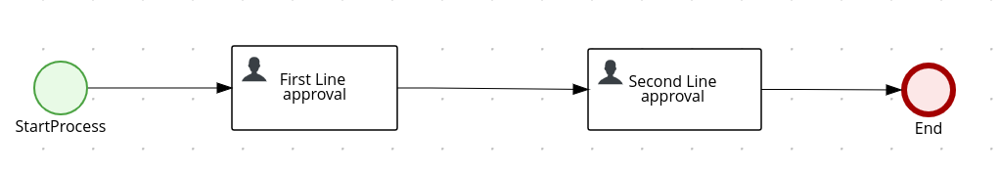

# Kogito user task orchestration

## Description

A quickstart project shows very typical user task orchestration. It comes with two tasks assigned
to human actors via groups assignments - `managers`. So essentially anyone who is a member of that 
group can act on the tasks. Though this example applies four eye principle which essentially means 
that user who approved first task cannot approve second one. So there must be always at least two 
distinct manager involved.

This example shows

* working with user tasks
* four eye principle with user tasks
	
	
<p align="center"></p>


## Build and run

### Prerequisites
 
You will need:
  - Java 1.8.0+ installed 
  - Environment variable JAVA_HOME set accordingly
  - Maven 3.5.4+ installed
  - [jq](https://stedolan.github.io/jq) tool installed. You can download it from [here](https://stedolan.github.io/jq/download)
  - Docker to be able to install keycloak server

#### Starting and Configuring the Keycloak Server

To start a Keycloak Server you can use Docker and just run the following command:

```
docker run -e KEYCLOAK_USER=admin -e KEYCLOAK_PASSWORD=admin  -e KEYCLOAK_IMPORT=/tmp/kogito-realm.json -v <kogito-quickstarts_absolute_path>/kogito-usertasks-with-security-oidc-springboot/config/kogito-realm.json:/tmp/kogito-realm.json -p 8280:8080  jboss/keycloak
```

You should be able to access your Keycloak Server at [localhost:8280/auth](http://localhost:8280).
and verify keycloak server is running properly: log in as the admin user to access the Keycloak Administration Console. 
Username should be admin and password admin.
With the keycloak kogito realm  imported we have defined users to be able to try the different endpoints
user: 
    john with role 'employees'
    mary with role 'managers'
    poul with roles 'interns and managers'

### Compile and Run in Local Dev Mode

```
mvn clean package spring-boot:run    
```


### Compile and Run using uberjar

```
mvn clean package 
```
  
To run the generated native executable, generated in `target/`, execute

```
java -jar target/kogito-usertasks-sprintboot-{version}.jar
```

### Use the application

### Submit a request to start new approval
The application is using bearer token authorization and the first thing to do is obtain an access token from the Keycloak 
Server in order to access the application resources. Obtain an access token for user john.

```
export access_token=$(\                                                           
    curl -X POST http://localhost:8280/auth/realms/kogito/protocol/openid-connect/token \
    --user kogito-app:secret \
    -H 'content-type: application/x-www-form-urlencoded' \
    -d 'username=john&password=john&grant_type=password' | jq --raw-output '.access_token' \
)
```

To make use of this application it is as simple as putting a sending request to `http://localhost:8080/approvals`  

```
{
"traveller" : { 
  "firstName" : "John", 
  "lastName" : "Doe", 
  "email" : "jon.doe@example.com", 
  "nationality" : "American",
  "address" : { 
  	"street" : "main street", 
  	"city" : "Boston", 
  	"zipCode" : "10005", 
  	"country" : "US" }
  }
}

```

Complete curl command can be found below, passing the token as Authorization header :

```
curl -X POST -H "Authorization: Bearer "$access_token -H 'Content-Type:application/json' -H 'Accept:application/json' -d '{"traveller" : { "firstName" : "John", "lastName" : "Doe", "email" : "jon.doe@example.com", "nationality" : "American","address" : { "street" : "main street", "city" : "Boston", "zipCode" : "10005", "country" : "US" }}}' http://localhost:8080/approvals
```

### Show active approvals

```
curl -H 'Content-Type:application/json' -H 'Accept:application/json' -H "Authorization: Bearer "$access_token http://localhost:8080/approvals
```

### Show tasks 

```
curl -H 'Content-Type:application/json' -H 'Accept:application/json' -H "Authorization: Bearer "$access_token 'http://localhost:8080/approvals/{uuid}/tasks?user=john&group=employees'
```

Try with the manager Mary

```
export access_token=$(\
    curl -X POST http://localhost:8280/auth/realms/kogito/protocol/openid-connect/token \
    --user kogito-app:secret \
    -H 'content-type: application/x-www-form-urlencoded' \
    -d 'username=mary&password=mary&grant_type=password' | jq --raw-output '.access_token' \
 )
```
```
curl -H 'Content-Type:application/json' -H 'Accept:application/json' -H "Authorization: Bearer "$access_token 'http://localhost:8080/approvals/{uuid}/tasks?user=mary&group=managers'
```

where `{uuid}` is the id of the given approval instance


### Complete first line approval task

```
curl -H "Authorization: Bearer "$access_token -X POST -d '{"approved" : true}' -H 'Content-Type:application/json' -H 'Accept:application/json' 'http://localhost:8080/approvals/{uuid}/firstLineApproval/{tuuid}?user=mary&group=managers'
```

where `{uuid}` is the id of the given approval instance and `{tuuid}` is the id of the task

### Show tasks 

```
curl -H "Authorization: Bearer "$access_token -H 'Content-Type:application/json' -H 'Accept:application/json' 'http://localhost:8080/approvals/{uuid}/tasks?user=mary&group=managers'
```

where `{uuid}` is the id of the given approval instance. 
This should return empty response as Mary was the first approver and another user with role managers needs to approve the Second 
Line.

Repeating the request with another user with role managers

```
export access_token=$(\
    curl -X POST http://localhost:8280/auth/realms/kogito/protocol/openid-connect/token \
    --user kogito-app:secret \
    -H 'content-type: application/x-www-form-urlencoded' \
    -d 'username=poul&password=poul&grant_type=password' | jq --raw-output '.access_token' \
 )
```

```
curl -H "Authorization: Bearer "$access_token -H 'Content-Type:application/json' -H 'Accept:application/json' 'http://localhost:8080/approvals/{uuid}/tasks?user=poul&group=managers'
```

Now we have the id for the second approval task

### Complete second line approval task

```
curl -H "Authorization: Bearer "$access_token -X POST -d '{"approved" : true}' -H 'Content-Type:application/json' -H 'Accept:application/json' 'http://localhost:8080/approvals/{uuid}/secondLineApproval/{tuuid}?user=poul&group=managers'
```

where `{uuid}` is the id of the given approval instance and `{tuuid}` is the id of the task instance

This completes the approval and returns approvals model where both approvals of first and second line can be found, 
plus the approver who made the first one.

```
{ 
 "id":"{uuid}",
 "approver":"mary",
 "firstLineApproval":true,
 "secondLineApproval":true,
 "traveller":{
       "firstName":"John",
       "lastName":"Doe",
       "email":"jon.doe@example.com",
       "nationality":"American",
       "address":{
           "street":"main street",
           "city":"Boston",
           "zipCode":"10005",
           "country":"US"
       }
  }
}
```
