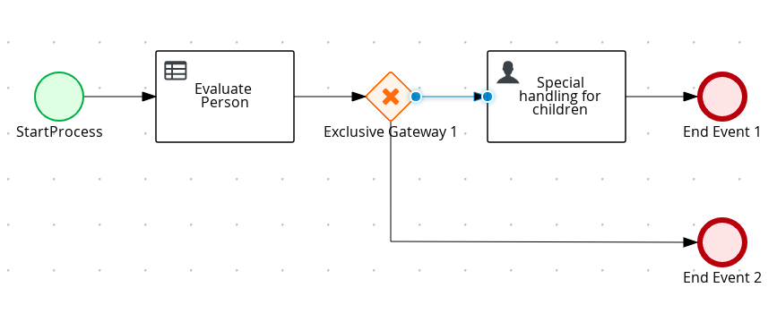
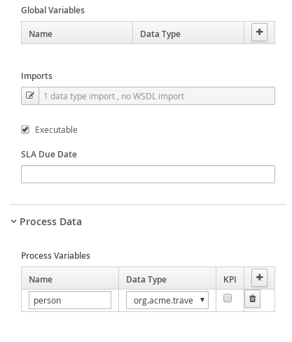

# Process with Decisions Integration through REST

## Description

This is an example project that shows the usage of decisions within processes. Decisions can be expressed in different domains or assets, such as DMN and DRL. 
The focus is to show how to integrate decisions in a remote way using REST APIs from the decision services that can be deployed decoupled from the process service, for instance, in different microservices with its own build and deployment pipelines. For convenience, in this example,  the decision assets are under the same project as the process, but in a real use case it would be ideal they are placed in a different project.

This example covers the following items:

* DMN to define a decision service
* DRL to define rules decision service
* How to integrate the process with decisions using REST
    * Service Task to call an external decision service
    * REST Work Item to call an external decision service

### The Traffic Process example:

It is based on traffic violation evaluation process, where it is required to fetch Driver information, and based on this, it is first performed the license validation to check if the driver has a valid license (using a RuleUnit in a DRL) after the license validation it is then executed the violation evaluation defined as a DMN decision and following, it is checked in the process if the output contains information whether the driver was suspended or not, completing the process.

There are two examples to show different approaches to do integration with decisions, they are pretty similar from the process definition perspective, the difference in related to the task that performs the call to the decision evaluation, either using a Service Task or a Rest Work item.

* Process using Service Tasks

In this apporach it requires coding, to provide an implementation in the application responsible to execute the task, in this case, a REST/HTTP call. The implementation is up to the user, but here it's been used what the platform provides, like the [Quarkus REST Client](https://quarkus.io/guides/rest-client). Details can be seen in the classes [LicenseValidationRestClient](src/main/java/org/kie/kogito/traffic/LicenseValidationRestClient.java) and [LicenseValidationRestClient](src/main/java/org/kie/kogito/traffic/TrafficViolationRestClient.java).

* Process using REST Work Item

This is a declarative apporach, it does not require to have any extra implementation, the REST/HTTP call is executed out-of-the-box by the engine. The information needed to execute the REST call, like the URL and HTTP method should be set in the Data Assignments in the REST Work Item.


* #### Process Properties


These are the properties defined for the process, the most important one in this section to pay attention is the ID beause it is used in the REST end point generation reffering to the path to interact with this process.

* #### Proces Variables

The variables used in the process itself, but the focus in this example are the classes that are used to define the POJOs to interact the process with decisions, that are the [Violation](src/main/java/org/kie/kogito/traffic/Violation.java), [Driver](src/main/java/org/kie/kogito/traffic/Driver.java), [Fine](src/main/java/org/kie/kogito/traffic/Fine.java) and [TrafficViolationResponse](src/main/java/org/kie/kogito/traffic/TrafficViolationResponse.java).



<b>Mapping data from Process to/from DMN</b>

Is is important to mention DMN for instance can define the Data Type in its own structure, but we can align all attributes names in a Java class that is used as process variables, in case the attribute names contains spaces or are not follwing java conventions we can use Jackson Annotations to make the process variable POJOs aligned with DMN data types, for instance in the [Violation](src/main/java/org/kie/kogito/traffic/Violation.java) class, where it is mapped the `speedLimit` attribute as `Speed Limit` using `@JsonProperty` annotation, in this case this attribute from the process variable with Violation can be seamsly integrated Violation Data Type defined in DMN.

DMN Violation Data Type


* #### Get Driver Task

Fetch for driver information, in this implementation it is just mocking a result, that simply fill with an expired license date in case the driverId is an odd number and with a valid date in case of an even number. In a real use case it could be performing an external call to a service or a database to get this information.

The service task implementation is done in the [DriverService] (src/main/java/org/kie/kogito/traffic/DriverService.java) class.

* #### License Validation Task (DRL)

Represents the task to do the call to the DRL service. 

Rest Work Item
Service Task


* #### Traffic Violation Task (DMN)
Represents the task to do the call to the DMN service.

Rest Work Item
Service Task

* #### Suspended Task
Just a task example where it could be performend and action based on the driver suspension. Here it is just logging the information in the console.

<p align="left"></p>

* #### Not Suspended Task
Just a task example where it could be performend and action based on the driver not suspension. Here it is just logging the information in the console.

<p align="left"></p>


## Build and run

### Prerequisites

You will need:
  - Java 11+ installed
  - Environment variable JAVA_HOME set accordingly
  - Maven 3.6.2+ installed

When using native image compilation, you will also need:
  - GraalVM 19.3+ installed
  - Environment variable GRAALVM_HOME set accordingly
  - GraalVM native image needs as well native-image extension: https://www.graalvm.org/docs/reference-manual/native-image/
  - Note that GraalVM native image compilation typically requires other packages (glibc-devel, zlib-devel and gcc) to be installed too, please refer to GraalVM installation documentation for more details.

### Compile and Run in Local Dev Mode

```sh
mvn clean compile quarkus:dev
```

NOTE: With dev mode of Quarkus you can take advantage of hot reload for business assets like processes, rules, decision tables and java code. No need to redeploy or restart your running application.

### Package and Run in JVM mode

```sh
mvn clean package
java -jar target/quarkus-app/quarkus-run.jar
```

or on windows

```sh
mvn clean package
java -jar target\quarkus-app\quarkus-run.jar
```

### Package and Run using Local Native Image
Note that this requires GRAALVM_HOME to point to a valid GraalVM installation

```sh
mvn clean package -Pnative
```

To run the generated native executable, generated in `target/`, execute

```
./target/process-decision-rest-quarkus-runner
```

## OpenAPI (Swagger) documentation
[Specification at swagger.io](https://swagger.io/docs/specification/about/)

You can take a look at the [OpenAPI definition](http://localhost:8080/openapi?format=json) - automatically generated and included in this service - to determine all available operations exposed by this service. For easy readability you can visualize the OpenAPI definition file using a UI tool like for example available [Swagger UI](https://editor.swagger.io).

In addition, various clients to interact with this service can be easily generated using this OpenAPI definition.

When running in either Quarkus Development or Native mode, we also leverage the [Quarkus OpenAPI extension](https://quarkus.io/guides/openapi-swaggerui#use-swagger-ui-for-development) that exposes [Swagger UI](http://localhost:8080/swagger-ui/) that you can use to look at available REST endpoints and send test requests.

## Example Usage

Once the service is up and running we can invoke the REST endpoints and examine the logic.

### Submit a request

To make use of this application it is as simple as putting a sending request to `http://localhost:8080/traffic_service`  with appropriate contents. See the following two cases:

#### Valid License and Suspended Driver

Given data:

```json
{
    "driverId": "12345",
    "violation":{
        "Type":"speed",
        "Speed Limit": 100,
        "Actual Speed":140
    }
}
```

Submit the JSON object from above:

```sh
curl -X POST -H 'Content-Type:application/json' -H 'Accept:application/json' -d '{"driverId": "12345","violation":{"Type":"speed","Speed Limit": 100,"Actual Speed":140}}' http://localhost:8080/traffic_service
```

After the Curl command you should see a similar console log

```json
{
    "id": "331fc19b-5af4-4735-a6f2-8a94ab37d067",
    "driverId": "12345",
    "driver": {
        "licenseExpiration": "2021-08-06T15:07:44.455+00:00",
        "validLicense": true,
        "Name": "Arthur",
        "State": "SP",
        "City": "Campinas",
        "Points": 13,
        "Age": 30
    },
    "trafficViolationResponse": {
        "Fine": {
            "Amount": 500.0,
            "Points": 3
        },
        "Suspended": "No"
    },
    "violation": {
        "Code": null,
        "Date": null,
        "Type": "speed",
        "Speed Limit": 100,
        "Actual Speed": 120
    }
}
```

Because the person is evaluated as an adult, no outstanding tasks should be here for given person.

We can verify there is no task running for Children Handling using following command:

```sh
curl http://localhost:8080/persons/{uuid}/tasks
```
where uuid is the id returned in the previous step.

#### A Child

Given data:

```json
{
    "person" : {
        "name" : "john",
        "age" : 5
    }
}
```

Submit the JSON object from above:

```sh
curl -X POST -H 'Content-Type:application/json' -H 'Accept:application/json' -d '{"person" : {"name" : "john", "age" : 5}}' http://localhost:8080/persons
```

After the Curl command you should see a similar console log

```json
{
    "id":"c59054b9-aa1d-4771-bc5e-40f8b32d3ff5",
    "person":{
        "name":"john",
        "age":5,
        "adult":false
    }
}
```

Because the person is not evaluated as an adult, there should be outstanding tasks for given person.

To verify there is a running task for Children

```sh
curl http://localhost:8080/persons/{uuid}/tasks
```
where uuid is the id returned from the preivous step.

Should return something like

```json
[{"id":"c59054b9-aa1d-4771-bc5e-40f8b32d3ff5","name":"ChildrenHandling".....}]
```


Then to see the Task created perfor the following command

```
curl http://localhost:8080/persons/{uuid}/ChildrenHandling/{tuuid}
```

where uuid is persons id and tuuid is task id.

It should return something similar to

```json
{
    "person":{
        "name":"john",
        "age":5,
        "adult":false
    },
    "id":"c59054b9-aa1d-4771-bc5e-40f8b32d3ff5",
    "name":"ChildrenHandling"
}
```

Then we can complete the task and validate child with

```sh
curl -X POST -H 'Content-Type:application/json' -H 'Accept:application/json' -d '{}' http://localhost:8080/persons/{uuid}/ChildrenHandling/{tuuid}
```

Where uuid is persons id and tuuid is task id

Should return something similar to

```json
{
    "id":"09f98756-b273-4ceb-9308-fae7cc423904",
    "person":{
        "name":"john",
        "age":5,
        "adult":false
    }
}
```
and there should be no outstanding task for the person anymore.

## Deploying with Kogito Operator

In the [`operator`](operator) directory you'll find the custom resources needed to deploy this example on OpenShift with the [Kogito Operator](https://docs.jboss.org/kogito/release/latest/html_single/#chap_kogito-deploying-on-openshift).
