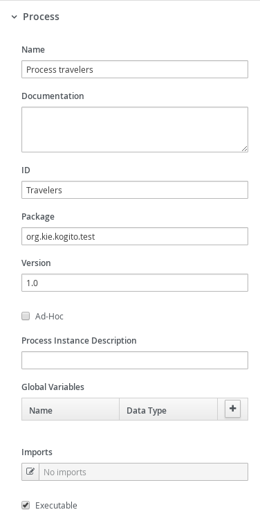
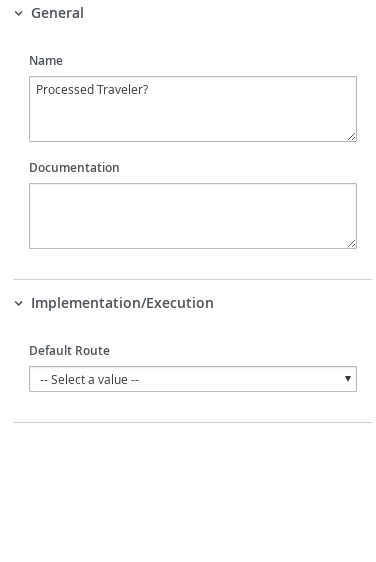
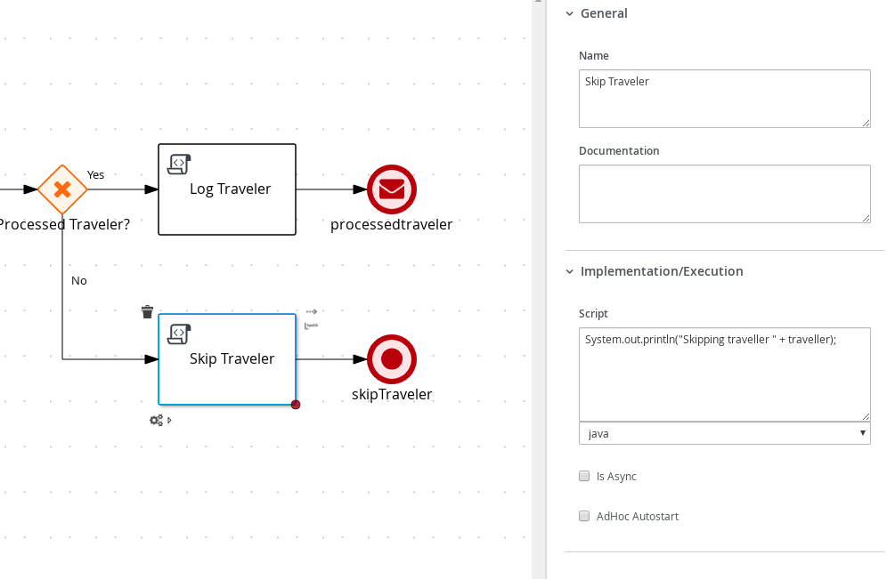

# Process with Knative Eventing

## Description

A quickstart project that deals with traveller processing carried by rules. It illustrates
how easy it is to make the Kogito processes and rules to work with Knative Eventing. 
This project is based on the example [Process with Kafka](https://github.com/kiegroup/kogito-examples/tree/master/process-kafka-quickstart-quarkus). 

This example shows

* consuming events from a Knative Eventing broker and for each event start new process instance
* each process instance is expecting a traveller information in JSON format
* traveller is then processed by rules and based on the outcome of the processing (processed or not) traveller is
	* if successfully processed traveller information is logged and then updated information is send to Knative broker
	* if not processed traveller info is logged and then process instance finishes emitting the event `skiptraveller` to Knative broker


* Diagram Properties (top)


* Diagram Properties (bottom)


* Diagram Properties (process variables)


* Start Message


* Start Message (Assignments)


* Process Traveler Business Rule (top)


* Process Traveler Business Rule (bottom)


* Process Traveler Business Rule (Assignments)


* Process Traveler Gateway


* Process Traveler Gateway Yes Connector


* Process Traveler Gateway No Connector


* Log Traveler Script Task


* Skip Traveler Script Task


* Processed Traveler End Message


* Processed Traveler End Message (Assignments)


* Skip Traveler End


## Infrastructure requirements

This quickstart requires Knative Eventing to be available in your cluster:

* Install [minikube](https://kubernetes.io/docs/tasks/tools/install-minikube/)
* Install [Knative Eventing](https://knative.dev/docs/install/) in your minikube cluster

For local testing only you can use [Podman](https://podman.io/getting-started/installation.html) or Docker to simulate an application
receiving your events.

## Build and run

### Prerequisites

You will need:
  - Java 11+ installed
  - Environment variable JAVA_HOME set accordingly
  - Maven 3.6.2+ installed

When using native image compilation, you will also need:
  - GraalVM 19.3+ installed
  - Environment variable GRAALVM_HOME set accordingly
  - GraalVM native image needs as well native-image extension: https://www.graalvm.org/docs/reference-manual/native-image/
  - Note that GraalVM native image compilation typically requires other packages (glibc-devel, zlib-devel and gcc) to be installed too, please refer to GraalVM installation documentation for more details.

### Compile and Run in Local Dev Mode

```sh
K_SINK=http://localhost:8181 mvn clean compile quarkus:dev
```

[`K_SINK` is the environment variable injected by the Knative Eventing platform](https://knative.dev/docs/eventing/samples/sinkbinding/#create-our-sinkbinding)
once we deploy the application on a Kubernetes cluster.
Instead of _hardcoding_ the endpoint where we are going to send our produced messages, we rely on Knative to inject this information in runtime.

The environment variable will be assigned to the SmallRye HTTP connector in runtime: `mp.messaging.outgoing.processedtravellers.url=${K_SINK}`.

For local tests we will mock the endpoint where the produced messages supposed to be delivered. 

NOTE: With dev mode of Quarkus you can take advantage of hot reload for business assets like processes, rules, decision tables and java code. No need to redeploy or restart your running application.

### Package and Run in JVM mode

```sh
mvn clean package
java -jar target/quarkus-app/quarkus-run.jar
```

or on windows

```sh
mvn clean package
java -jar target\quarkus-app\quarkus-run.jar
```

### Package and Run using Local Native Image
Note that this requires GRAALVM_HOME to point to a valid GraalVM installation

```
mvn clean package -Pnative
```
  
To run the generated native executable, generated in `target/`, execute

```
./target/process-kafka-quickstart-quarkus-runner
```

### OpenAPI (Swagger) documentation
[Specification at swagger.io](https://swagger.io/docs/specification/about/)

You can take a look at the [OpenAPI definition](http://localhost:8080/openapi?format=json) - automatically
generated and included in this service - to determine all available operations exposed by this service. 

For easy readability you can visualize the OpenAPI definition file using a UI tool like for 
example available [Swagger UI](https://editor.swagger.io).

In addition, various clients to interact with this service can be easily generated using this OpenAPI definition.

When running in either Quarkus Development or Native mode, we also leverage the 
[Quarkus OpenAPI extension](https://quarkus.io/guides/openapi-swaggerui#use-swagger-ui-for-development) that exposes [Swagger UI](http://localhost:8080/swagger-ui/) 
that you can use to look at available REST endpoints and send test requests.

### Use the application locally

First thing, fire up the sink application using podman/docker:

```shell script
$ podman run --rm -it -p 8181:8080 gcr.io/knative-releases/knative.dev/eventing-contrib/cmd/event_display
```

This is the same image used by Knative Eventing demos. It's running on port 8181 to not clash with the example application.

Then run the application with:

```shell script
$ K_SINK=http://localhost:8181 mvn clean quarkus:dev

__  ____  __  _____   ___  __ ____  ______ 
 --/ __ \/ / / / _ | / _ \/ //_/ / / / __/ 
 -/ /_/ / /_/ / __ |/ , _/ ,< / /_/ /\ \   
--\___\_\____/_/ |_/_/|_/_/|_|\____/___/   
2020-08-04 17:50:08,685 INFO  [org.kie.kog.cod.pro.ProcessCodegen] (build-24) Knative Eventing addon enabled, generating CloudEvent HTTP listener
2020-08-04 17:50:11,350 INFO  [io.sma.rea.mes.provider] (Quarkus Main Thread) SRMSG00208: Deployment done... start processing
2020-08-04 17:50:11,353 INFO  [io.sma.rea.mes.provider] (Quarkus Main Thread) SRMSG00226: Found incoming connectors: [smallrye-http]
2020-08-04 17:50:11,355 INFO  [io.sma.rea.mes.provider] (Quarkus Main Thread) SRMSG00227: Found outgoing connectors: [smallrye-http]
2020-08-04 17:50:11,355 INFO  [io.sma.rea.mes.provider] (Quarkus Main Thread) SRMSG00229: Channel manager initializing...
2020-08-04 17:50:11,384 INFO  [io.sma.rea.mes.provider] (Quarkus Main Thread) SRMSG00209: Initializing mediators
2020-08-04 17:50:11,386 INFO  [io.sma.rea.mes.provider] (Quarkus Main Thread) SRMSG00215: Connecting mediators
2020-08-04 17:50:11,386 INFO  [io.sma.rea.mes.provider] (Quarkus Main Thread) SRMSG00216: Attempt to resolve org.kie.kogito.test.TravelersMessageConsumer_3#consume
2020-08-04 17:50:11,387 INFO  [io.sma.rea.mes.provider] (Quarkus Main Thread) SRMSG00217: Connecting org.kie.kogito.test.TravelersMessageConsumer_3#consume to `[travellers]` (org.eclipse.microprofile.reactive.streams.operators.core.PublisherBuilderImpl@fb1ed7a)
2020-08-04 17:50:11,421 INFO  [io.sma.rea.mes.provider] (Quarkus Main Thread) SRMSG00222: Connecting emitter to sink processedtravellers
2020-08-04 17:50:11,510 INFO  [io.quarkus] (Quarkus Main Thread) process-knative-quickstart-quarkus 8.0.0-SNAPSHOT on JVM (powered by Quarkus 1.6.0.Final) started in 4.222s. Listening on: http://0.0.0.0:8080
2020-08-04 17:50:11,510 INFO  [io.quarkus] (Quarkus Main Thread) Profile dev activated. Live Coding activated.
2020-08-04 17:50:11,510 INFO  [io.quarkus] (Quarkus Main Thread) Installed features: [cdi, kogito, mutiny, resteasy, resteasy-jackson, smallrye-context-propagation, smallrye-openapi, smallrye-reactive-messaging, swagger-ui, vertx]
``` 

Now send a message to the application on 8080 port using the [cloud event format](https://github.com/cloudevents/spec) with `curl`:

```shell script
$ curl -X POST \
      -H "content-type: application/json"  \
      -H "ce-specversion: 1.0"  \
      -H "ce-source: /from/localhost"  \
      -H "ce-type: travellers"  \
      -H "ce-id: 12345"  \
      -d '{"firstName": "Jan", "lastName": "Kowalski", "email": "jan.kowalski@example.com", "nationality": "Polish"}' \
  http://localhost:8080
```

You should see an output like this one in the running container terminal:

```shell script
☁️  cloudevents.Event
Validation: valid
Context Attributes,
  specversion: 1.0
  type: process.travelers.processedtravellers
  source: /process/Travelers/57faaf75-959e-4b09-a6c8-b53ee33fb2f0
  id: e8bddf03-e05c-4884-bd82-6fb1acc6e805
  time: 2020-08-04T20:55:07.215083Z
Extensions,
  kogitoprocessid: Travelers
  kogitoprocessinstanceid: 57faaf75-959e-4b09-a6c8-b53ee33fb2f0
  kogitoprocessinstancestate: 1
Data,
  {"firstName":"Jan","lastName":"Kowalski","email":"jan.kowalski@example.com","nationality":"Polish","processed":true}
```

There are a bunch of extension attributes that starts with `kogito` to provide some context of the execution and the event producer.

To take the other path of the process send this message to your application:

```shell script
$ curl -X POST \
      -H "content-type: application/json"  \
      -H "ce-specversion: 1.0"  \
      -H "ce-source: /from/localhost"  \
      -H "ce-type: travellers"  \
      -H "ce-id: 12346"  \
      -d '{"firstName": "Jane", "lastName": "Doe", "email": "jane.doe@example.com", "nationality": "American"}' \
  http://localhost:8080
```

this will not result in a message sent to the broker:

```shell script
This system can't deal with American
Skipping traveller Traveller [firstName=Jane, lastName=Doe, email=jane.doe@example.com, nationality=American, processed=false]
```

## Deploying with Kogito Operator

In the [`operator`](operator) directory you'll find the custom resources needed to deploy this example on OpenShift or Kubernetes with the [Kogito Operator](https://docs.jboss.org/kogito/release/latest/html_single/#chap_kogito-deploying-on-openshift).

Just make sure your cluster has [Knative Eventing available](https://knative.dev/docs/eventing/getting-started/):

1. [Install Istio](https://knative.dev/development/install/installing-istio/)
2. [Install Knative with Operators](https://knative.dev/development/install/knative-with-operators/)
    1. Install Knative Serving
    2. Install Knative Eventing
3. [Create and configure](https://knative.dev/docs/eventing/getting-started/#setting-up-knative-eventing-resources) a namespace with Knative Eventing (you will need a Broker)
4. [Install the Kogito Operator](https://docs.jboss.org/kogito/release/latest/html_single/#chap_kogito-deploying-on-openshift)
5. On Kubernetes, build this example locally with the Dockerfile on [operator/kubernetes/Dockerfile](operator/kubernetes/Dockerfile) path, then [push it](operator/kubernetes/process-knative-quickstart-quarkus.yaml) to a third party registry. 
For OpenShift, you can let the [cluster build it for you](operator/openshift/process-knative-quickstart-quarkus.yaml)
6. Expose the service, if on minikube [follow this tutorial](https://kubernetes.io/docs/tasks/access-application-cluster/ingress-minikube/). There's an `Ingress` already pre created in [operator/kubernetes/ingress.yaml](operator/kubernetes/ingress.yaml). [`NodePort` also works](https://kubernetes.io/docs/tasks/access-application-cluster/ingress-minikube/#deploy-a-hello-world-app).
7. Run `curl` from the terminal like you did in the previously steps. To see what's going on, just query for the Knative service `event-display`. You should see something like: 
```
☁️  cloudevents.Event
Validation: valid
Context Attributes,
  specversion: 1.0
  type: process.travelers.processedtravellers
  source: /process/Travelers/2f692fd9-fff8-4b0a-bb64-96d1a4772490
  id: 29e43b17-3a70-4b46-aca0-7ab8e2133eee
  time: 2020-08-10T20:52:39.383346Z
Extensions,
  knativearrivaltime: 2020-08-10T20:52:39.391404032Z
  knativehistory: default-kne-trigger-kn-channel.kogito.svc.cluster.local
  kogitoprocessid: Travelers
  kogitoprocessinstanceid: 2f692fd9-fff8-4b0a-bb64-96d1a4772490
  kogitoprocessinstancestate: 1
Data,
  {"firstName":"Jan","lastName":"Kowalski","email":"jan.kowalski@example.com","nationality":"Polish","processed":true}
```

The diagram below illustrates the Knative objects architecture for this demo:


