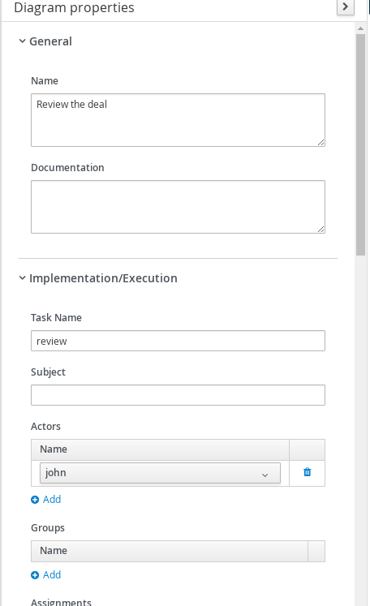

# Kogito with persistence powered by Mongo DB

## Description

A quickstart project that processes deals for travellers. It utilizes process composition to split the work of

* submitting a deal
* reviewing a deal

At the same time shows simplified version of a approval process that waits for human actor to provide review.

This example shows

* exposing Submit Deal as public service
* each process instance is going to be evaluated and asks for review
* at any point in time service can be shutdown and when brought back it will keep the state of the instances

Note: The use of this example shows that the data sent to mongodb is saved, you can shut down the application and restart it
and as long as mongodb is running after you restart you should still see the data

It utilizes MongoDB server as the backend store. 
	
* Process (submitDeal.bpmn)	
<p align="center"></p>

* Process Properties (top)
<p align="center"></p>

* Process Properties (bottom)
<p align="center"></p>

* Call a deal	
<p align="center"></p>

* Call a deal (Assignments)
<p align="center"></p>

* Print review the Deal	
<p align="center"></p>

* Subprocess (reviewDeal.bpmn)
<p align="center"></p>

* Deal Review (top)
<p align="center"></p>

* Deal Review (bottom)
<p align="center"></p>

* Review deal user task	(top)
<p align="center"></p>

* Review deal user task (bottom)
<p align="center"></p>

* Review deal user task	(Assignments)
<p align="center"></p>

## Infrastructure requirements

This quickstart requires an MongoDB server to be available and by default expects it to be on default port (27017) and localhost.
The default database is "kogito" or you can provide the database name using property - spring.data.mongodb.database.
You must set property - kogito.persistence.type=mongodb
For more details you can check applications.properties.

* MongoDB installed and running	
<p align="center"></p>

## Build and run

### Prerequisites
 
You will need:
  - Java 11+ installed 
  - Environment variable JAVA_HOME set accordingly
  - Maven 3.6.2+ installed

### Enable MongoDB configuration

By default, MongoDB configuration properties are commented, due to conflict if configuration is coming from outside the code.  
You should uncomment the commented `spring.data.mongodb` variables from [properties](./src/main/resources/application.properties) file.

### Compile and Run in Local Dev Mode

```
mvn clean package spring-boot:run    
```

NOTE: With dev mode of Quarkus you can take advantage of hot reload for business assets like processes, rules, decision tables and java code. No need to redeploy or restart your running application.


### Compile and Run using uberjar

```
mvn clean package 
```
  
To run the generated native executable, generated in `target/`, execute

```
java -jar target/process-mongodb-persistence-springboot.jar
```

### OpenAPI (Swagger) documentation
[Specification at swagger.io](https://swagger.io/docs/specification/about/)

You can take a look at the [OpenAPI definition](http://localhost:8080/docs/swagger.json) - automatically generated and included in this service - to determine all available operations exposed by this service. For easy readability you can visualize the OpenAPI definition file using a UI tool like for example available [Swagger UI](https://editor.swagger.io).

In addition, various clients to interact with this service can be easily generated using this OpenAPI definition.


### Submit a deal

To make use of this application it is as simple as putting a sending request to `http://localhost:8080/deals`  with following content 

```
{
"name" : "my fancy deal",
"traveller" : { 
  "firstName" : "John", 
  "lastName" : "Doe", 
  "email" : "jon.doe@example.com", 
  "nationality" : "American",
  "address" : { 
  	"street" : "main street", 
  	"city" : "Boston", 
  	"zipCode" : "10005", 
  	"country" : "US" }
  }
}

```

Complete curl command can be found below:

```
curl -X POST -H 'Content-Type:application/json' -H 'Accept:application/json' -d '{"name" : "my fancy deal", "traveller" : { "firstName" : "John", "lastName" : "Doe", "email" : "jon.doe@example.com", "nationality" : "American","address" : { "street" : "main street", "city" : "Boston", "zipCode" : "10005", "country" : "US" }}}' http://localhost:8080/deals
```

this will then trigger the review user task that you can work with.

### Get review task for given deal

First you can display all active reviews of deals

```
curl -H 'Content-Type:application/json' -H 'Accept:application/json' http://localhost:8080/dealreviews
```

based on the response you can select one of the reviews to see more details

```
curl -H 'Content-Type:application/json' -H 'Accept:application/json' http://localhost:8080/dealreviews/{uuid}/tasks?user=john
```

where uuid is the id of the deal review you want to work with.

Next you can get the details assigned to review user task by

```
curl -H 'Content-Type:application/json' -H 'Accept:application/json' http://localhost:8080/dealreviews/{uuid}/review/{tuuid}?user=john
```

where uuid is the id of the deal review and tuuid is the id of the user task you want to get


### Complete review task for given deal

Last but not least you can complete review user task by

```
curl -X POST -H 'Content-Type:application/json' -H 'Accept:application/json' -d '{"review" : "very good work"}' http://localhost:8080/dealreviews/uuid/review/{tuuid}?user=john
```

where uuid is the id of the deal review and tuuid is the id of the user task you want to get

* Review Log should look similar to 	

```
Review of the deal very good work for traveller Doe
```
You can also query the process instance information and model variables from the database and review the same using tools like MongoDB Compass, download community version from below link
https://www.mongodb.com/try/download/compass
