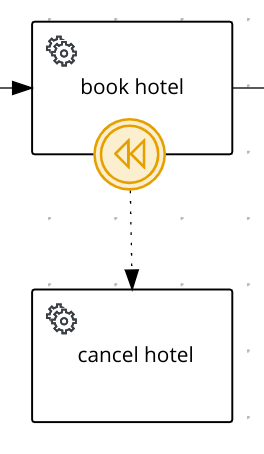
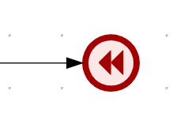
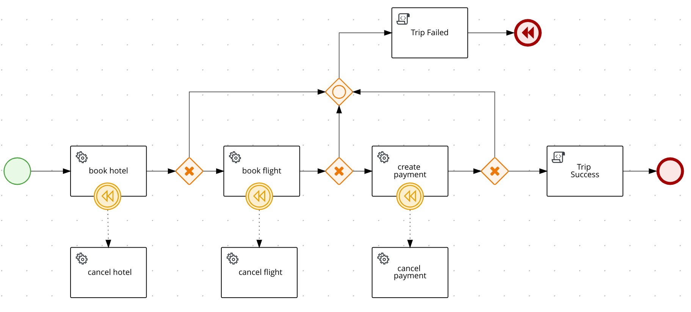

# Saga Process example with Quarkus

## Description

Service to demonstrate how to implement Saga pattern based on BPMN process with Kogito. The used example is based on a
 Trip reservation process with a sequence of steps that could represent calls to external services/microservices.
 All of each steps `book hotel`, `book flight` and `create payment` should be executed to confirm a Trip, if any of the
  steps fail, then a compensation for each completed step should be executed to undo the operation or to keep the
   process on a consistent state. For instance, the book hotel step, should cancel the hotel booking. The
    compensations for the steps are represented in the process using a boundary `Intermediate Catching Compensation
Event` attached to the respective step to be compensated.          



The catching compensation events can be triggered by an `Intermediate Throwing Compensation Event` or the
 ` Compensation End Event` in any point of the process that represents an error or inconsistent state, like a response
  from a service.
 
 

The steps and compensations actions in the process example are implemented as service tasks using a Java class under
 the `src` of the project, and for this example they are just mocking responses, but in a real use case they
  could be executing calls to external services through REST, or any other mechanism depending on the architecture. 
 
 The start point of the trip process is to submit a request to create a new trip with a given `tripId`, this could be
  any  other payload that represents a `Trip`, but for the sake of simplicity, in this example it will be
   based on the `id`.
  The output of each step, is represented by a `Response` that contains a type, indicating <b>success</b> or <b>error
  </b> and the id of the resource that was invoked in the service, but this could be any kind of response depending on
   the requirement of each service.

## Trip Saga process

This is the BPMN process that represents the Trip Saga, and it is the one being used in the project to be built using
 kogito.



## Installing and Running

### Prerequisites

You will need:
  - Java 11+ installed
  - Environment variable JAVA_HOME set accordingly
  - Maven 3.6.2+ installed

When using native image compilation, you will also need:
  - [GraalVM 19.1.1](https://github.com/oracle/graal/releases/tag/vm-19.1.1) installed
  - Environment variable GRAALVM_HOME set accordingly
  - Note that GraalVM native image compilation typically requires other packages (glibc-devel, zlib-devel and gcc) to be installed too.  You also need 'native-image' installed in GraalVM (using 'gu install native-image'). Please refer to [GraalVM installation documentation](https://www.graalvm.org/docs/reference-manual/aot-compilation/#prerequisites) for more details.

### Compile and Run in Local Dev Mode

```
mvn clean compile quarkus:dev
```

### Package and Run in JVM mode

```
mvn clean package
java -jar target/process-saga-quarkus-runner.jar
```

### Package and Run using Local Native Image
Note that this requires GRAALVM_HOME to point to a valid GraalVM installation

```
mvn clean package -Pnative
```

To run the generated native executable, generated in `target/`, execute

```
./target/process-saga-quarkus-runner
```

Note: Native builds does not yet work on Windows, GraalVM and Quarkus should be rolling out support for Windows soon.

## OpenAPI (Swagger) documentation
[Specification at swagger.io](https://swagger.io/docs/specification/about/)

You can take a look at the [OpenAPI definition](http://localhost:8080/openapi?format=json) - automatically generated and included in this service - to determine all available operations exposed by this service. For easy readability you can visualize the OpenAPI definition file using a UI tool like for example available [Swagger UI](https://editor.swagger.io).

In addition, various clients to interact with this service can be easily generated using this OpenAPI definition.

When running in either Quarkus Development or Native mode, we also leverage the [Quarkus OpenAPI extension](https://quarkus.io/guides/openapi-swaggerui#use-swagger-ui-for-development) that exposes [Swagger UI](http://localhost:8080/swagger-ui/) that you can use to look at available REST endpoints and send test requests.

## Usage

Once the service is up and running, you can use the following examples to interact with the service. Note that rather than using the curl commands below, you can also use the [Swagger UI](http://localhost:8080/swagger-ui/) to send requests.

### Creating a new trip

#### POST /trip

Allows to create a new trip with the given data:

Given data:

```json
{
    "tripId" : "03e6cf79-3301-434b-b5e1-d6899b5639aa"
    
}
```

Curl command (using the JSON object above):

```sh
curl -H "Content-Type: application/json" -X POST http://localhost:8080/trip -d '{"tripId" : "03e6cf79-3301-434b-b5e1-d6899b5639aa"}'
```
The response for the trip reservation is returned with the attributes representing the response of each step, either
 success or failure. The `tripResponse` attribute indicates if the trip can be confirmed in case of success or
  canceled in case of error.

Response example:

```json
    {
        "id": "902a2caa-4ed0-4675-96e8-1434e1ea5bde",
        "paymentResponse": {
            "type": "SUCCESS",
            "resourceId": "af87e7b8-e455-4170-96e0-8bf23081158a"
        },
        "tripResponse": {
            "type": "SUCCESS",
            "resourceId": "03e6cf79-3301-434b-b5e1-d6899b5639aa"
        },
        "failService": null,
        "hotelResponse": {
            "type": "SUCCESS",
            "resourceId": "54101773-9a20-4e53-963c-353891ed8517"
        },
        "tripId": "03e6cf79-3301-434b-b5e1-d6899b5639aa",
        "flightResponse": {
            "type": "SUCCESS",
            "resourceId": "523d33be-815c-44f7-b52b-2337b770872d"
        }
    }
```

In the console executing the application you can check the log it with the executed steps.

```text
2020-11-05 16:23:32,478 INFO  [org.kie.kog.HotelService] (executor-thread-198) Book Hotel for t 3e6cf79-3301-434b-b5e1-d6899b5639aa
2020-11-05 16:23:32,481 INFO  [org.kie.kog.FlightService] (executor-thread-198) Book Flight for t 3e6cf79-3301-434b-b5e1-d6899b5639aa
2020-11-05 16:23:32,481 INFO  [org.kie.kog.PaymentService] (executor-thread-198) Create Payment for t 3e6cf79-3301-434b-b5e1-d6899b5639aa
Trip Success
```

#### Simulating errors to activate the compensation flows

To make testing the process easier it was introduced an optional attribute `failService` that indicates which service
 should respond with an error. The attribute is basically the simple class name of the service.

Example:

```json
{
    "tripId" : "03e6cf79-3301-434b-b5e1-d6899b5639aa",
    "failService" : "PaymentService"    
}
```
Curl command (using the JSON object above):

```sh
curl -H "Content-Type: application/json" -X POST http://localhost:8080/trip -d '{"tripId" : "03e6cf79-3301-434b-b5e1-d6899b5639aa", "failService" : "PaymentService"}' 
```

Response example:

```json
{
    "id": "623f87c1-03ab-42e5-a1f4-e89b26cda769",
    "paymentResponse": {
        "type": "ERROR",
        "resourceId": "76d77805-3b28-445d-b38d-5796930d9996"
    },
    "tripResponse": {
        "type": "ERROR",
        "resourceId": "03e6cf79-3301-434b-b5e1-d6899b5639aa"
    },
    "failService": "PaymentService",
    "hotelResponse": {
        "type": "SUCCESS",
        "resourceId": "7ff1b4df-f999-4306-bc1d-e45cc7206695"
    },
    "tripId": "03e6cf79-3301-434b-b5e1-d6899b5639aa",
    "flightResponse": {
        "type": "SUCCESS",
        "resourceId": "e2441697-f548-48be-aa1c-120e71bcd488"
    }
}
```

In the console executing the application you can check the log it with the executed steps.

```text
2020-11-05 16:51:10,653 INFO  [org.kie.kog.HotelService] (executor-thread-199) Book Hotel for t 03e6cf79-3301-434b-b5e1-d6899b5639aa
2020-11-05 16:51:10,654 INFO  [org.kie.kog.FlightService] (executor-thread-199) Book Flight for t 03e6cf79-3301-434b-b5e1-d6899b5639aa
2020-11-05 16:51:10,654 INFO  [org.kie.kog.PaymentService] (executor-thread-199) Create Payment for t 03e6cf79-3301-434b-b5e1-d6899b5639aa
Trip Failed
2020-11-05 16:51:10,656 INFO  [org.kie.kog.PaymentService] (executor-thread-199) Cancel Payment for t 03e6cf79-3301-434b-b5e1-d6899b5639aa
2020-11-05 16:51:10,656 INFO  [org.kie.kog.FlightService] (executor-thread-199) Cancel Flight for t 03e6cf79-3301-434b-b5e1-d6899b5639aa
2020-11-05 16:51:10,657 INFO  [org.kie.kog.HotelService] (executor-thread-199) Cancel Hotel for t 03e6cf79-3301-434b-b5e1-d6899b5639aa
```


## Deploying with Kogito Operator

In the [`operator`](operator) directory you'll find the custom resources needed to deploy this example on OpenShift with the [Kogito Operator](https://docs.jboss.org/kogito/release/latest/html_single/#chap_kogito-deploying-on-openshift).
