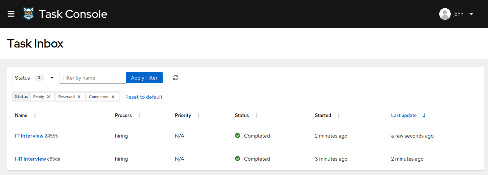

# Process user task orchestration: Hiring

## Description

This Quickstart showcases a basic implementation of the **Hiring** process. 

For simplicity, this example doesn't include any authentication mechanism, so all tasks will be assigned to a default user `john`.
This quickstart project shows very typical user task orchestration

<p align="center"></p>

The required *Kogito and Infrastructure Services* for this example are:

- Infinispan
- Kafka
- Kogito Data Index
- Kogito Management Console
- Kogito Task Console

## Running the Quickstart

### Prerequisites

* Java 11+ installed
* Environment variable JAVA_HOME set accordingly
* Maven 3.6.2+ installed
* Docker and Docker Compose to run the required example infrastructure.

And when using native image compilation, you will also need: 
  - GraalVM 19.3+ installed
  - Environment variable GRAALVM_HOME set accordingly
  - GraalVM native image needs as well native-image extension: https://www.graalvm.org/docs/reference-manual/native-image/
  - Note that GraalVM native image compilation typically requires other packages (glibc-devel, zlib-devel and gcc) to be installed too, please refer to GraalVM installation documentation for more details.

### Starting the Kogito and Infrastructure Services

This quickstart provides a docker compose template that starts all the required services. This setup ensures that all services are connected with a default configuration.

<p align="center"></p>

You should start all the services before you execute any of the **Hiring** example, to do that please execute:

For Linux and MacOS:

1. Open a Terminal
2. Go to the process-usertasks-quarkus folder at kogito-examples

```bash
cd <path_to_process-usertasks-quarkus>/docker-compose
```

3. Run the ```startServices.sh``` script

```bash
sh ./startServices.sh
```

Once all services bootstrap, the following ports will be assigned on your local machine:

- Infinispan: 11222
- Kafka: 9092
- Data Index: 8180
- Management Console: 8280
- Task Console: 8380

> **_NOTE:_**  This step requires the project to be compiled, please consider running a ```mvn clean compile``` command on the project root before running the ```startServices.sh``` script for the first time or any time you modify the project.

Once started you can simply stop all services by executing the ```docker-compose stop```.

All the created containers can be removed by executing the ```docker-compose rm```.


### Compile and Run Hiring example process in Local Dev Mode

Once all the infrastructure services are ready, you can start the Hiring example by doing:

1. Open a Terminal
2. Go to the process-usertasks-quarkus folder at kogito-examples
```bash
cd <path_to_process-usertasks-quarkus>/
```
3.- Start the example with the command
```bash
mvn clean package quarkus:dev
```

NOTE: With dev mode of Quarkus you can take advantage of hot reload for business assets like processes, rules, decision tables and java code. No need to redeploy or restart your running application.


### Package and Run in JVM mode

```sh
mvn clean package
java -jar ./target/process-usertasks-quarkus-extended-runner.jar
```

or on windows

```sh
mvn clean package
java -jar target\process-usertasks-quarkus-extended-runner.jar
```

### Package and Run using Local Native Image
Note that this requires GRAALVM_HOME to point to a valid GraalVM installation

```sh
mvn clean package -Pnative
```

To run the generated native executable, generated in `target/`, execute

```sh
./target/process-usertasks-quarkus-extended-runner
```

### Submit a request to start new hiring

Once the service is up and running you can make use of the **Hiring** application by a sending request to `http://localhost:8080/hiring`  with following content:
```json
{   
    "candidate": {
        "name": "Jon Snow",
        "email": "jsnow@example.com",
        "salary": 30000,
        "skills": "Java, Kogito"
    }
}
```

In a Terminal you can execute this command to start a **Hiring** process for the "Jon Snow" candidate:
```bash
curl -H "Content-Type: application/json" -H "Accept: application/json" -X POST http://localhost:8080/hiring -d @- << EOF
{   
    "candidate": {
        "name": "Jon Snow",
        "email": "jdoe@example.com",
        "salary": 30000,
        "skills": "Java, Kogito"
    }
}
EOF
```

### Show active Hiring process instance at Kogito Management Console

To access the Kogito Management Console just open your browser and navigate to ``http://localhost:8280``.

<p align="center">
    
</p>

> **_NOTE:_**  For more information about how to work with Kogito Management Console, please refer to the [Kogito Documentation](https://docs.jboss.org/kogito/release/latest/html_single/#con-management-console_kogito-developing-process-services) page.

Check the process instance details to see where is the execution path 

<p align="center">
    
</p>

### Execute HR Interview task at Kogito Task Console

To access the Kogito Task Console just open your browser and navigate to ``http://localhost:8380`` and you should be redirected to the **Task Inbox**.

<p align="center">
    
</p>

> **_NOTE:_**  For more information about how to work with Kogito Task Console, please refer to the [Kogito Documentation](https://docs.jboss.org/kogito/release/latest/html_single/#con-task-console_kogito-developing-process-services) page.

Access to HR Interview task and complete
  
<p align="center">
    
</p>

Check the process instance details at Kogito Management console to see the execution path reflects the completed task

<p align="center">
    
</p>


### Execute IT Interview task

Access to Task Console again and verify IT Interview is available  
<p align="center">
    
</p>

Access to HR Interview task  
<p align="center">
    
</p>

And after complete the task, check the list of tasks show both completed tasks  
<p align="center">
    
</p>

Check the process instance details to verify the instance have been completed 

<p align="center">
    
</p>
