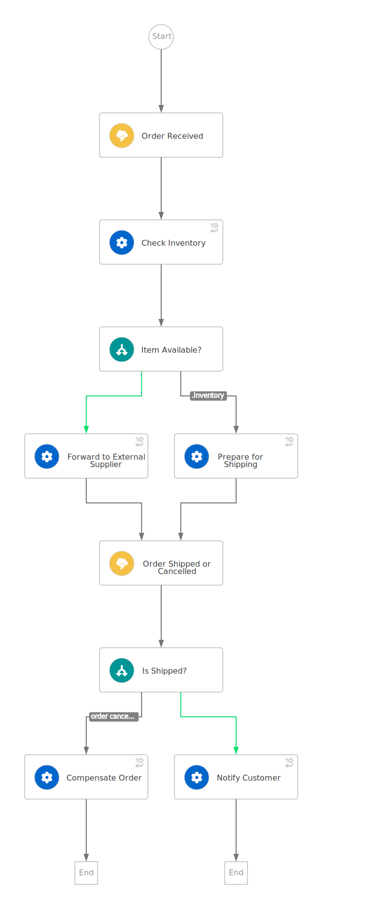

# Serverless Operator - Inventory Example

## Description

This example is meant to let you understand how to deploy on Kubernetes the [Inventory Logic Tutorial](https://redhat-scholars.github.io/serverless-workflow/osl/index.html) using the [Operator](https://github.com/apache/incubator-kie-kogito-serverless-operator).
We'll report here for this reason only a short summary of the workflow use case, and we'd suggest you [read the complete documentation](https://redhat-scholars.github.io/serverless-workflow/osl/index.html) about this tutorial if you need more details about it.

### Use Case

An e-commerce company has to implement the following **order management** workflow:

* When a new order comes in, they need to **check the inventory** for the availability of the items. If the items are available the order will be **prepared for shipping** (picking, packaging, printing label, etc), when the shipping is completed, the shipping department sends an event back to the workflow, and the customer is **notified** about the shipping status with usual tracking information.
* If the item is out of stock, the order will be forwarded to an **external supplier** who will take care of the shipping procedure, when the **supplier ships** the order, it also sends an event back to the workflow, in such a way the workflow can continue and **send the notification** to the customer.
* As long as the order is not shipped, the customer has the option of **canceling the order** by also canceling the shipping.

The following picture shows a high-level design:



## Deploy the Inventory workflow on Kubernetes 

### Prepare your environment

1. Install [minikube](https://minikube.sigs.k8s.io/docs/start/)
2. Install the [Operator](https://kiegroup.github.io/kogito-docs/serverlessworkflow/latest/cloud/operator/install-serverless-operator.html)

### Deploy the Workflow with Quarkus in Dev Mode
In the [resources](./resources/) directory you can find the Kubernetes Custom Resources (CR) that you need in order to deploy this workflow on your cluster in dev mode.

To do this you only need to apply these resources using the following commands:

```bash
kubectl create namespace my-workflows
kubectl apply -f ./resources/ -n my-workflows
```

### Test that the workflow is running

Open a new terminal and start the flow with the following command:

```shell
#!/bin/sh
ADDRESS=$(kubectl get workflow -n my-workflows -o custom-columns="URL":.status.address.url --no-headers)
curl -X POST $ADDRESS \
  -H 'Content-Type:application/json' -H 'Accept:application/json' \
  -d '{ "orderId": "order-123" }'
```

You should get back the output which resembles the following:

```shell
{"id":"7484e05f-3b95-4ac7-8c09-a2c717a0293e","workflowdata":{"orderId":"order-123"}}
```

In the other terminal where the workflow is running you can spot the following message in the log:
```shell
Order received: order-123
```

**CONGRATULATION!!!** Your first workflow was executed as expected!
