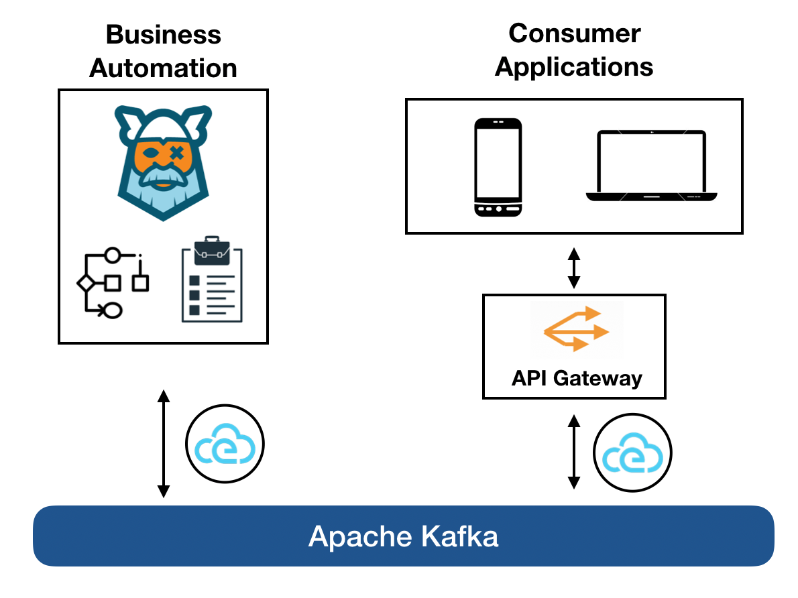
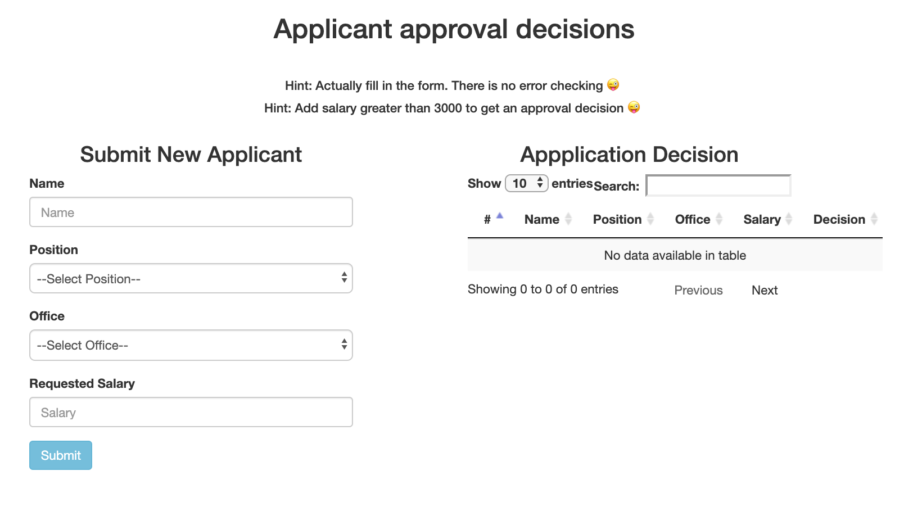
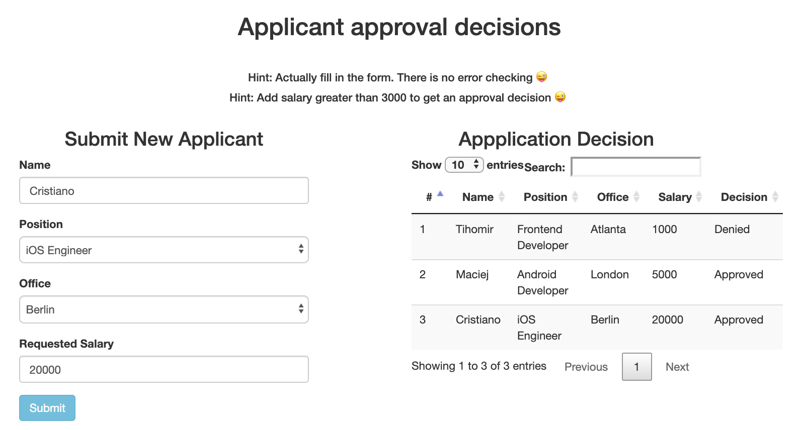

# Kogito Serverless Workflow - Job Application Events Example

## Description

This example showcases the use of [Serverless Workflow specification](https://github.com/cncf/wg-serverless/tree/master/workflow/spec) 
markup to create a job application decision workflow.
It also showcases the power of Kogito to create a completely event-driven services example.
The UI and workflow service communicate only over events (CloudEvents format) that are streamed
to Kafka topics.

Here is the overall architecture of this example:

<p align="center">

</p>

## Installing and Running

### Prerequisites
 
You will need:
  - Java 11+ installed
  - Environment variable JAVA_HOME set accordingly
  - Maven 3.6.2+ installed
  - Apache Kafka installed

When using native image compilation, you will also need: 
  - [GraalVm](https://www.graalvm.org/downloads/) 19.3.1+ installed
  - Environment variable GRAALVM_HOME set accordingly
  - Note that GraalVM native image compilation typically requires other packages (glibc-devel, zlib-devel and gcc) to be installed too.  You also need 'native-image' installed in GraalVM (using 'gu install native-image'). Please refer to [GraalVM installation documentation](https://www.graalvm.org/docs/reference-manual/aot-compilation/#prerequisites) for more details.

### Infrastructure requirements

This quickstart requires Apache Kafka to be available and by default expects it to be on default port and localhost.

* Install and Startup Kafka Server / Zookeeper

https://kafka.apache.org/quickstart

### Compile and Run in Local Dev Mode

```text
mvn clean compile quarkus:dev    
```

### Package and Run in JVM mode

```text
mvn clean package 
java -jar target/serverless-workflow-events-quarkus-runner.jar    
```

or on windows

```text
mvn clean package
java -jar target\serverless-workflow-events-quarkus-runner.jar
```

### Package and Run using Local Native Image
Note that this requires GRAALVM_HOME to point to a valid GraalVM installation

```text
mvn clean package -Pnative
```
  
To run the generated native executable, generated in `target/`, execute

```text
./target/serverless-workflow-events-quarkus-runner
```

### Running the Example

After starting the example application you can access the front-end page at:

```text
http://localhost:8080/applicants.html
```

You should see the following page:

<p align="center">

</p>

Fill in the "Submit New Applicant" form and submit it. This will send a cloud event
to Kafka which starts a new workflow instance. The workflow include a rule action
which evaluates the salary entered. Before the workflow execution ends
it sends a cloud event to kafka. The UI subscribes to these events using SSE and 
updates the "Application Decision" table withe the results, for example:

<p align="center">

</p>