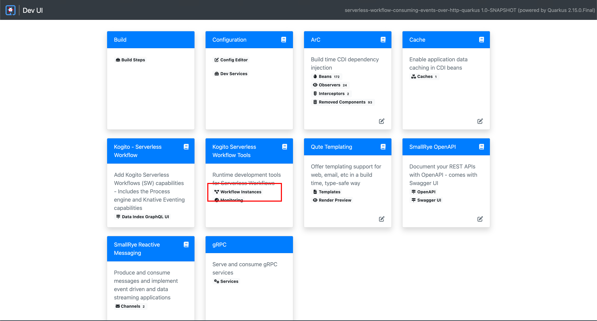
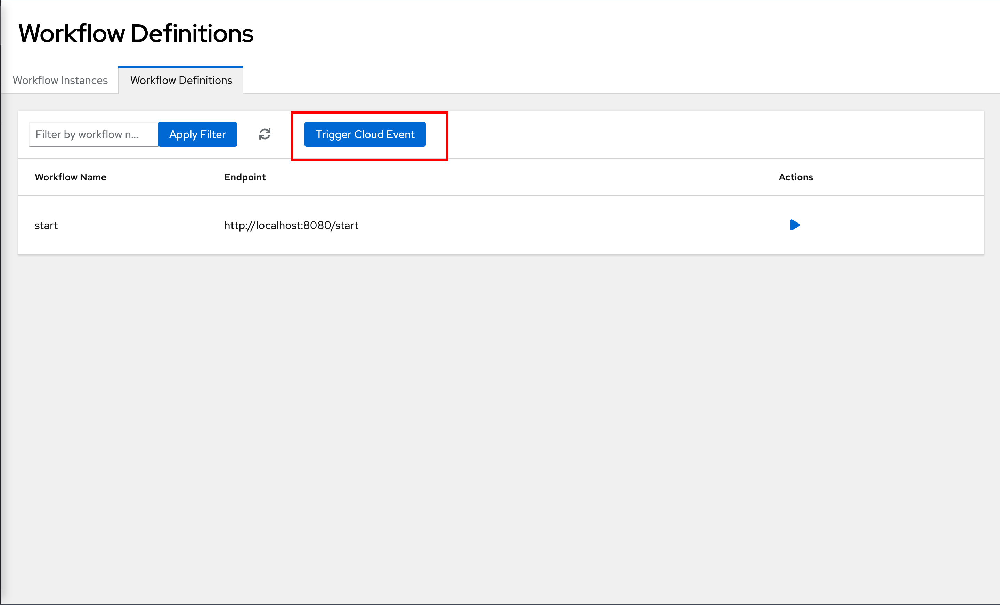
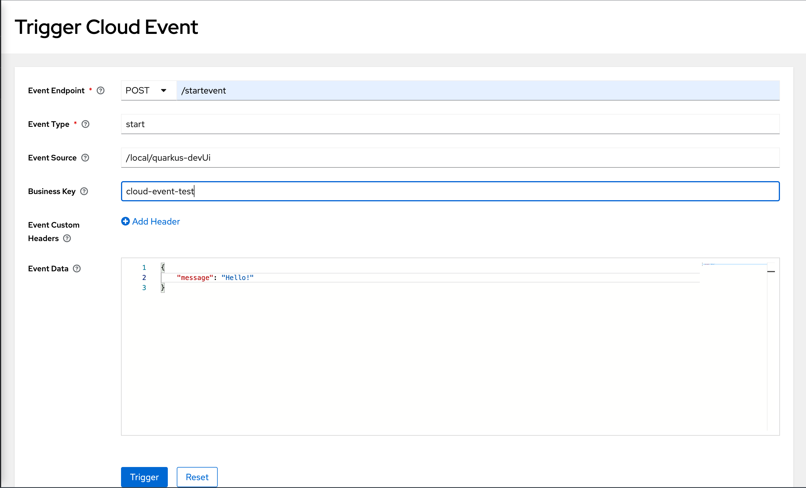
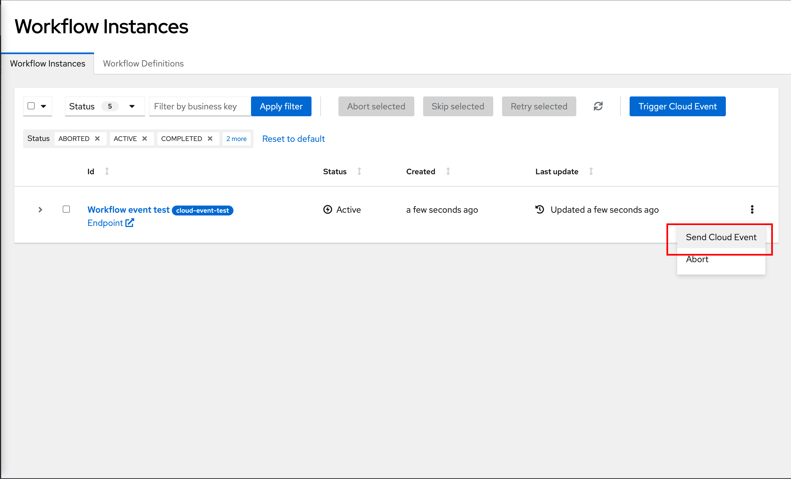
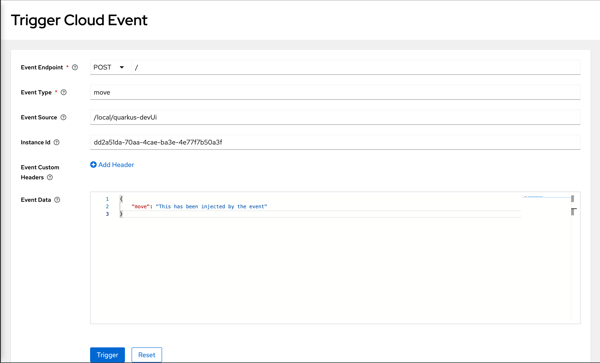
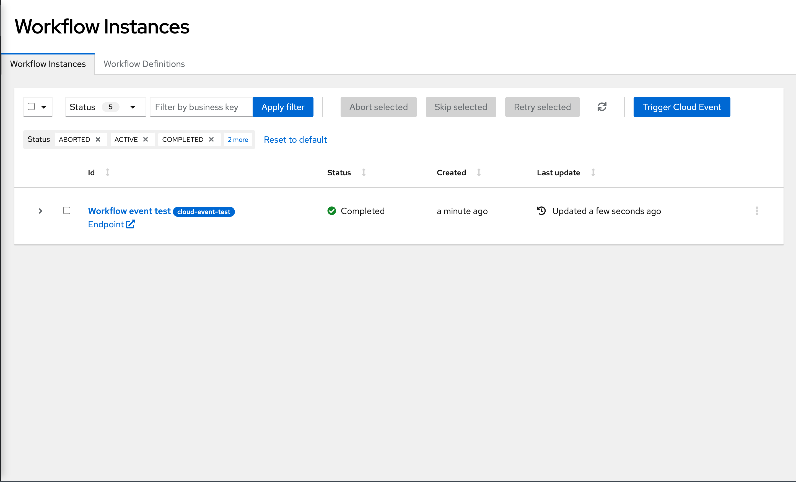

# Kogito Serverless Workflow - Consuming Events Over HTTP Example

## Description

This example contains a simple workflow service that consumes events over HTTP. 
The service is described using JSON format as defined in the 
[CNCF Serverless Workflow specification](https://github.com/serverlessworkflow/specification).
It's a simple workflow that, after starting, waits for an event to be published over HTTP.
Then the workflow prints the event content to the console when the event is received.

To go further on using HTTP with Reactive Messaging, take a look at [this article](https://quarkus.io/guides/reactive-messaging-http.html).

This is the infrastructure required to integrate with [Knative Eventing](https://knative.dev/docs/eventing/).

> Knative Eventing uses standard HTTP POST requests to send and receive events between event producers and sinks. These events conform to the CloudEvents specifications, which enables creating, parsing, sending, and receiving events in any programming language.

## Installing and Running

### Prerequisites
 
You will need:
  - Java 17+ installed
  - Environment variable JAVA_HOME set accordingly
  - Maven 3.9.6+ installed
  - [Docker Engine](https://docs.docker.com/engine/) and [Docker Compose](https://docs.docker.com/compose/) installed

When using native image compilation, you will also need: 
  - [GraalVm](https://www.graalvm.org/downloads/) 19.3.1+ installed
  - Environment variable GRAALVM_HOME set accordingly
  - Note that GraalVM native image compilation typically requires other packages (glibc-devel, zlib-devel and gcc) to be installed too.  You also need 'native-image' installed in GraalVM (using 'gu install native-image'). Please refer to [GraalVM installation documentation](https://www.graalvm.org/docs/reference-manual/aot-compilation/#prerequisites) for more details.

### Compile and Run in Local Dev Mode

```sh
mvn clean package quarkus:dev
```

### Compile and Run in JVM mode

```sh
mvn clean package 
java -jar target/quarkus-app/quarkus-run.jar
```

or on Windows

```sh
mvn clean package
java -jar target\quarkus-app\quarkus-run.jar
```

### Compile and Run using Local Native Image
Note that this requires GRAALVM_HOME to point to a valid GraalVM installation

```sh
mvn clean package -Pnative
```
  
To run the generated native executable, generated in `target/`, execute

```sh
./target/serverless-workflow-compensation-quarkus-{version}-runner
```

### Submit a request

The service based on the JSON workflow definition can be started by publishing an HTTP event to 'http://localhost:8080/startevent'
with following content:

```json
{
  "specversion": "1.0",
  "id": "dad76364-1cf1-48ca-bf95-485a511f8707",
  "source": "",
  "type": "start",
  "kogitobusinesskey": "cloud-event-test",
  "time": "2023-01-17T15:35:29.967831-03:00",
  "data": {
    "message": "Hello!"
  }
}
```

Complete curl command can be found below:

```sh
curl -X POST -H 'Content-Type:application/json' -H 'Accept:application/json' -d  '{"specversion":"1.0","id": "dad76364-1cf1-48ca-bf95-485a511f8707","source":"","type":"start","kogitobusinesskey": "cloud-event-test","time":"2023-01-17T15:35:29.967831-03:00","data":{"message":"Hello!"}}' http://localhost:8080/startevent
```

After executing the command, in the Quarkus console log may appear some messages printed. The first one notifying that an
instance of the 'start' workflow has been started with a given id (notice that the id might change), for example like:
```shell
Starting workflow 'start' (4a254d46-0cbf-41f8-8e27-15b3da625561)
```

You may also find another one printing the `message` we send in the event `data`.
```shell
[ "Hello" ]
```

At this point, your workflow is waiting for an event to be published over HTTP. Send the following event: (You should
use in "kogitoprocrefid" field the id returned by the previous request)

```json
{
  "specversion":"1.0",
  "source":"",
  "type":"move",
  "time":"2023-01-17T15:35:29.967831-03:00",
  "kogitoprocrefid":"4a254d46-0cbf-41f8-8e27-15b3da625561",
  "data":{
    "move":"This has been injected by the event"
  }
}
```

Complete curl command can be found below:

```shell
curl -X POST -H 'Content-Type:application/json' -H 'Accept:application/json' -d '{"specversion":"1.0","id":"e4604756-f58e-440e-9619-484b92408308","source":"","type":"move","time":"2023-01-17T15:35:29.967831-03:00","kogitoprocrefid":"4a254d46-0cbf-41f8-8e27-15b3da625561","data":{"move":"This has been injected by the event"}}' http://localhost:8080/move
```

The workflow will consume the event and print the message you sent to the console.

```shell
[ "Hello", "This has been injected by the event" ]
```

### Running the example from Quarkus Dev UI

This example can also be tested by using the `Kogito Serverless Workflows Tools` UI in the Quarkus Dev UI, to do so, just
start the example in Dev Mode:

```sh
mvn clean package quarkus:dev
```

In the browser type to `http://localhost:8080/q/dev` show the Quarkus Dev UI, and then open the `Kogito Serverless Workflows Tools` 
by clicking in `Workflow Instances`.



Once the `Workflow Instances` is opened, click on the `Workflow Definitions` tab. There you'll see the list of
workflows available in your project (in this example the table should display only the `start` workflow). 
This screen allows you to start an instance of any of the workflows in the table.



To trigger the event that will initiate the workflow, just click the `Trigger Cloud Event` and you'll be forwarded to the 
`Trigger Cloud Event` Page where a form will appear to fill in the event data. For this example use the following data:

- Event Endpoint:
  - method: "POST"
  - path: "/startevent"
- Event type: "start"
- Event Source: <`any`>
- Business Key: "cloud-event-test"
- Custom Headers: <`empty - not required for this example`>
- Event Data:
```json
{
  "message": "Hello!"
}
```

And click on the `Trigger` button to trigger the event and start the workflow instance.



If everything went well, a success notification message will appear that will let you go back to the 
`Workflow Instances` Page. Once there you should be able to see that a new workflow instance in `Active` state waiting 
for the `move` event to move forward.

In order to trigger the event that will move the workflow, you can just click in the `Send Cloud Event` available in actions Kebab.



This again will open the `Trigger Cloud Event` Page, but in this case it's configured to notify the selected workflow instance.
Notice that there's no `Business Key` and it has the `Instance Id` field already filled with the right Id. 
To trigger the `move` event, please fill the form with the following data:

- Event Endpoint:
    - method: "POST"
    - path: "/"
- Event type: "move"
- Event Source: <`any`>
- Instance Id: <`leave current value`>
- Custom Headers: <empty - not required for this example>
- Event Data:
```json
{
  "move":"This has been injected by the event"
}
```

And click on the `Trigger` button to trigger the `move` event so the workflow can advance.

> **Note:**
> This screen can also be accessed by clicking the `Trigger Cloud Event` button on the `Workflow Instances` page, but 
> it'll require manually typing the `Instance Id`. 



After the success message appears, if you go back to the `Workflow Instances` page you should see that the workflow 
instance now appears in `Complete` state.



### Building and Deploying Workflow using CLI + Kogito Serverless Workflow Operator
For this prepare your environment by following the instructions from [here]().

Refer to [Serverless Workflow Guide](), to know how to build and deploy workflows using CLI + Kogito Serverless Workflow Operator.
Refer to [Serverless Workflow Guide](https://kiegroup.github.io/kogito-docs/serverlessworkflow/latest/cloud/index.html), to know more about Kogito Serverless Workflow Operator.
