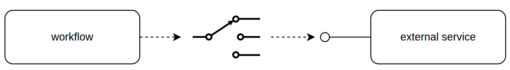
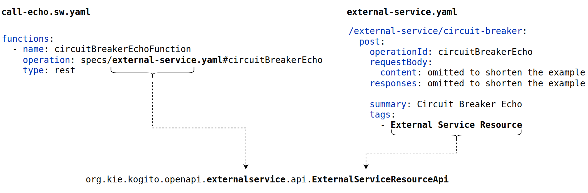
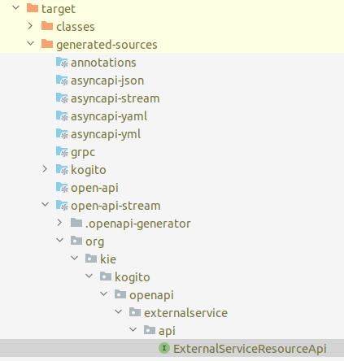

# Kogito Serverless Workflow Fault Tolerance

This example shows how to configure fault tolerance alternatives when you work with workflows.

## Circuit Breaker Pattern

Every REST call executed by a workflow can be configured to use the Circuit Breaker Pattern.



The internals of the pattern configuration and execution are based on the [MicroProfile Fault Tolerance](https://github.com/eclipse/microprofile-fault-tolerance/) specification,
and the corresponding [Smallrye Fault Tolerance](https://github.com/smallrye/smallrye-fault-tolerance) implementation shipped with Quarkus.

The following example shows how to configure the [call-echo](src/main/resources/call-echo.sw.yml) workflow to use the Circuit Breaker Pattern to execute the `circuitBreakerEcho` operation provided by the [external-service](src/main/resources/specs/external-service.yaml).

### Build time configurations


To enable and configure the Circuit Breaker you must follow this procedure:

1. Add the following maven dependency to your project:
````
<dependency>
    <groupId>io.quarkus</groupId>
    <artifactId>quarkus-smallrye-fault-tolerance</artifactId>
</dependency>
````

2. Enable the Circuit Breaker

When a workflow uses REST calls, behind the scene, a set of classes are generated to support these invocations.
In general, the generation is transparent, and you don't need to pay attention on it.

However, to enable the Circuit Breaker, you must provide some configurations that are related to that generation, and impacts the generated code.

The first step is to find the generated Java class name that is registered as the Microprofile Rest Client to access the external service.

The following picture shows how this class name is calculated at code generation time:



We recommend that you build the project and inspect the generated sources under the directory `target/generated-sources/open-api-stream/org/kie/kogito/openapi`:




By default, when the Circuit Breaker is not enabled, the generated signature for the Java method corresponding to the `circuitBreakerEcho` operation will look like this:

````
@io.quarkiverse.openapi.generator.markers.OperationMarker(name="", openApiSpecId="external_service_yaml", operationId="circuitBreakerEcho", method="POST", path="/external-service/circuit-breaker")
@jakarta.ws.rs.POST
@jakarta.ws.rs.Path("/circuit-breaker")
@jakarta.ws.rs.Consumes({"text/plain"})
@jakarta.ws.rs.Produces({"application/json"})
@io.quarkiverse.openapi.generator.annotations.GeneratedMethod("circuitBreakerEcho")
public EchoResponse circuitBreakerEcho(
    String body
);
````

Given the class name `org.kie.kogito.openapi.externalservice.api.ExternalServiceResourceApi`, and the method `circuitBreakerEcho`, 
to enable the Circuit Breaker, you must add the following entry in the `application.properties`:

````
org.kie.kogito.openapi.externalservice.api.ExternalServiceResourceApi/circuitBreakerEcho/CircuitBreaker/enabled=true
````

In general, for any other operation you must follow this pattern:

`<classname>/<methodname>/CircuitBreaker/enabled=true`

* classname: is the fully qualified name of the generated class.
* methodname: is the name of the method corresponding to the given operation.


> **NOTE:** Every operation must be configured individually, and different operations might be located in different classes.

After adding the configuration, the next build will generate the following signature:

````
@io.quarkiverse.openapi.generator.markers.OperationMarker(name="", openApiSpecId="external_service_yaml", operationId="circuitBreakerEcho", method="POST", path="/external-service/circuit-breaker")
@jakarta.ws.rs.POST
@jakarta.ws.rs.Path("/circuit-breaker")
@jakarta.ws.rs.Consumes({"text/plain"})
@jakarta.ws.rs.Produces({"application/json"})
@io.quarkiverse.openapi.generator.annotations.GeneratedMethod("circuitBreakerEcho")
@org.eclipse.microprofile.faulttolerance.CircuitBreaker
public EchoResponse circuitBreakerEcho(
    String body
);
````

If the `@org.eclipse.microprofile.faulttolerance.CircuitBreaker` annotation is present in the generated method signature, 
it means that the configuration was set correct.

If you don't see the annotation, we recommend that you navigate and look into the generated sources to find the correct class name, or any potential typo in the property name, etc.

3. Configure other behavioural properties:

The build time behavioural properties are used to define configurations like thresholds and delays, for more information [see](https://quarkus.io/version/3.20/guides/smallrye-fault-tolerance#configuration-reference).

To create these properties you must follow this pattern:

`quarkus.fault-tolerance."<classname>/<methodname>".<property>=<value>`
* classname: is the fully qualified name of the generated class.
* methodname: is the name of the method corresponding to the given operation.

Below is the configuration used for the example:

````
# Build time property to add the Circuit Breaker capability to the corresponding generated class/method, by annotating
# it with the eclipse microprofile @org.eclipse.microprofile.faulttolerance.CircuitBreaker.
# NOTE: this property doesn't follow the quarkus.fault-tolerance.xxx prefix, you must use this format instead.
org.kie.kogito.openapi.externalservice.api.ExternalServiceResourceApi/circuitBreakerEcho/CircuitBreaker/enabled=true

# Configuration values for the sake of current example. Produces a quick circuit Open, and a long delayed transitioning
# to the Half Closed state. Don't consider this as suggested configurations for a production system.

# Use a rolling window of 4 consecutive requests
quarkus.fault-tolerance."org.kie.kogito.openapi.externalservice.api.ExternalServiceResourceApi/circuitBreakerEcho".circuit-breaker.request-volume-threshold=4
# With a ratio of .5, if 2 requests fail, the circuit is Opened.
quarkus.fault-tolerance."org.kie.kogito.openapi.externalservice.api.ExternalServiceResourceApi/circuitBreakerEcho".circuit-breaker.failure-ratio=0.5

# Wait 2 minutes before the Open circuit goes to the Half Open state.
quarkus.fault-tolerance."org.kie.kogito.openapi.externalservice.api.ExternalServiceResourceApi/circuitBreakerEcho".circuit-breaker.delay=2
quarkus.fault-tolerance."org.kie.kogito.openapi.externalservice.api.ExternalServiceResourceApi/circuitBreakerEcho".circuit-breaker.delay-unit=minutes
````

### Executing the example

#### Prerequisites

You will need:
- Java 17+ installed
- Environment variable JAVA_HOME set accordingly
- Maven 3.9.6+ installed

##### Executing in Quarkus Dev mode

To see the Circuit Breaker behaviour, we recommend that you follow this procedure:

1. Start the workflow:

````
mvn quarkus:dev
````

2. Execute the workflow to verify a regular execution (without errors):

````
curl -X 'POST' \
'http://localhost:8080/call-echo' \
-H 'accept: */*' \
-H 'Content-Type: application/json' \
-d '{ "echo" : "Hello!" }'
````

You will see an output like this:

````
{
  "id": "2de57de7-38f7-4a33-bb7e-670bedefbcf1",
  "workflowdata": {
    "echo": "Hello!",
    "echoResult": {
      "id": "cf3405af-c903-4a7f-86cc-d2287d383d36",
      "echo": "Hello!",
      "createdAt": "2025-08-04T12:03:35.705894795+02:00[Europe/Madrid]"
    }
  }
}
````

3. Configure the external service `circuitBreakerEcho` operation to fail using the following command:

````
curl -X 'POST' \
  'http://localhost:8080/external-service/admin' \
  -H 'accept: */*' \
  -H 'Content-Type: application/json' \
  -d '{
  "operation": "circuitBreakerEcho",
  "enabled": false
}'
````
> **NOTE:** The external service was designed to expose an `/admin` endpoint that can be used to program the `circuitBreakerEcho` operation intentionally to fail.

4. Execute the workflow again with the following command:

````
curl -X 'POST' \
'http://localhost:8080/call-echo' \
-H 'accept: */*' \
-H 'Content-Type: application/json' \
-d '{ "echo" : "Hello!" }'
````

This time you will see an output with the HTTP 500 error code. This means that the workflow has executed the regular
call to the external service `circuitBreakerEcho` operation, and has got the error. The circuit is in the `Closed` status. 
````
{
  "errorCode": "500",
  "failedNodeId": "6",
  "id": "5e731491-8850-44de-a3c5-a68fd2817af6",
  "message": "HTTP 500 Internal Server Error"
}
````

5. Repeat 3 or more executions of the workflow execution command. And, this time, you will start to see the following result:

````
{
  "failedNodeId": "6",
  "id": "f3f12ca3-2a1e-4267-9d82-a0ee3d9acd80",
  "message": "org.eclipse.microprofile.faulttolerance.exceptions.CircuitBreakerOpenException - org.kie.kogito.openapi.externalservice.api.ExternalServiceResourceApi#circuitBreakerEcho circuit breaker is open"
}
````

This means that circuit has transitioned to the `Open` status, and thus, no call to external service is produced. 
Instead, the fault tolerance layer is producing the error.

6. Configure the external service `circuitBreakerEcho` operation to go back to normal execution with the following command:

````
curl -X 'POST' \
  'http://localhost:8080/external-service/admin' \
  -H 'accept: */*' \
  -H 'Content-Type: application/json' \
  -d '{
  "operation": "circuitBreakerEcho",
  "enabled": true
}'
````

This time, the external service will not fail if executed, however, if you repeat the workflow execution during the next 2 minutes,
you will continue getting the org.eclipse.microprofile.faulttolerance.exceptions.CircuitBreakerOpenException, since 
the circuit will remain in the `Open` status because of the following configuration:

````
# Wait 2 minutes before an Open circuit goes to the Half Open state.
quarkus.fault-tolerance."org.kie.kogito.openapi.externalservice.api.ExternalServiceResourceApi/circuitBreakerEcho".circuit-breaker.delay=2
quarkus.fault-tolerance."org.kie.kogito.openapi.externalservice.api.ExternalServiceResourceApi/circuitBreakerEcho".circuit-breaker.delay-unit=minutes
````

After this time, the circuit will transition to the `Half Closed`, and `Closed` status as expected. And the workflow execution
will be successful again.

