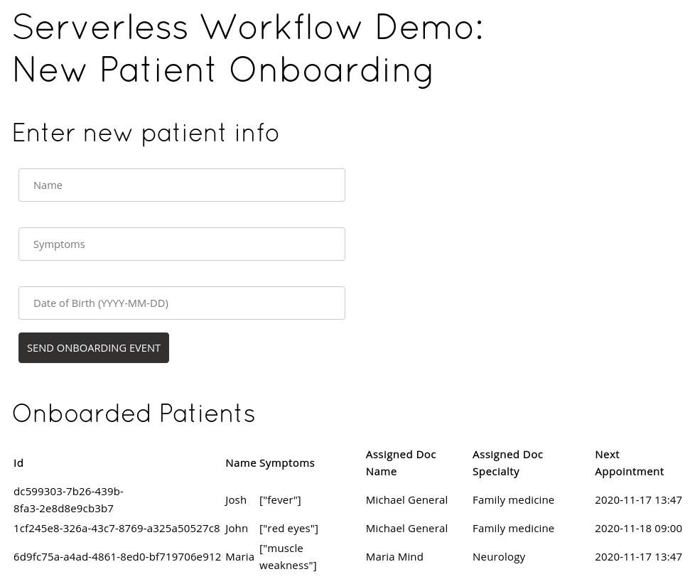

# Kogito Serverless Workflow - Patient Onboarding

## Description

In this example we will see how to use the [Serverless Workflow specification](https://github.com/serverlessworkflow/specification)
implementation on Kogito to orchestrate a sequence of REST calls in an Event-Driven architecture.

This use case is about onboarding a new patient in a hospital, and based on their symptom, the 
application will assign to the right expert. 

The workflow starts with a CloudEvent informing a new patient entry:

```json
{
   "id":"12345",
   "source":"/hospital/entry",
   "specversion":"1.0",
   "type":"new.patient.events",
   "data":{
      "name":"John",
      "dateOfBirth":"2017-08-15",
      "symptoms":[
         "seizures"
      ]
   }
}
```

Or you can use cURL and set the CloudEvents parameters in the request headers:

```shell script
$ curl -X POST \
      -H "content-type: application/json"  \
      -H "ce-specversion: 1.0"  \
      -H "ce-source: /hospital/entry"  \
      -H "ce-type: new.patients.events"  \
      -H "ce-id: 12346"  \
      -d "{ \"name\": \"Mick\", \"dateOfBirth\": \"1983-08-15\", \"symptoms\":[\"seizures\"]}" \
  http://localhost:8080
```

The [workflow](src/main/resources/onboarding.sw.json) will then call a sequence of REST services:

1. `StoreNewPatient` will store the patient in the internal database for later processing
2. `AssignDoctorToPatient` will run a set of [rules](https://docs.jboss.org/kogito/release/latest/html_single/#con-drl-rule-units_drl-rules) 
to determine to which doctor this patient should be assigned, based on their symptoms or general characteristics (children always go to Pediatrics, for example)
3. `SchedulePatientAppointment` will find a time slot for this patient based on the agenda of the assigned doctor

After executing the workflow, the appointments' data can be fetched using the `/onboarding/schedule/appointment` endpoint.

There's a nice web interface for you to try the example available in the root url (http://localhost:8080 for local environments):



Enter the data into the provided form to see the example in action! Date of Birth must be in `YYYY-MM-DD` format.

Also, there is the Swagger UI that can also be used to explore the APIs in this example: http://localhost:8080/swagger-ui/

## Installing and Running

### Prerequisites
 
You will need:
  - Java 17+ installed
  - Environment variable JAVA_HOME set accordingly
  - Maven 3.9.11+ installed

When using native image compilation, you will also need: 
  - [GraalVm](https://www.graalvm.org/downloads/) 20.2.0+ installed
  - Environment variable GRAALVM_HOME set accordingly
  - Note that GraalVM native image compilation typically requires other packages (glibc-devel, zlib-devel and gcc) to be installed too.  You also need 'native-image' installed in GraalVM (using 'gu install native-image'). Please refer to [GraalVM installation documentation](https://www.graalvm.org/docs/reference-manual/aot-compilation/#prerequisites) for more details.

### Compile and Run in Local Dev Mode

```sh
mvn clean package quarkus:dev
```

Use `curl` command to send the CloudEvent through HTTP to the application:

```shell script
$ curl -X POST \
      -H "content-type: application/json"  \
      -H "ce-specversion: 1.0"  \
      -H "ce-source: /hospital/entry"  \
      -H "ce-type: new.patients.events"  \
      -H "ce-id: 12346"  \
      -d "{ \"name\": \"Mick\", \"dateOfBirth\": \"1983-08-15\", \"symptoms\":[\"seizures\"]}" \
  http://localhost:8080
```

In the application's log, you will see something like:

```log
2020-11-17 12:51:11,581 DEBUG [org.acm.sw.onb.res.PatientResource] (executor-thread-198) Received patient to store in the internal in memory database: Patient{name='Mick', id='null', symptoms=[seizures], dateOfBirth=1983-08-15}
2020-11-17 12:51:11,581 DEBUG [org.acm.sw.onb.res.PatientResource] (executor-thread-198) Patient has been stored in the internal memory: Patient{name='Mick', id='5560ed3d-becb-4f35-8c6a-2816338bf8fd', symptoms=[seizures], dateOfBirth=1983-08-15}
2020-11-17 12:51:11,600 DEBUG [org.acm.sw.onb.res.AppointmentResource] (executor-thread-198) Receive patient to schedule appointments: Patient{name='Mick', id='5560ed3d-becb-4f35-8c6a-2816338bf8fd', symptoms=[seizures], dateOfBirth=1983-08-15}
2020-11-17 12:51:11,600 DEBUG [org.acm.sw.onb.res.AppointmentResource] (executor-thread-198) Processed patient: Patient{name='Mick', id='5560ed3d-becb-4f35-8c6a-2816338bf8fd', symptoms=[seizures], dateOfBirth=1983-08-15}
```

Then query the appointments' resource to see the assigned doctor:

```shell script
$ curl http://localhost:8080/onboarding/schedule/appointment | jq '.'

[
  {
    "doctor": {
      "id": "8293dc94-2386-11eb-adc1-0242ac120002",
      "name": "Maria Mind",
      "specialty": "Neurology"
    },
    "patient": {
      "name": "Mick",
      "id": "5560ed3d-becb-4f35-8c6a-2816338bf8fd",
      "symptoms": [
        "seizures"
      ],
      "dateOfBirth": "1983-08-15",
      "assignedDoctor": {
        "id": "8293dc94-2386-11eb-adc1-0242ac120002",
        "name": "Maria Mind",
        "specialty": "Neurology"
      }
    },
    "date": "2020-11-18 09:00"
  }
]
```

_**Note:** Please make sure you have [jq](https://stedolan.github.io/jq/download/) installed in your system to see the formatted output._

### Compile and Run in JVM mode

```sh
mvn clean package 
java -jar target/quarkus-app/quarkus-run.jar
```

or on Windows

```sh
mvn clean package
java -jar target\quarkus-app\quarkus-run.jar
```

### Compile and Run using Local Native Image
Note that this requires GRAALVM_HOME to point to a valid GraalVM installation

```sh
mvn clean package -Pnative
```
  
To run the generated native executable, generated in `target/`, execute

```sh
./target/serverless-workflow-functions-quarkus-runner.jar
```

## Deploying in Minikube

We have prepared a `knative` Maven profile to build the service image locally and all the Knative resources you need
to get started.

1. [Install Knative](https://knative.dev/docs/getting-started/)
2. Install the `KogitoSource` [via command line](https://github.com/knative-sandbox/eventing-kogito#installation).
3. Run `eval $(minikube docker-env)` to build the image directly into the Minikube registry.
4. Run `mvn clean install -Pknative -Dnamespace=<your namespace>` to build the image and the Knative resources for your application to run.
5. Apply the objects created for you with `kubectl apply -f target/kubernetes/*.yml`. It will deploy the objects from `knative.yml` and `kogito.yml` generated files.
6. Run `curl` from the terminal like you did in the previously steps.

## Credits

- [Disease Prediction through Symptoms](https://www.kaggle.com/usamag123/disease-prediction-through-symptoms) dataset from Kagle
- [Tihomir Surdilovic](https://twitter.com/tsurdilo) for the nice UI
