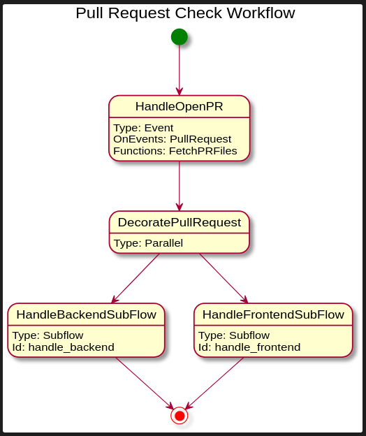
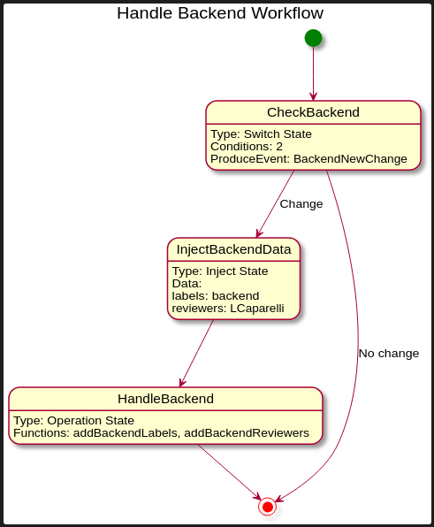
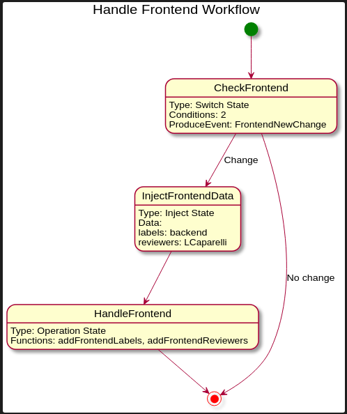

## Pull Request Checker Workflow

Before going further, please make sure you have deployed the [GitHub](../github-service) and [Notification](../notification-service)
services since the workflow depends on them.

This is the main service of this example, it's responsible to orchestrate the services in
order to verify an opened PR. The service will add labels and reviewers according
to the files that have been modified.

The image below illustrates the workflow:



Once a new PR is opened or changed in a given GitHub repository, the Knative platform will generate
a new CloudEvent containing the pull request context. The Broker will deliver this 
event to the workflow service, thus starting a new instance.

When the workflow starts, it will call the GitHub service to fetch the files changed in the PR.
Then, the workflow will verify what kind of changes have been made in the PR: 
based on the files' path, a specific label and reviewer will be added to it.




In the end of the workflow, a new event will be created and sent to the Knative broker.
This event will be consumed by the [Notification service](../notification-service) 
to post a new message to a given Slack channel.

### Review the sub-flows Labels and Reviewers

Open the files `src/main/resources/handle-backend.sw.json` and `src/main/resources/handle-frontend.sw.json`
to review the labels and reviewers you wish to add to your PRs. Modify the `Inject` state
and save the workflow files.

_**Note**: You can modify the workflow to call a function and set the labels and reviewers
in the context based on a configuration file instead. Are you up to the challenge?_

### Review GitHub App WebHook Secret

> **HEADS UP!** we assume you already have the GitHub App created for this demo when
> you deployed the GitHub service

Go to your [GitHub Apps dashboard](https://github.com/settings/apps) and click on "Edit" button
in the application you created when deploying the [GitHub Service](../github-service). 

Edit the field "Webhook secret (optional)" and add the value `super-kogito-demo-secret`
in the text field. This secret will be used by the Knative platform to identify the incoming events.

_**Note:** In the "Webhook" section you should have a link to the [smee.io](https://smee.io/) service 
if you chose to run the demo locally or in a cluster that is not accessible from the external world.
Just make sure that the Webhook link is correct._ 

### Install Knative GitHub Source

Install the GitHub source from [eventing-contrib](https://github.com/knative/eventing-contrib/releases) releases that match your Knative Eventing
platform. To know the Knative eventing version run:

```shell script
$ kubectl get KnativeEventing knative-eventing -n knative-eventing

NAME               VERSION   READY   REASON
knative-eventing   0.17.3    True  
```

Then run:

```shell script
$ kubectl apply -f https://github.com/knative/eventing-contrib/releases/download/v<VERSION>/github.yaml
```

**Note:** replace `<VERSION>` with the correct Knative Eventing version.

### Deploying on Kubernetes

> **IMPORTANT! :warning:** we assume you have read the prerequisites section in the main
> [README file](../README.md). Please follow those instructions before continuing.

**Please do not proceed any further if you haven't deployed the [GitHub](../github-service) and [Notification](../notification-service) services.**

To make things easier there is a [script in this directory](deploy-kubernetes.sh) to generate the template
files, build the application and the image, and then deploy it to your Kubernetes cluster.

**IMPORTANT!** You **must** be authenticated to the target Kubernetes cluster as a **cluster administrator** for this script
to work.

You can run the script once and all the required files will be generated in the `kubernetes/base` directory, 
and the image will be published to your Quay.io account.

Fill the value for the variables as shown below and run the script:

```shell script
# the script accepts positional arguments as following:
QUAY_NAMESPACE=
GITHUB_REPO=

./deploy-kubernetes.sh $QUAY_NAMESPACE $GITHUB_REPO
```

You should see a similar output like this:

<details><summary>Build logs</summary>
```
---> Building and pushing image using tag quay.io/your_namespace/pr-checker-workflow:latest
STEP 1: FROM quay.io/kiegroup/kogito-runtime-jvm:2.44
STEP 2: ENV RUNTIME_TYPE quarkus
STEP 3: COPY target/*-runner.jar $KOGITO_HOME/bin
--> 58760d128d8
STEP 4: COPY target/lib $KOGITO_HOME/bin/lib
STEP 5: COMMIT quay.io/your_namespace/pr-checker-workflow:latest
--> 7bea1f647bc
Writing manifest to image destination
Writing manifest to image destination
Storing signatures
---> Applying objects to the cluster in the namespace kogito-github.
secret/github-webhook-secret unchanged
service/pr-checker-workflow-default-http unchanged
kogitoruntime.app.kiegroup.org/pr-checker-workflow configured
broker.eventing.knative.dev/default unchanged
trigger.eventing.knative.dev/pr-checker-listener unchanged
githubsource.sources.knative.dev/github-event-listener unchanged
sinkbinding.sources.knative.dev/pr-checker-sink unchanged
```
</details>

If your cluster is already ready to receive GitHub Webhooks calls, just create
a new PR in your repository with a file named "backend", and you should see the PR
being labeled as "backend", also your chosen friend will be notified to review the PR.

If you're running on Minikube locally, proceed to the next section before trying the demo.   

### Setting up your cluster to be publicly available

Skip this section if your cluster is already publicly available and capable
to receive events from GitHub Webhooks.

#### Minikube

If you reach this point, you probably have tested and deployed the other services. 
Just make sure you have a terminal window opened with:

```
$ minikube tunnel
```

Now run:

```
$ ./expose-on-minikube.sh
```

This command will create a new Istio `VirtualService` to access the Knative GitHub Source
from the Smee CLI tool. Since this tool adds a `Host: smee.io` in the request before redirecting
it to the cluster, Istio will reply with a 404 (Not Found) status code because it uses the
HTTP header `Host` to route requests within the cluster. 

Our just created `github-event-listener-smee` will take care of redirecting any requests 
with `Host: smee.io` to the right service.

Now on a new terminal window run:

```
$ SMEE_WEBHOOK=<YOUR_SMEE_WEBHOOK>
$ ROUTE=$(kubectl get routes -l receive-adapter=github -o jsonpath="{.items[*].status.url}" -n kogito-github)

$ smee -u $SMEE_WEBHOOK -t $ROUTE
```

Replace `<YOUR_SMEE_WEBHOOK>` with the Smee URL generated for you while creating a new GitHub App.

The Smee CLI will capture all events coming from your repository and redirect
to your local cluster, you should see the Knative pods starting on demand and in the end
a message in the Slack channel. :)

#### Kubernetes or OpenShift 4.x

Talk to the cluster administrator to understand how your cluster and Istio Ingress can be exposed to the world.  

### Cleaning up!

See the project root's [README](./README.md) documentation.