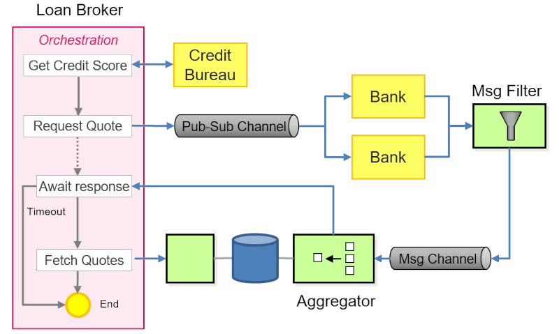
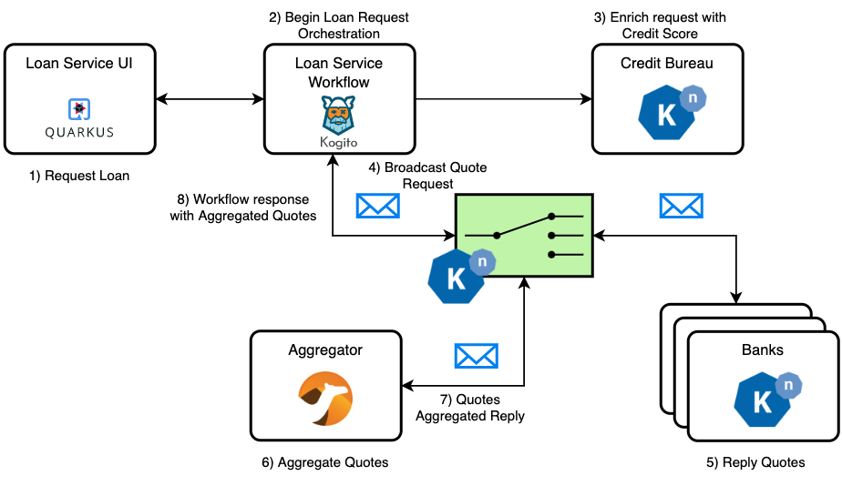
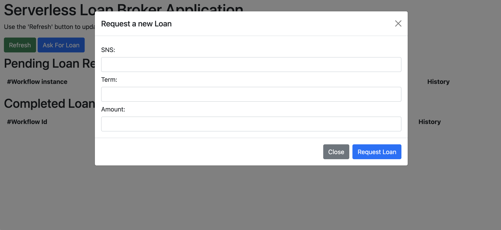
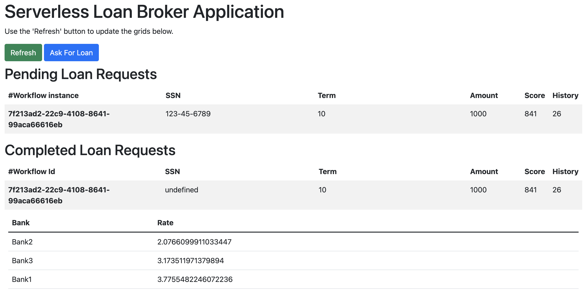

# Kogito Serverless Loan Broker Example

Serverless Loan Broker example Application on Kogito Workflows and Knative.
This example is based on the [Gregor Hohpe's blog post](https://www.enterpriseintegrationpatterns.com/ramblings/loanbroker_gcp_workflows.html). Please read the original blog to have a better understanding of this use case.

## Deploying on Minikube

You can easily deploy this example on Minikube by using the provided `deploy.sh` script. But first, make sure that you have:

1. Installed Minikube
2. Installed [Knative Quickstart](https://knative.dev/docs/getting-started/quickstart-install/) on your Minikube installation. It adds a new `knative` profile to your cluster, so bear in mind that every command on Minikube must be followed by `-p knative`.
3. Installed JDK 17, Maven, NPM, and Docker in order to build all the parts of the example.

Start the tunnel in a separate terminal:

```shell
minikube tunnel -p knative
```

Now just run `./deploy.sh`. It will build all the services, create the Kubernetes object, and push the images to your Minikube's internal registry.

The UI will be exposed as a NodePort on `8080`. Access it using http://localhost:8080.

For some reason, if you need to run the script again but would like to skip the build process, run it with `deploy.sh true`. It will try to deploy the application directly in the cluster.

> It's likely to work on any Kubernetes cluster if you have the permissions to create namespaces. Otherwise, just change the `deploy.sh` script's `NAMESPACE` variable to install in another one.

### Minimum Requirements

- Minikube with at least 4 CPU cores
- Minikube RAM of 12GB

## How it works

This is an implementation of the same use case Gregor Hohpe discussed in his blog, but using only open source technology not tied to any cloud provider. You can deploy all the services, functions, and the workflow in any cloud given that you have access to Kubernetes with Knative.

This is the original architecture view of the use case:



This is the implementation:



The main orchestration flow we implemented with [Kogito Serverless Workflow](https://kiegroup.github.io/kogito-docs/serverlessworkflow/latest/) and [Knative Serving](https://knative.dev/docs/serving/), which is Red Hat's implementation of the [CNCF Serverless Workflow Specification](https://serverlessworkflow.io/).

The Credit Bureau and Bank functions where implemented with Knative Functions project using NodeJS. Credit Bureau is a synchronous HTTP function and the Bank is an async function listening to a CloudEvent event. Knative Eventing is the messaging platform of choice so every message must be a CloudEvent over HTTP. 

The Aggregator application is a Camel Quarkus implementation. Every quote is aggregated by the workflow instance ID, created when the Kogito Workflow engine started.

To facilitate the interaction with the services, we created a simple User Interface (http://localhost:8080 if you used the `deploy.sh` script on Minikube).



You can send a request for a loan using the UI or a curl command to the workflow with the content data, for example:

```shell
curl -X 'POST' \
  'http://loanbroker-flow.loanbroker-example.127.0.0.1.sslip.io/loanbroker' \
  -H 'accept: */*' \
  -H 'Content-Type: application/json' \
  -d '{ "workflowdata": { "SSN": "123-45-6789", "term": 10, "amount": 10000 } }' 
```

> Use the following command to grab the service URL:
> 
> ```
> kn service describe loanbroker-flow  -o jsonpath --template="{.status.url}" -n loanbroker-example 
> ```

After a few moments you should see the quote aggregation in the UI:



> TIP: If you request too much money, Bank3 won't send a quote.

You can even take a look at the event-display pod logs to see all the events flowing through the cluster.

## Known Issues

- Lack of timeout. It's on Kogito's roadmap to have a consistent timeout implementation on version 1.28. As soon as we get there, I'll update the example.
