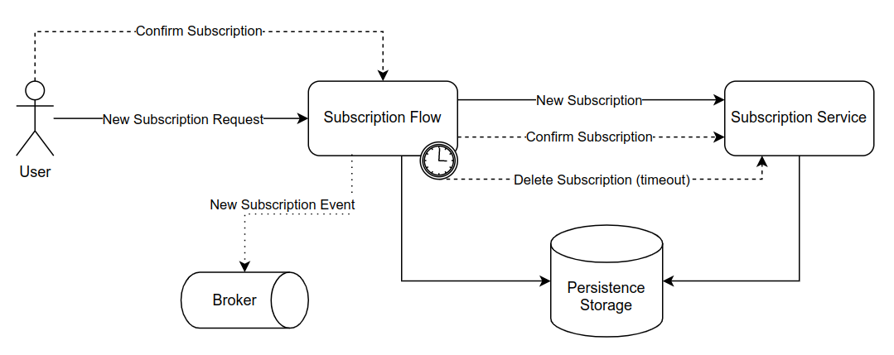
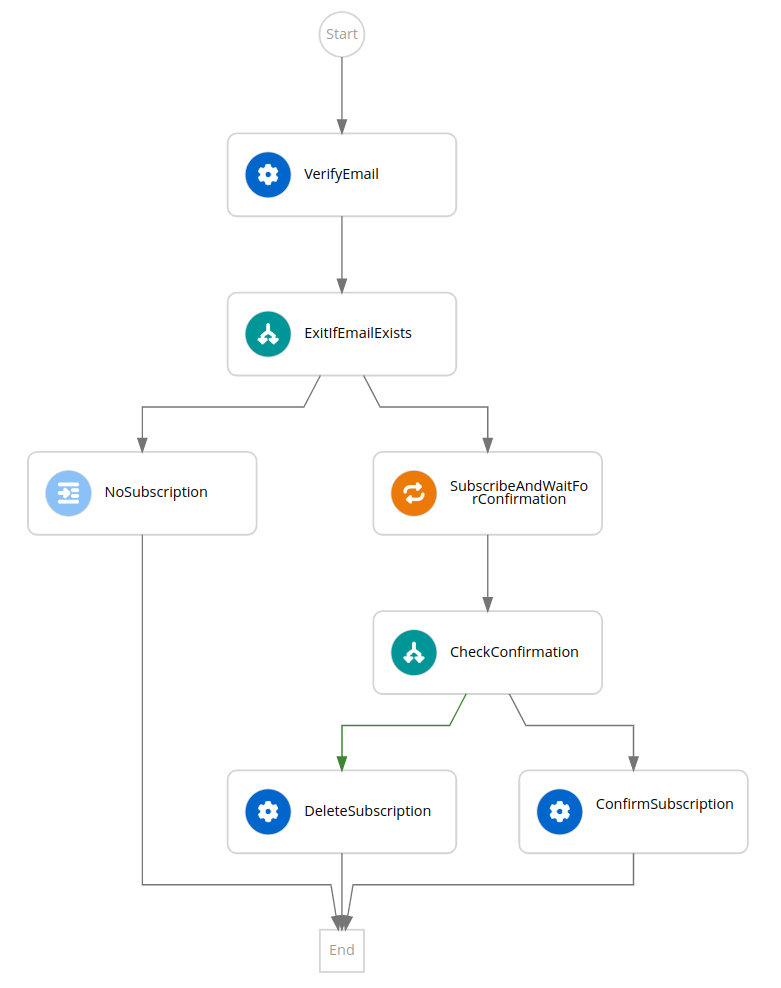

# Kogito Serverless Workflow - Newsletter Subscription Showcase

In this example, you will see a Newsletter Subscription use case described with the [Serverless Workflow specification](https://serverlessworkflow.io/).

The figure below illustrates the overall architecture of this use case.



1. Once a new subscription request comes, the flow will evaluate if it's not already subscribed.
2. Case not, it will attempt to subscribe the new user and wait for the confirmation.
3. Once a new event containing the confirmation arrives, the flow will resume and subscribe the new user.
4. Subscriptions that are not confirmed during a configured period of time, are considered timed-out and are automatically removed from the system.
5. By the end, a new event containing the details of the subscription is broadcasted in the environment, so other actors can react upon it.



This example demonstrates a few features powered by the Kogito implementation of the Serverless Workflow specification:

1. REST Services calls via OpenAPI definitions
2. Pause and resume of a given workflow instance
3. Consuming and producing CloudEvents

In a Knative environment, the services involved in this use case can be scaled to zero and resume from the exact stage it was, saving cluster resources in the process.

## The User Interface

The [Newsletter Subscription Flow](subscription-flow) application has a user interface to interact with the workflow without having to rely on the command line to push events or making HTTP requests: 


## Running Locally

The example has two modules: [the workflow application](subscription-flow) that will orchestrate the use case and the [subscription service application](subscription-service) that has a REST API to interact with the newsletter subscription domain.

You can run it locally using Maven and Java:

1. Compile the whole application with:
```
mvn clean install -DskipTests
```
2. In a new terminal, run the Subscription Service via:
```
java -jar -Dquarkus.http.port=8282 subscription-service/target/quarkus-app/quarkus-run.jar
```
3. Again, in a new terminal, run the Subscription Workflow with:
```
java -jar subscription-flow/target/quarkus-app/quarkus-run.jar
```
4. Lastly, start the CloudEvent sink log to receive the `new subscription` event:
```
docker run --rm -it -p 8181:8080 gcr.io/knative-releases/knative.dev/eventing-contrib/cmd/event_display
```

You should have the ports `8080`, `8181` and `8282` free to have all the services up.

Go to http://localhost:8080 and play around with the interface. You will see in the CloudEvents sink the new subscription event produced by the workflow after confirming a given subscription.

> The Subscription API also has an interface that can be accessed in http://localhost:8282/ to see the confirmed subscriptions.

## Running on Knative

Alternatively, you can run this whole example on Knative. Instead of using Kafka, we are going to leverage the Knative Eventing Broker to abstract the broker implementation for us.

In this example we use a regular, in-memory, broker. Feel free to adapt the example to use other brokers implementations.

### Preparing your environment

1. Install [minikube](https://minikube.sigs.k8s.io/docs/start/)
2. Install Knative using the [quickstarts](https://knative.dev/docs/getting-started/) since a DNS will be configured for you.
3. Run `eval $(minikube -p minikube docker-env --profile knative)` to build the images in your internal Minikube registry.
4. Run `mvn clean install -Pknative`. All resources needed to run the example will be generated for you.

Deploy the services with the following command:

```shell
# the namespace name is very important. If you decide to change the namespace, please be update the subscription-flow Knative properties.
$ kubectl create ns newsletter-showcase
# install the supporting services to run the example in knative, the PostgreSQL database, the Jobs Service and the event-display application.
$ kubectl apply -f kubernetes/supporting-services.yml -n newsletter-showcase

# Install the data index service to be able to index the information related with the ProcessInstances and Jobs events 
$ kubectl apply -f kubernetes/data-index-services.yml -n newsletter-showcase

# install the subscription-flow
$ kubectl apply -f subscription-flow/target/kubernetes/knative.yml -n newsletter-showcase
$ kubectl apply -f subscription-flow/target/kubernetes/kogito.yml -n newsletter-showcase
# install the subscription-service 
$ kubectl apply -f subscription-service/target/kubernetes/knative.yml -n newsletter-showcase
```

And you are done! To play around with the example UI, first discover the URLs managed by Knative:

```shell
$ kubectl get ksvc -n newsletter-showcase

NAME                   URL                                                                  LATESTCREATED                LATESTREADY                  READY   REASON
event-display          http://event-display.newsletter-showcase.127.0.0.1.sslip.io          event-display-00001          event-display-00001          True    
subscription-flow      http://subscription-flow.newsletter-showcase.127.0.0.1.sslip.io      subscription-flow-00001      subscription-flow-00001      True    
subscription-service   http://subscription-service.newsletter-showcase.127.0.0.1.sslip.io   subscription-service-00002   subscription-service-00002   True    
```

The `URL` column has the applications' endpoint.

To access to the IP where the Data Index service exposes the GraphQL-UI execute:

```shell
$ kubectl get services -n newsletter-showcase

NAME                                 TYPE           CLUSTER-IP       EXTERNAL-IP                                         PORT(S)                                              AGE
data-index-service-postgresql        ClusterIP      10.100.228.32    <none>                                              80/TCP                                               7m22s
default-kne-trigger-kn-channel       ExternalName   <none>           imc-dispatcher.knative-eventing.svc.cluster.local   80/TCP                                               7h50m
event-display                        ExternalName   <none>           kourier-internal.kourier-system.svc.cluster.local   80/TCP                                               7h49m
event-display-00001                  ClusterIP      10.100.114.14    <none>                                              80/TCP,443/TCP                                       7h50m
event-display-00001-private          ClusterIP      10.109.69.197    <none>                                              80/TCP,443/TCP,9090/TCP,9091/TCP,8022/TCP,8012/TCP   7h50m
jobs-service-postgresql              ClusterIP      10.102.232.229   <none>                                              80/TCP                                               7h50m
newsletter-postgres                  ClusterIP      10.111.31.14     <none>                                              5432/TCP                                             7h50m
subscription-flow                    ExternalName   <none>           kourier-internal.kourier-system.svc.cluster.local   80/TCP                                               7h34m
subscription-service                 ExternalName   <none>           kourier-internal.kourier-system.svc.cluster.local   80/TCP                                               7h24m
```

The `CLUSTER-IP` column has the data-index IP, assigned in each installation. In this case putting 10.100.228.32 in a browser it will show the http://10.100.228.32/graphiql/

Expose the URLs in your local environment. In a separated terminal, run:

```shell
# you will be asked for your admin password
$ minikube tunnel --profile knative
```

Open the URLs in your browser and try playing with your services scaling to 0.

Note that even when the pod is scaled back after a short period of time, your data remains there. That's the power of a stateful Kogito Serverless Workflow!

### Cleaning-up your environment

The recommended procedure to remove the showcase from your local minikube is to delete the `newsletter-showcase` namespace by executing the following command. 

```shell
# delete the newsletter-showcase 
$ kubectl delete namespace newsletter-showcase

# the deletion procedure might take some time to complete, don't cancel it. 
# in meantime an output like this is printed in the terminal window. 
namespace "newsletter-showcase" deleted
```

