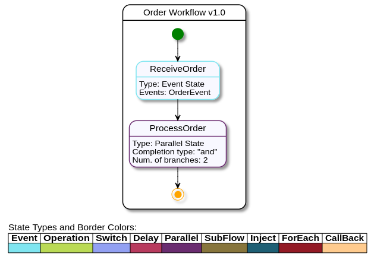
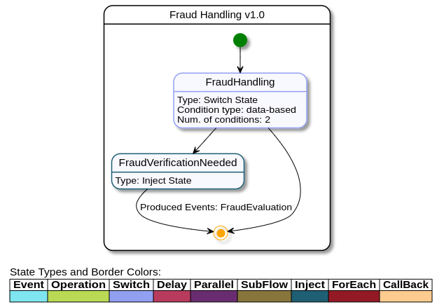
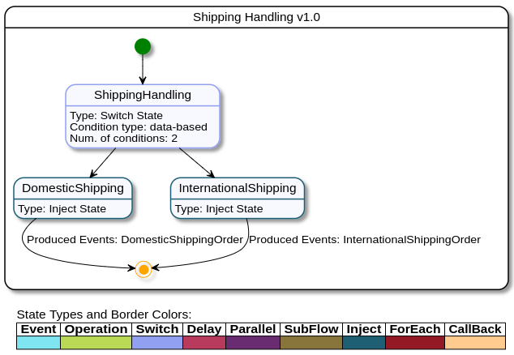

# Kogito Serverless Workflow Order Processing Example

## Description

In this example we will see how to use the [Serverless Workflow specification](https://github.com/serverlessworkflow/specification)
implementation on Kogito to orchestrate events with Knative Eventing.

This use case is about processing an incoming order and producing new events based on the order details.
The images below illustrates the workflow:



The main workflow process the incoming Order event and start a parallel state calling two subflows: 
Fraud Handling and Shipping Handling. The workflow will end once **both** subflows end.



Fraud Handling will produce a new `FraudEvaluation` event if the order is above 1000 USD. Any other system or
service in the architecture can then read this event and react upon it, like canceling the order for example.



In parallel, regarding or not the order would need fraud evaluation, the workflow will produce events classifying
the required Shipping service: International or Domestic. For this example, domestic shipping is any 
order with address within US.

## Infrastructure requirements

This quickstart requires Knative Eventing to be available in your cluster:

* Install [minikube](https://kubernetes.io/docs/tasks/tools/install-minikube/)
* Install [Knative Eventing](https://knative.dev/docs/install/) in your minikube cluster

For local testing only you can use [Podman](https://podman.io/getting-started/installation.html) or Docker to simulate an application
receiving your events.

## Build and run

### Prerequisites

You will need:
- Java 17+ installed
- Environment variable JAVA_HOME set accordingly
- Maven 3.9.6+ installed

When using native image compilation, you will also need:
- GraalVM 19.3+ installed
- Environment variable GRAALVM_HOME set accordingly
- GraalVM native image needs as well native-image extension: https://www.graalvm.org/reference-manual/native-image/
- Note that GraalVM native image compilation typically requires other packages (glibc-devel, zlib-devel and gcc) to be installed too, please refer to GraalVM installation documentation for more details.

### Compile and Run in Local Dev Mode

```sh
K_SINK=http://localhost:8181 mvn clean compile quarkus:dev
```

[`K_SINK` is the environment variable injected by the Knative Eventing platform](https://knative.dev/docs/eventing/samples/sinkbinding/#create-our-sinkbinding)
once we deploy the application on a Kubernetes cluster.
Instead of _hardcoding_ the endpoint where we are going to send our produced messages, we rely on Knative to inject this information in runtime.

The environment variable will be assigned to the SmallRye HTTP connector in runtime: 

`mp.messaging.outgoing.kogito_outgoing_stream.url=${K_SINK}`.

For local tests we will mock the endpoint where the produced messages supposed to be delivered.

### Package and Run in JVM mode

```sh
mvn clean package
java -jar target/quarkus-app/quarkus-run.jar
```

or on Windows

```sh
mvn clean package
java -jar target\quarkus-app\quarkus-run.jar
```

### Package and Run using Local Native Image
Note that this requires GRAALVM_HOME to point to a valid GraalVM installation

```sh
mvn clean package -Pnative
```

To run the generated native executable, generated in `target/`, execute

```sh
./target/serverless-workflow-order-processing-runner
```

### OpenAPI (Swagger) documentation
[Specification at swagger.io](https://swagger.io/docs/specification/about/)

You can take a look at the [OpenAPI definition](http://localhost:8080/openapi?format=json) - automatically
generated and included in this service - to determine all available operations exposed by this service.

For easy readability you can visualize the OpenAPI definition file using a UI tool like for
example available [Swagger UI](https://editor.swagger.io).

In addition, various clients to interact with this service can be easily generated using this OpenAPI definition.

When running in either Quarkus Development or Native mode, we also leverage the
[Quarkus OpenAPI extension](https://quarkus.io/guides/openapi-swaggerui#use-swagger-ui-for-development) that exposes [Swagger UI](http://localhost:8080/swagger-ui/)
that you can use to look at available REST endpoints and send test requests.

### Use the application locally

First thing, fire up the sink application using podman/docker:

```shell script
$ podman run --rm -it -p 8181:8080 gcr.io/knative-releases/knative.dev/eventing-contrib/cmd/event_display
```

This is the same image used by Knative Eventing demos. It's running on port 8181 to not clash with the example application.

Then run the application with:

```shell script
$ K_SINK=http://localhost:8181 mvn clean quarkus:dev

__  ____  __  _____   ___  __ ____  ______ 
 --/ __ \/ / / / _ | / _ \/ //_/ / / / __/ 
 -/ /_/ / /_/ / __ |/ , _/ ,< / /_/ /\ \   
--\___\_\____/_/ |_/_/|_/_/|_|\____/___/   
2021-04-13 17:39:39,488 INFO  [org.kie.kog.cod.api.uti.AddonsConfigDiscovery] (build-22) Performed addonsConfig discovery, found: AddonsConfig{usePersistence=false, useTracing=false, useMonitoring=false, usePrometheusMonitoring=false, useKnativeEventing=true, useCloudEvents=true, useExplainability=false}
2021-04-13 17:39:39,612 INFO  [io.ser.api.wor.BaseWorkflow] (build-22) Unable to convert as json markup, trying as yaml
2021-04-13 17:39:39,676 INFO  [io.ser.api.wor.BaseWorkflow] (build-22) Unable to convert as json markup, trying as yaml
2021-04-13 17:39:39,677 INFO  [io.ser.api.wor.BaseWorkflow] (build-22) Unable to convert as json markup, trying as yaml
2021-04-13 17:39:39,746 INFO  [org.kie.kog.cod.cor.uti.ApplicationGeneratorDiscovery] (build-22) Generator discovery performed, found [openapispecs, processes]
2021-04-13 17:39:40,193 INFO  [org.kie.kog.cod.pro.ProcessCodegen] (build-22) Knative Eventing addon enabled, generating CloudEvent HTTP listener
2021-04-13 17:39:41,034 WARN  [io.qua.arc.pro.BeanArchives] (build-45) Failed to index byte: Class does not exist in ClassLoader QuarkusClassLoader:Deployment Class Loader
2021-04-13 17:39:41,754 INFO  [org.kie.kog.ser.eve.imp.AbstractMessageConsumer] (Quarkus Main Thread) Consumer for class com.fasterxml.jackson.databind.JsonNode started.
2021-04-13 17:39:41,776 INFO  [org.kie.kog.add.clo.qua.QuarkusKogitoExtensionInitializer] (Quarkus Main Thread) Registered Kogito CloudEvent extension
2021-04-13 17:39:41,827 INFO  [io.quarkus] (Quarkus Main Thread) serverless-workflow-order-processing 999-SNAPSHOT on JVM (powered by Quarkus 1.11.5.Final) started in 2.815s. Listening on: http://localhost:8080
2021-04-13 17:39:41,827 INFO  [io.quarkus] (Quarkus Main Thread) Profile dev activated. Live Coding activated.
2021-04-13 17:39:41,827 INFO  [io.quarkus] (Quarkus Main Thread) Installed features: [cdi, mutiny, rest-client, rest-client-jackson, resteasy, resteasy-jackson, servlet, smallrye-context-propagation, smallrye-health, smallrye-openapi, smallrye-reactive-messaging, swagger-ui, vertx]
``` 

Now send a message to the application on 8080 port using the [cloud event format](https://github.com/cloudevents/spec) with `curl`:

```shell script
$ curl -X POST \
      -H "content-type: application/json"  \
      -H "ce-specversion: 1.0"  \
      -H "ce-source: /from/localhost"  \
      -H "ce-type: orderEvent"  \
      -H "ce-id: f0643c68-609c-48aa-a820-5df423fa4fe0"  \
      -d ' {"id":"f0643c68-609c-48aa-a820-5df423fa4fe0","country":"Brazil","total":10000,"description":"iPhone 12"}' \
  http://localhost:8080
```

You should see an output like this one in the running container terminal:

```shell script
☁️  cloudevents.Event
Validation: valid
Context Attributes,
  specversion: 1.0
  type: fraudEvaluation
  source: /process/fraudhandling
  id: 2acd4329-a215-4460-9750-d7f07eb2d5e5
  time: 2021-04-13T20:40:38.394409Z
Extensions,
  kogitoparentprociid: f12e91c0-8980-40b6-a49b-3c35ce435718
  kogitoprocid: fraudhandling
  kogitoprocinstanceid: b822962b-959d-412c-bb4b-80a0cdcdf7f0
  kogitorootprocid: orderworkflow
  kogitorootprociid: f12e91c0-8980-40b6-a49b-3c35ce435718
  kogitousertaskist: 1
Data,
  {"id":"f0643c68-609c-48aa-a820-5df423fa4fe0","country":"Brazil","total":10000,"description":"iPhone 12","fraudEvaluation":true}
☁️  cloudevents.Event
Validation: valid
Context Attributes,
  specversion: 1.0
  type: internationalShipping
  source: /process/shippinghandling
  id: d557fad8-81b5-482a-b981-5ecb267a92f9
  time: 2021-04-13T20:40:38.431677Z
Extensions,
  kogitoparentprociid: f12e91c0-8980-40b6-a49b-3c35ce435718
  kogitoprocid: shippinghandling
  kogitoprocinstanceid: ba57743d-521f-41f2-864a-a7b3f68d35af
  kogitorootprocid: orderworkflow
  kogitorootprociid: f12e91c0-8980-40b6-a49b-3c35ce435718
  kogitousertaskist: 1
Data,
  {"id":"f0643c68-609c-48aa-a820-5df423fa4fe0","country":"Brazil","total":10000,"description":"iPhone 12","fraudEvaluation":true,"shipping":"international"}
```

You will notice that we received two events: one for Fraud Evaluation and another one for
International Shipping processing.

Additionally, there are some extension attributes that starts with `kogito` to provide some context of the execution and the event producer.

To take the other path of the workflow send this message to your application:

```shell script
$ curl -X POST \
      -H "content-type: application/json"  \
      -H "ce-specversion: 1.0"  \
      -H "ce-source: /from/localhost"  \
      -H "ce-type: orderEvent"  \
      -H "ce-id: f0643c68-609c-48aa-a820-5df423fa4fe0"  \
      -d ' {"id":"f0643c68-609c-48aa-a820-5df423fa4fe0","country":"Brazil","total":500,"description":"iPhone 7"}' \
  http://localhost:8080
```

Since the value is under 1000 USD, we will only receive the International Shipping event: 

```shell script
☁️  cloudevents.Event
Validation: valid
Context Attributes,
  specversion: 1.0
  type: internationalShipping
  source: /process/shippinghandling
  id: 096d1009-7566-41ac-a3f1-ab0756172adc
  time: 2021-04-13T20:44:12.391093Z
Extensions,
  kogitoparentprociid: 4ae2d088-5492-417a-b625-3a4ac0e91403
  kogitoprocid: shippinghandling
  kogitoprocinstanceid: 2e9fca25-c1f9-4e31-bc08-0ad740cfea5d
  kogitorootprocid: orderworkflow
  kogitorootprociid: 4ae2d088-5492-417a-b625-3a4ac0e91403
  kogitousertaskist: 1
Data,
  {"id":"f0643c68-609c-48aa-a820-5df423fa4fe0","country":"Brazil","total":500,"description":"iPhone 12","shipping":"international"}
```

## Deploying in Minikube

We have prepared a `knative` Maven profile to build the service image locally and all the Knative resources you need
to get started.

Just make sure your cluster has [Knative Eventing available](https://knative.dev/docs/eventing/getting-started/):

1. [Install Knative](https://knative.dev/docs/getting-started/)
2. Install the `KogitoSource` [via command line](https://github.com/knative-sandbox/eventing-kogito#installation).
3. Run `eval $(minikube docker-env)` to build the image directly into the Minikube registry. 
4. Run `mvn clean install -Pknative -Dnamespace=<your namespace>` to build the image and the Knative resources for your application to run.
5. Apply the objects created for you with `kubectl apply -f target/kubernetes/knative.yml,target/kubernetes/kogito.yml`. It will deploy the objects from `knative.yml` and `kogito.yml` generated files.
6. Run `curl` from the terminal like you did in the previously steps. 
   To see what's going on, just query for one of the Knative service sinks created on step #5. 
   You should see something like:

```
☁️  cloudevents.Event
Validation: valid
Context Attributes,
  specversion: 1.0
  type: internationalShipping
  source: /process/shippinghandling
  id: f1193deb-9c4e-4e90-8aab-27fdba4ed740
  time: 2021-04-15T16:12:04.455905Z
Extensions,
  knativearrivaltime: 2021-04-15T16:12:04.657355879Z
  kogitoparentprociid: 836fbb3b-a68f-487b-9d96-cc93ca387ab9
  kogitoprocid: shippinghandling
  kogitoprocinstanceid: 1cc0d2b9-c5fb-445c-8229-5790e7a7b254
  kogitorootprocid: orderworkflow
  kogitorootprociid: 836fbb3b-a68f-487b-9d96-cc93ca387ab9
  kogitousertaskist: 1
Data,
  {"id":"f0643c68-609c-48aa-a820-5df423fa4fe0","country":"Brazil","total":500,"description":"iPhone 7","shipping":"international"}
```

### Accessing the Service on Minikube

Ideally, you installed Knative on Minikube via [their quickstart](https://knative.dev/docs/getting-started/). 
Doing so, you will have installed nip.io DNS and will be able to access the services via their exposed Knative Routes.

Alternatively, if you installed via Knative Operators and Istio, you will need to follow this procedure in order to access the service:

1. Run `minikube tunnel`
2. Define the Ingress Gateway `INGRESSGATEWAY=istio-ingressgateway`
3. Get the Gateway IP with:
   ```shell
   export GATEWAY_IP=`kubectl get svc $INGRESSGATEWAY --namespace istio-system \
    --output jsonpath="{.status.loadBalancer.ingress[*]['ip']}"`
   ```
4. Run the `curl` command using the Gateway URL. For example:

   ```shell
   curl -X POST \
      -H "content-type: application/json"  \
      -H "ce-specversion: 1.0"  \
      -H "ce-source: /from/localhost"  \
      -H "ce-type: orderEvent"  \
      -H "ce-id: f0643c68-609c-48aa-a820-5df423fa4fe0"  \
      -d ' {"id":"f0643c68-609c-48aa-a820-5df423fa4fe0","country":"Brazil","total":15000,"description":"iPhone 7"}' \
   http://${GATEWAY_IP} --header "Host:serverless-workflow-order-processing.kogito.example.com"
   ```