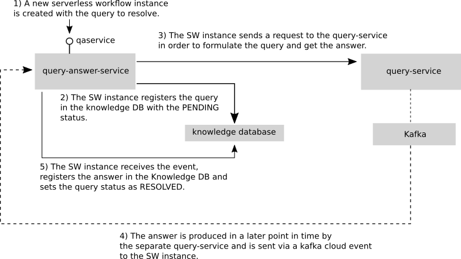
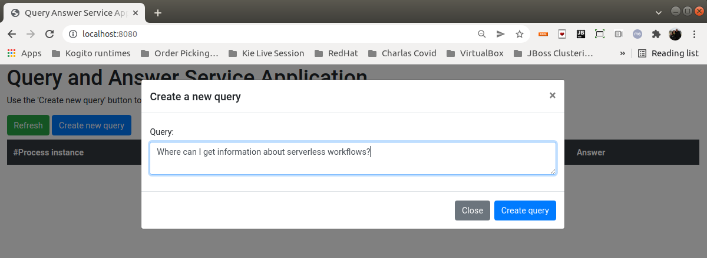
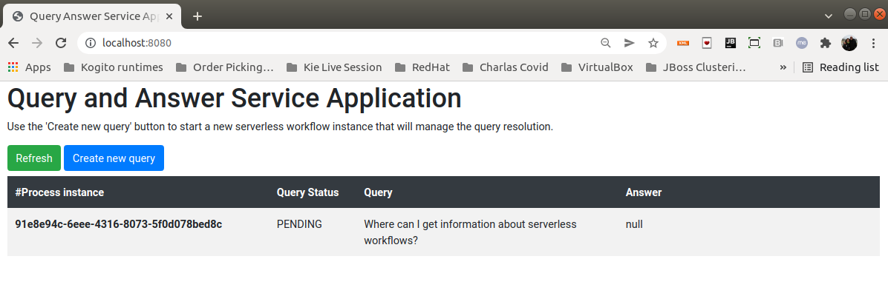
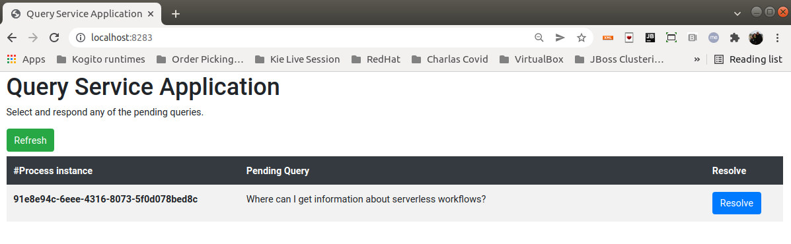
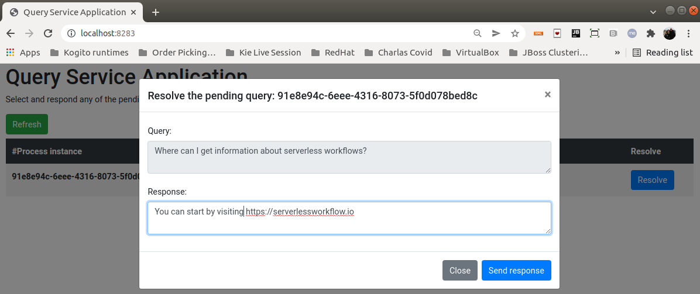
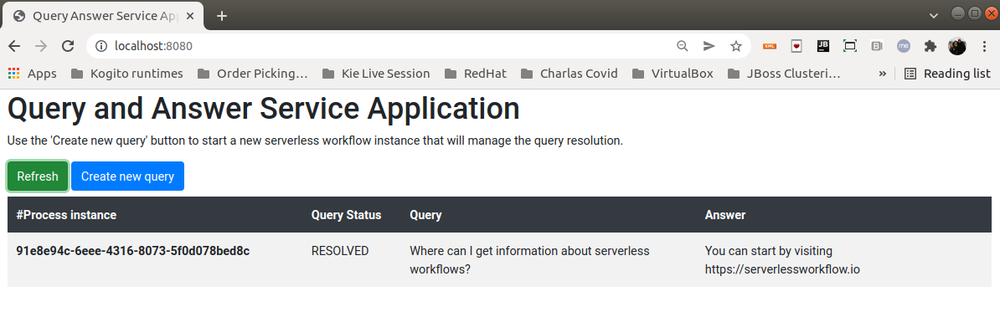

# Kogito Serverless Workflow - Query Answer Service Showcase

The goal of this example is to implement a simple *Query and Answer* service.

The resolution of a formulated query is managed by a [serverless workflow instance](query-answer-service/src/main/resources/qaservice.sw.json), which will interact with an external service to get the
answers. Considering that an external service produces the answers, they can arrive at any later point in time. Thus, the serverless workflow must coordinate all these interactions to correctly
populate the knowledge database with the queries and the corresponding answers.

The lifespan of the [serverless workflow instance](query-answer-service/src/main/resources/qaservice.sw.json) makes sense only during the query resolution time. However, the queries and answers will
remain stored in the knowledge database for later consumption, querying, etc.

The following diagram shows the problem structure and the different interactions that occur to resolve a query.



## Example UI

To run the example, a simple UI is provided and can be used to emulate both the query formulation and resolution. Note that two different applications are being emulated.

**Please read the following files and follow the required steps to start all the required components.**

1) [query-answer-service/README.md](query-answer-service/README.md)
2) [query-service/README.md](query-service/README.md)

When all the components and services are started, follow these steps to formulate and resolve queries using the UI.

> **NOTE:** All the query formulation and resolution cycle can also be invoked by using the services respective endpoints.

### Formulate a query

1) Open a browser window with the following url: http://localhost:8080.

   The application that represents the Query and Answer service will be opened.

2) Create your query and send it.



3) After creating the query, you will see all the queries in the knowledge database.



### Resolve a query

1) Open a browser window with the following url: http://localhost:8283

   The application that represents the external service that solves the queries will be opened.



2) Select and resolve a query.



### See the results

1) Go back to the Query Answer Service application http://localhost:8080 and see the results.



## Running on Knative

Alternatively, you can run this whole example on Knative. Instead of using Kafka, we are going to leverage the Knative Eventing Broker to abstract the broker implementation for us.

In this example we use a regular, in-memory, broker. Feel free to adapt the example to use other brokers implementations.

### Preparing your environment

1. Install [minikube](https://minikube.sigs.k8s.io/docs/start/)
2. Install Knative using the [quickstarts](https://knative.dev/docs/getting-started/) since a DNS will be configured for you.
3. Install the [Knative Kogito Source](https://github.com/knative-sandbox/eventing-kogito#installation).
4. Run `eval $(minikube -p minikube docker-env --profile knative)` to build the images in your internal Minikube registry.
5. Run `mvn clean install -Pknative`. All resources needed to run the example will be generated for you.

Deploy the services with the following command:

```shell
# the namespace name is very important. If you decide to change the namespace, please be update the query-answer-service Knative properties.
$ kubectl create ns qos-showcase
# install the query-answer-service and the Postgres database
$ kubectl apply -f query-answer-service/target/kubernetes/knative.yml -n qos-showcase
$ kubectl apply -f query-answer-service/target/kubernetes/kogito.yml -n qos-showcase
# install the query-service 
$ kubectl apply -f query-service/target/kubernetes/knative.yml -n qos-showcase
```

And you are done! To play around with the example UI, first discover the URLs managed by Knative:

```shell
$ kubectl get ksvc -n qas-showcase

NAME                   URL                                                           LATESTCREATED                LATESTREADY                  READY   REASON
query-answer-service   http://query-answer-service.qas-showcase.127.0.0.1.sslip.io   query-answer-service-00004   query-answer-service-00004   True
query-service          http://query-service.qas-showcase.127.0.0.1.sslip.io          query-service-00002          query-service-00002          True
```

The `URL` column has the applications' endpoint.

Expose the URLs in your local environment. In a separated terminal, run:

```shell
# you might be asked for your admin password
$ minikube tunnel --profile knative
```

Open the URLs in your browser and try playing with your services scaling to 0.

Note that even when the pod is scaled back after a short period of time, your data remains there. That's the power of a stateful Kogito Serverless Workflow!
