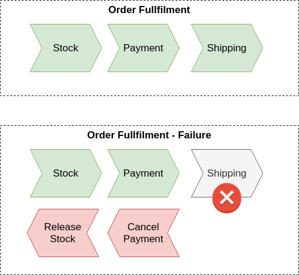
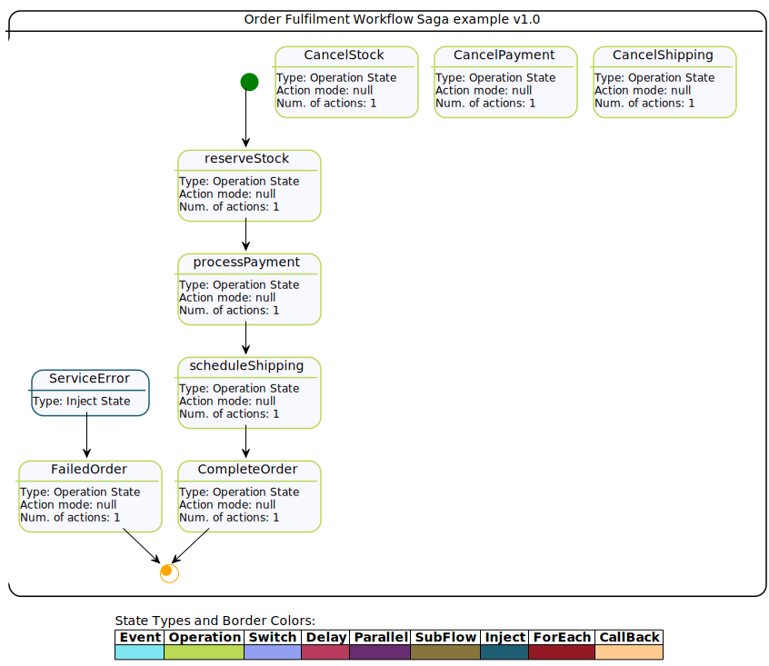

# Saga Serverless Workflow example with Quarkus

## Description

This is an example of how to implement the Saga pattern based on Serverless Workflow with Kogito. The proposed example is based on an Order Fulfillment process which consists of a sequence of steps that could represent calls to external services, microservices, serverless functions, etc. More details can be found in [kie blog][https://blog.kie.org/2021/11/saga-pattern-with-processes-and-kogito-part-1.html].
  
  
  
 All steps, defined as states in the workflow, `stock`, `payment`, and `shipping` should be executed to confirm an Order. If any of the steps fail, then a compensation for each completed step should be performed to undo the operation or keep the process consistent. For instance, the reserve stock should cancel the stock reservation. The compensations for the steps are defined in the workflow using the `compensatedBy` property, which indicates the state responsible for performing a compensation action.
 
  
 
The compensations can be triggered by a transition setting the property `compensate` to `true`, this transition can be declared in a state that represents an error in the workflow. In the order workflow example, it is the `ServiceError` state. In general, the error in a state can be declared with the property `onErrors`, which may include a transition to a state that represents this error.
  
The functions to execute the steps and compensations in this example are implemented using Java classes under the project's `src`, for instance, [StockService](/src/main/java/org/kie/kogito/StockService.java). For this example, they are just mocking responses, but they could be executing calls to external services or any business logic in an actual use case. Other options can declare these operations, like OpenAPI, REST, or events. 
 
The start point of the Saga workflow is to submit a request to create a new Order with a given `orderId`. This could be any other payload that represents an `Order`. For the sake of simplicity, in this example, it will be based on the `id` that could be used as a correlation key to the client starting the Saga workflow.
  
  The output of each step, is represented by a `Response` that contains a type, indicating <b>success</b> or <b>error
  </b> and the id of the resource that was invoked in the service, for instance, for `PaymentService` the `resourceId` represents the payment, but this could be any kind of response depending on the requirement of each service, in case of error handling we can simply throw Java Exceptions from the service classes, in this case, the error handling is triggered with the defined transitions in the workflow, in this example the transition is target to the `ServiceError`state. 
  
  During the workflow execution the response information of each state executing a service call are filtered and mapped in the workflow data, in this way this information can be used when calling the compensations, for instance, when cancelling a payment for a given order, the payment ID can be used, since it was received from the process payment call and is kept in the workflow data. After a workflow execution is completed all responses from each step can be checked in the `workflowdata` attribute.

## Order Saga workflow

This is the Serverless Workflow that represents the Order Saga.



## Installing and Running

### Prerequisites

You will need:
  - Java 17+ installed
  - Environment variable JAVA_HOME set accordingly
  - Maven 3.9.9+ installed

When using native image compilation, you will also need:
  - [GraalVM 21.3.0+](https://github.com/oracle/graal/releases/tag/vm-21.3.0)
  - Environment variable GRAALVM_HOME set accordingly
  - Note that GraalVM native image compilation typically requires other packages (glibc-devel, zlib-devel and gcc) to be installed too.  You also need 'native-image' installed in GraalVM (using 'gu install native-image'). Please refer to [GraalVM installation documentation](https://www.graalvm.org/docs/reference-manual/aot-compilation/#prerequisites) for more details.
  - More details can be found in the [Quarkus Guide](https://quarkus.io/guides/building-native-image)

### Compile and Run in Local Dev Mode

```
mvn clean compile quarkus:dev
```

### Package and Run in JVM mode

```
mvn clean package
java -jar target/quarkus-app/quarkus-run.jar
```

## OpenAPI (Swagger) documentation
[Specification at swagger.io](https://swagger.io/docs/specification/about/)

You can take a look at the [OpenAPI definition](http://localhost:8080/openapi?format=json) - automatically generated and included in this service - to determine all available operations exposed by this service. For easy readability you can visualize the OpenAPI definition file using a UI tool like for example available [Swagger UI](https://editor.swagger.io).

In addition, various clients to interact with this service can be easily generated using this OpenAPI definition.

When running in either Quarkus Development or Native mode, we also leverage the [Quarkus OpenAPI extension](https://quarkus.io/guides/openapi-swaggerui#use-swagger-ui-for-development) that exposes [Swagger UI](http://localhost:8080/swagger-ui/) that you can use to look at available REST endpoints and send test requests.

## Usage

Once the service is up and running, you can use the following examples to interact with the service. Note that rather than using the curl commands below, you can also use the [Swagger UI](http://localhost:8080/swagger-ui/) to send requests.

### Starting the Order Saga

#### POST /order_saga_error_workflow

Allows to start a new Order Saga with the given data:

Given data:

```json
{
  "orderId": "03e6cf79-3301-434b-b5e1-d6899b5639aa",
  "failService": "none"
}
```

Curl command (using the JSON object above):

```sh
curl -H "Content-Type: application/json" -X POST http://localhost:8080/order_saga_error_workflow -d '{"orderId": "03e6cf79-3301-434b-b5e1-d6899b5639aa","failService" : "none"}'
```
The response for the request is returned with attributes representing the response of each step, either
 success or failure. The `orderResponse` attribute indicates if the order can be confirmed in case of success or
  canceled in case of error.

Response example:

```json
{
    "id": "7238fc00-adb7-4d3f-acea-3c7ca2898ed6",
    "workflowdata": {
        "orderId": "03e6cf79-3301-434b-b5e1-d6899b5639aa",
        "failService": "none",
        "stockResponse": {
            "type": "SUCCESS",
            "resourceId": "48721a10-19bb-4951-b11d-6ffb8438452e"
        },
        "paymentResponse": {
            "type": "SUCCESS",
            "resourceId": "638a83e8-d407-4761-8c9a-7c1affda7dd5"
        },
        "shippingResponse": {
            "type": "SUCCESS",
            "resourceId": "1ceea89a-c6ba-4bc0-bf06-49f9560ffe43"
        },
        "orderResponse": {
            "type": "SUCCESS",
            "resourceId": "03e6cf79-3301-434b-b5e1-d6899b5639aa"
        }
    }
}
```

In the console executing the application, you can check the log with the executed steps.

```text
2021-12-21 09:25:07,375 INFO  [org.kie.kog.exa.StockService] (executor-thread-0) Reserve Stock for order 03e6cf79-3301-434b-b5e1-d6899b5639aa
2021-12-21 09:25:07,398 INFO  [org.kie.kog.exa.PaymentService] (executor-thread-0) Process Payment for order 03e6cf79-3301-434b-b5e1-d6899b5639aa
2021-12-21 09:25:07,401 INFO  [org.kie.kog.exa.ShippingService] (executor-thread-0) Schedule Shipping for order 03e6cf79-3301-434b-b5e1-d6899b5639aa
2021-12-21 09:25:07,403 INFO  [org.kie.kog.exa.OrderService] (executor-thread-0) Order Success 03e6cf79-3301-434b-b5e1-d6899b5639aa
```

#### Simulating errors to activate the compensation flows

An optional attribute, `failService` was introduced to make testing the process easier, which indicates which service should respond with an error. The attribute is the simple class name of the service.

Example:

```json
{
  "orderId": "03e6cf79-3301-434b-b5e1-d6899b5639aa",
  "failService": "ShippingService"
}
```
Curl command (using the JSON object above):

```sh
                                                                                                        }
curl -H "Content-Type: application/json" -X POST http://localhost:8080/order_saga_error_workflow  -d '{"orderId": "03e6cf79-3301-434b-b5e1-d6899b5639aa","failService" : "ShippingService"}' 
```

Response example:

```json
{
           "id": "13f00981-31c5-4776-a3f5-ee0595705c14",
           "workflowdata": {
               "orderId": "03e6cf79-3301-434b-b5e1-d6899b5639aa",
               "failService": "ShippingService",
               "stockResponse": {
                   "type": "SUCCESS",
                   "resourceId": "8cc0144b-87e0-47ed-8d8f-eedbe4b69abe"
               },
               "paymentResponse": {
                   "type": "SUCCESS",
                   "resourceId": "a1068ef3-63cc-464e-820a-c049d1a5e3a6"
               },
               "cancelPaymentResponse": {
                   "type": "SUCCESS",
                   "resourceId": "a1068ef3-63cc-464e-820a-c049d1a5e3a6"
               },
               "cancelStockResponse": {
                   "type": "SUCCESS",
                   "resourceId": "8cc0144b-87e0-47ed-8d8f-eedbe4b69abe"
               },
               "orderResponse": {
                   "type": "ERROR",
                   "resourceId": "03e6cf79-3301-434b-b5e1-d6899b5639aa"
               }
           }
       }
```

In the console executing the application, you can check the log with the executed steps.

```text
2021-12-21 09:20:45,960 INFO  [org.kie.kog.exa.StockService] (executor-thread-0) Reserve Stock for order 03e6cf79-3301-434b-b5e1-d6899b5639aa
2021-12-21 09:20:45,962 INFO  [org.kie.kog.exa.PaymentService] (executor-thread-0) Process Payment for order 03e6cf79-3301-434b-b5e1-d6899b5639aa
2021-12-21 09:20:45,964 INFO  [org.kie.kog.exa.ShippingService] (executor-thread-0) Schedule Shipping for order 03e6cf79-3301-434b-b5e1-d6899b5639aa
2021-12-21 09:20:45,964 ERROR [org.kie.kog.exa.MockService] (executor-thread-0) Error in ShippingService for 03e6cf79-3301-434b-b5e1-d6899b5639aa
2021-12-21 09:20:45,966 INFO  [org.kie.kog.exa.PaymentService] (executor-thread-0) Cancel Payment a1068ef3-63cc-464e-820a-c049d1a5e3a6
2021-12-21 09:20:45,968 INFO  [org.kie.kog.exa.StockService] (executor-thread-0) Cancel Stock 8cc0144b-87e0-47ed-8d8f-eedbe4b69abe
2021-12-21 09:20:45,970 INFO  [org.kie.kog.exa.OrderService] (executor-thread-0) Order Failed 03e6cf79-3301-434b-b5e1-d6899b5639aa
```
