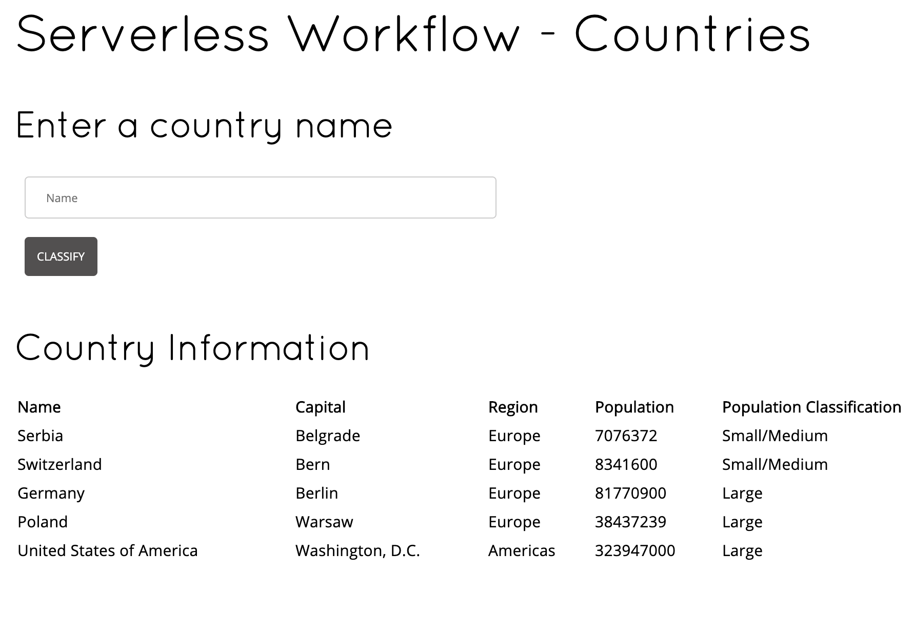

# Kogito Serverless Workflow - Country Info Services Example

## Description

This example showcases the use of [Serverless Workflow specification](https://github.com/cncf/wg-serverless/tree/main/workflow/spec) 
markup to create country information
classification workflow. It also showcases how easy it is to create a simple AngularJS app/page 
which you can use to start workflow instances and show the country information classified by the example
workflow.

The serverless workflow used in this example expects a name of a country. It then uses an Operation state
to execute a function service that retrieves country information given the country name from https://restcountries.eu.
It then goes through a Switch state which looks at the provided country population size. The switch state is
very simple with just two conditions, namely if population size is less than 20000000 it classifies it as "Small/Large",
and if greater than 20000000 it classifies it as "Large". The workflow send the information to a classification
service to store the data before it finishes execution.

## Installing and Running

### Prerequisites
 
You will need:
  - Java 17+ installed
  - Environment variable JAVA_HOME set accordingly
  - Maven 3.9.11+ installed

When using native image compilation, you will also need: 
  - [GraalVm](https://www.graalvm.org/downloads/) 19.3.1+ installed
  - Environment variable GRAALVM_HOME set accordingly
  - Note that GraalVM native image compilation typically requires other packages (glibc-devel, zlib-devel and gcc) to be installed too.  You also need 'native-image' installed in GraalVM (using 'gu install native-image'). Please refer to [GraalVM installation documentation](https://www.graalvm.org/docs/reference-manual/aot-compilation/#prerequisites) for more details.

### Compile and Run in Local Dev Mode

```text
mvn clean compile quarkus:dev    
```

### Package and Run in JVM mode

```text
mvn clean package 
java -jar target/quarkus-app/quarkus-run.jar
```

or on windows

```text
mvn clean package
java -jar target\quarkus-app\quarkus-run.jar
```

### Package and Run using Local Native Image
Note that this requires GRAALVM_HOME to point to a valid GraalVM installation

```text
mvn clean package -Pnative
```
  
To run the generated native executable, generated in `target/`, execute

```text
./target/serverless-workflow-service-calls-quarkus-runner
```

### Running the Example

After starting the example application you can access the AngularJS page at:

```text
http://localhost:8080/
```

You should see the following page:

<p align="center">

</p>

Enter a name of a country in the "Name" text input box (e.g "Germany", "Greece", "USA", etc) and press the 
"Classify" button. 

This will call the serverless workflow passing it the name of the country you entered. The workflow 
will execute and the Country Information portion of the page will refresh showing the classification results, 
for example:

<p align="center">

</p>
