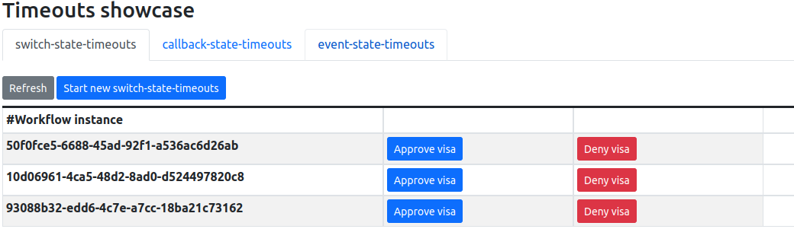
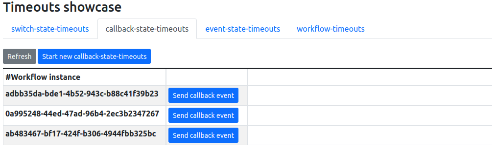
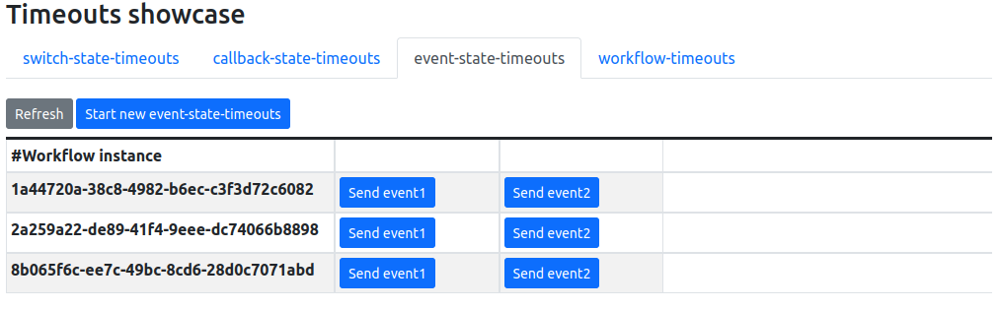
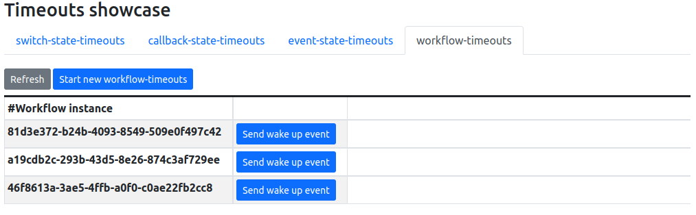
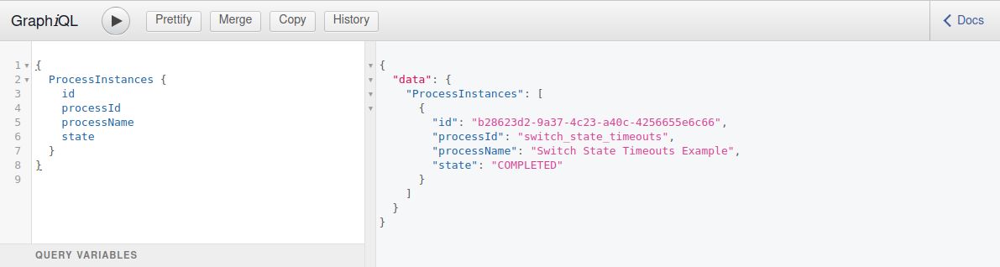
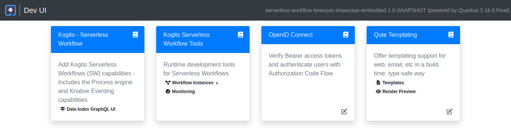

### Preparing your environment

1. Install [minikube](https://minikube.sigs.k8s.io/docs/start/)
2. Install Knative using the [quickstarts](https://knative.dev/docs/getting-started/) since a DNS will be configured for you.

> **NOTE:** Every time you restart your minikube installation, you must activate the knative profile, and be sure that you have enabled the minikube tunnel for this profile after minikube has started.
> You can do this by executing these commands:
> ```shell
> minikube start -p knative
> minikube tunnel -p knative
> ```

### Building the project

Once the minikube environment is running, open a terminal window, go to the serverless-workflow-timeouts-showcase-embedded directory, and execute these commands to be sure the generated images are stored in the minikube internal registry. 

```shell
eval $(minikube -p knative docker-env)

mvn clean package -Pknative
```

### Deploying the workflows

To deploy the example workflows you must execute this command:

```shell
kubectl apply -f target/kubernetes/knative.yml

# After executing the commands you will see an output like this:

service.serving.knative.dev/timeouts-showcase-embedded created
rolebinding.rbac.authorization.k8s.io/timeouts-showcase-embedded-view unchanged
serviceaccount/timeouts-showcase-embedded configured
```

To get the URL to access the service you can execute this command:

```shell
kn service list | grep timeouts-showcase-embedded

# After executing the command you will see an output like this:

NAME                         URL                                                               LATEST                             AGE     CONDITIONS   READY   REASON
timeouts-showcase-embedded   http://timeouts-showcase-embedded.default.10.98.134.49.sslip.io   timeouts-showcase-embedded-00001   5m39s   3 OK / 3     True   
```

Note that the output above might be different in your installation, and the IP numbers in the URL can be different.

### Executing the workflows via REST APIs

To execute the following commands you must use the http://timeouts-showcase-embedded.default.10.98.134.49.sslip.io corresponding to your installation.

Execute the following command to create a new `switch_state_timeouts` workflow instance:

```shell
curl -X 'POST' \
  'http://timeouts-showcase-embedded.default.10.98.134.49.sslip.io/switch_state_timeouts' \
  -H 'accept: */*' \
  -H 'Content-Type: application/json' \
  -d '{}'

# The command will produce an output like this:

{"id":"2e8e1930-9bae-4d60-b364-6fbd61128f51","workflowdata":{}}
```

If you execute the following command during the first 30 seconds after the SW instance was created, you'll get the following results:
```shell
curl -X 'GET' 'http://timeouts-showcase-embedded.default.10.98.134.49.sslip.io/switch_state_timeouts'

# The command will produce an output like this, which indicates that the workflow is waiting for an event to arrive.

[{"id":"2e8e1930-9bae-4d60-b364-6fbd61128f51","workflowdata":{}}]
```

If you execute the previous command 30+ seconds after the SW instance was created, you'll get an empty array as 
result, which means that the SW has timed-out.
```shell
# empty array as result.
[]
```

To execute the `callback_state_timeouts` workflow you must execute this command:

```shell
curl -X 'POST' \
  'http://timeouts-showcase-embedded.default.10.98.134.49.sslip.io/callback_state_timeouts' \
  -H 'accept: */*' \
  -H 'Content-Type: application/json' \
  -d '{}'
```
Similar to `switch_state_timeouts` you can wait for 30+ seconds to check the SW was timed-out.

To execute the `event_state_timeouts` workflow you must execute this command:

```shell
curl -X 'POST' \
  'http://timeouts-showcase-embedded.default.10.98.134.49.sslip.io/event_state_timeouts' \
  -H 'accept: */*' \
  -H 'Content-Type: application/json' \
  -d '{
  "workflowdata": {}
}'
```

Finally, you can execute the following command to create a new `workflow_timeouts` workflow instance:

```shell
curl -X 'POST' \
  'http://timeouts-showcase-embedded.default.10.98.134.49.sslip.io/workflow_timeouts' \
  -H 'accept: */*' \
  -H 'Content-Type: application/json' \
  -d '{
  "workflowdata": {}
}'
```

You can also verify the timeouts functioning following this procedure:
```shell
kubectl get pod | grep timeouts-showcase-embedded

# The command above will produce an output like this, where timeouts-showcase-00001-deployment-56dcc74c77-jttv5 
# corresponds to the Pod executing the service.

timeouts-showcase-embedded-00001-deployment-7459776dc8-kndhd   2/2     Running   0          10m
```

Finally, you can execute the following command to see the logs corresponding to that Pod. And see the log traces
corresponding to the created and timed-out serverless workflow instance.

```shell
kubectl logs timeouts-showcase-embedded-00001-deployment-7459776dc8-kndhd

# The command will produce an output like this, where you'll find the log traces produced by the timeouts showcase workflow instances.

switch-state-timeouts: 2e8e1930-9bae-4d60-b364-6fbd61128f51 has started.
switch-state-timeouts: 2e8e1930-9bae-4d60-b364-6fbd61128f51 has finalized. No decision was made. The switch state did not receive any event, and the timeout has overdue.
```

### Timeouts showcase UI
The timeouts showcase provides a simple UI that can be used to create workflow instances, and also send them the expected events.
To execute the UI you must:
1) Follow the steps described at the beginning of this document to get the timeouts showcase running
2) Execute the following command to determine the URL of the timeouts showcase in your local environment:

```shell
kn service list 

# After executing the command you will see an output like this:

NAME                         URL                                                               LATEST                             AGE     CONDITIONS   READY   REASON
timeouts-showcase-embedded   http://timeouts-showcase-embedded.default.10.98.134.49.sslip.io   timeouts-showcase-embedded-00001   5m39s   3 OK / 3     True   
```
3) Open a browser window with the url above: http://timeouts-showcase.default.10.105.86.217.sslip.io

#### Switch-state-timeouts tab
In this tab, you can create and complete instances of the `switch-sate-timeouts` workflow.



#### Callback-state-timeouts tab
In this tab, you can create and complete instances of the `callback-sate-timeouts` workflow.



#### Event-state-timeouts tab

In this tab, you can create and complete instances of the `event-sate-timeouts` workflow.



#### Workflow-timeouts tab
In this tab, you can create and complete instances of the `workflow-timeouts` workflow.



> **NOTE:** Remember that example workflows are configured with timeouts, which means that, if you create a workflow instance
> and execute no action, when the timeout is met, if you refresh the data, the given instance won't be shown anymore. This last is perfectly fine, since the workflow might have finished because of the timeout overdue.
> 
> We recommend that you test the different workflows and actions one by one, at the same time that you query the timeouts showcase logs to verify the traces generated by the workflows.

### Query workflow details in Data Index
Data Index GraphQL UI is available at <timeouts-showcase-embedded_URL>/q/graphql-ui/

In case of the url above: http://timeouts-showcase-embedded.default.10.98.134.49.sslip.io/q/graphql-ui/



### Showcase cleaning
To remove the installed service from your minikube installation you can use the following command:

```shell
kn service delete timeouts-showcase-embedded
```

### Compile and Run in Local Dev Mode

To run the example in the Quarkus dev mode you must execute this command:

```shell
mvn clean package quarkus:dev
```
After this, the application will be available at http://localhost:8080

Additionally, the Quarkus Dev UI will be available at http://localhost:8080/q/dev/ with the Serverless Workflow Tools.

#### Dev UI Main View


