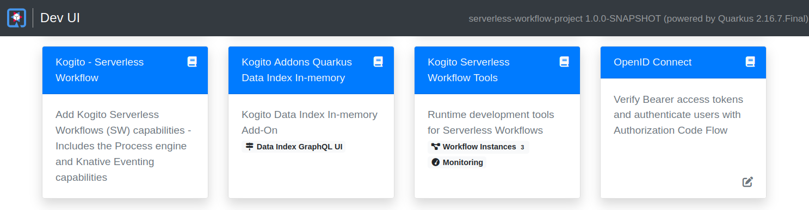
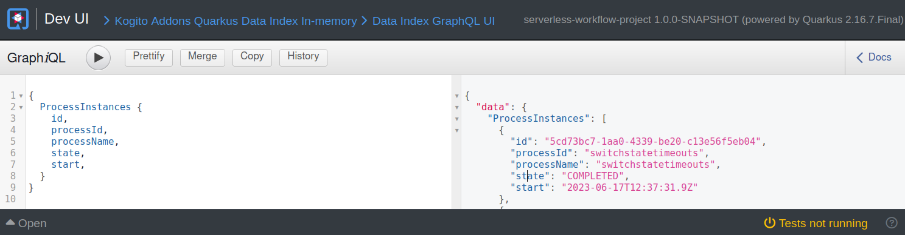
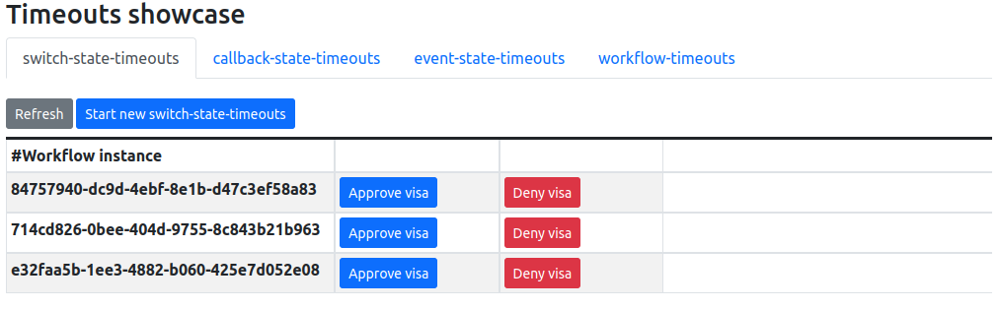
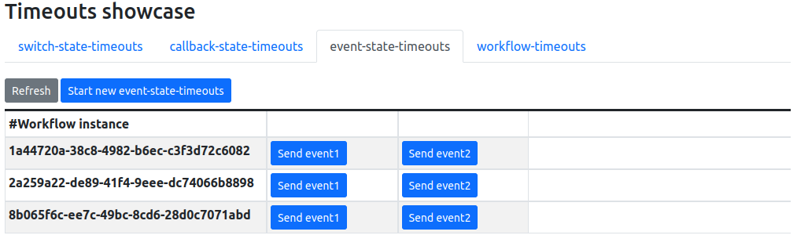
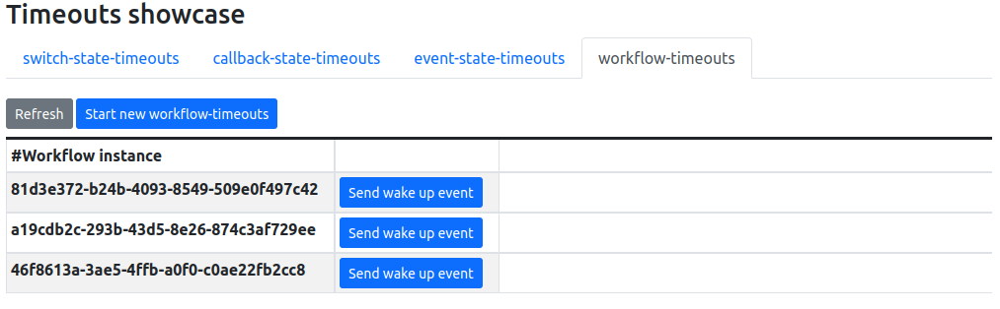

### Preparing your environment

1. Install [minikube](https://minikube.sigs.k8s.io/docs/start/)

2. Start your minikube with the following command:

```shell
minikube start --cpus 4 --memory 10g --addons registry --addons metrics-server --insecure-registry "10.0.0.0/24" --insecure-registry "localhost:5000"
```

> **NOTE:** If the allocated cpus and memory configurations don't fit well for your installation, you can try adjusting these numbers.
> However, lower configurations might cause your cluster to run out of memory. Remember that every time you change these values, you will have to recreate your instance.

3. Be sure that the SonataFlow Operator is installed in your minikube.

For more information about the installation procedure see [Install the SonataFlow Operator](https://kiegroup.github.io/kogito-docs/serverlessworkflow/latest/cloud/operator/install-serverless-operator.html).

### Creating the namespace

```shell
# The namespace name is very important to ensure all the services that compose the showcase can interact.
kubectl create ns timeouts-showcase
```

> **NOTE:** In cases where you need to clean the deployed workflows, to start again, or simply release the
> resources on your minikube installation see: [Showcase cleaning](#showcase-cleaning)
>

### Deploying the workflows

Once the minikube environment is running, open a terminal window, go to the `serverless-workflow-timeouts-showcase-operator-devprofile` directory, and execute these commands:

To deploy the workflows you must execute these commands:

```shell
kubectl apply -f workflows/callback_state_timeouts_devprofile.yaml -n timeouts-showcase
```


> **NOTE:** In local environments, we recommend that you deploy the workflows one by one at the same time you verify that
> each deployment was successful. To do that, you can execute this command after each deployment, and you might have to 
> execute command several times until you see that the deployed workflow pod is running successfully, as it might take
> some time to download the images used by the operator.
>
> 
> 
> ```shell
> kubectl get pod -n timeouts-showcase
> 
> NAME                                                    READY   STATUS    RESTARTS   AGE
> callbackstatetimeouts-5b958764db-z5dw9                  1/1     Running   0          4m29s 
> 
>```


```shell
kubectl apply -f workflows/event_state_timeouts_devprofile.yaml -n timeouts-showcase
```

```shell
kubectl apply -f workflows/switch_state_timeouts_devprofile.yaml -n timeouts-showcase
```

```shell
kubectl apply -f workflows/workflow_timeouts_devprofile.yaml -n timeouts-showcase
```

After executing the commands you should have seen the following outputs:
```shell
sonataflow.sonataflow.org/callbackstatetimeouts created
sonataflow.sonataflow.org/eventstatetimeouts created
sonataflow.sonataflow.org/switchstatetimeouts created
sonataflow.sonataflow.org/workflowtimeouts created
```

### Accessing the timeouts showcase workflows

To get the URLs to access each workflow you must execute these commands:

```shell
minikube service callbackstatetimeouts -n timeouts-showcase  --url

# callback_sate_timeouts url output example
http://192.168.49.2:32750
```

```shell
minikube service eventstatetimeouts -n timeouts-showcase  --url

# event_state_timeouts url output example
http://192.168.49.2:31191
```

```shell
minikube service switchstatetimeouts -n timeouts-showcase  --url

# switch_state_timeouts url output example
http://192.168.49.2:31917
```

```shell
minikube service workflowtimeouts -n timeouts-showcase  --url

# workflow_timeouts url output example
http://192.168.49.2:31786
```

> **NOTE:** The outputs above might be different in your installation, and the IP numbers and ports can change even when you delete and redeploy a particular workflow. 
>
> To facilitate the workflows executions, you can use the following script to define env variables with the corresponding urls. (remember to re-execute if you redeploy any workflow)


```shell
source set-urls.sh

# The execution of the script will produce an output like this:

Setting workflows env variables to:
CALLBACK_STATE_TIMEOUTS_URL=http://192.168.49.2:31471/callbackstatetimeouts
EVENT_STATE_TIMEOUTS_URL=http://192.168.49.2:30936/eventstatetimeouts
SWITCH_STATE_TIMEOUTS_URL=http://192.168.49.2:32428/switchstatetimeouts
WORKFLOW_TIMEOUTS_URL=http://192.168.49.2:31786/workflowtimeouts
```

### Executing the workflows via REST APIs

To execute the `switch_state_timeouts` you must use the corresponding url obtained in the previous steps, or the env variable SWITCH_STATE_TIMEOUTS_URL: 

Execute the following command to create a new `switch_state_timeouts` workflow instance:

```shell
 curl -X 'POST' \
   "$SWITCH_STATE_TIMEOUTS_URL" \
  -H 'accept: */*' \
  -H 'Content-Type: application/json' \
  -d '{}' 

# The command will produce an output like this:

{"id":"2e8e1930-9bae-4d60-b364-6fbd61128f51","workflowdata":{}}
```

If you execute the following command during the first 30 seconds after the SW instance was created, you'll get the following results:
```shell
curl -X 'GET' "$SWITCH_STATE_TIMEOUTS_URL"

# The command will produce an output like this, which indicates that the workflow instance is active and waiting for an event to arrive.

[{"id":"2e8e1930-9bae-4d60-b364-6fbd61128f51","workflowdata":{}}]
```

If you execute the previous command 30+ seconds after the SW instance was created, you'll get an empty array as 
result, which means that the SW has timed-out.
```shell
# empty array as result.
[]
```

To execute the `callback_state_timeouts` workflow you must execute this command:

```shell
curl -X 'POST' \
  "$CALLBACK_STATE_TIMEOUTS_URL" \
  -H 'accept: */*' \
  -H 'Content-Type: application/json' \
  -d '{}'
```

Similar to the `switch_state_timeouts` you can wait for 30+ seconds to check the SW was timed-out.

To execute the `event_state_timeouts` workflow you must execute this command:

```shell
curl -X 'POST' \
  "$EVENT_STATE_TIMEOUTS_URL" \
  -H 'accept: */*' \
  -H 'Content-Type: application/json' \
  -d '{
  "workflowdata": {}
}'
```

Similar to the `switch_state_timeouts` you can wait for 30+ seconds to check the SW was timed-out.


Finally, you can execute the following command to create a new `workflow_timeous` workflow instance:

```shell
curl -X 'POST' \
  "$WORKFLOW_TIMEOUTS_URL" \
  -H 'accept: */*' \
  -H 'Content-Type: application/json' \
  -d '{
  "workflowdata": {}
}'
```

You can also verify the timeouts functioning for particular workflow by looking at the log traces:
```shell
kubectl get pods -n timeouts-showcase

# The command above will produce an output like this, where you can see the corresponding pod for each workflow. 

NAME                                     READY   STATUS    RESTARTS   AGE
callbackstatetimeouts-58c9f5d8fb-xgnmm   1/1     Running   0          17m
eventstatetimeouts-8564767bd5-c7zqc      1/1     Running   0          18m
switchstatetimeouts-8775d4c69-7pjvc      1/1     Running   0          17m
workflowtimeouts-749657d85-jxhj8         1/1     Running   0          138m
```

Finally, you can execute the following command to see the logs corresponding to any of these Pods. And see the log traces
corresponding to the created and timed-out workflow instance.

```shell
kubectl logs switchstatetimeouts-8775d4c69-7pjvc -n timeouts-showcase

# The command will produce an output like this, where you'll find the log traces produced by the timeouts showcase workflow instances.

switchstatetimeouts: 2e8e1930-9bae-4d60-b364-6fbd61128f51 has started.
switchstatetimeouts: 2e8e1930-9bae-4d60-b364-6fbd61128f51 has finalized. No decision was made. The switch state did not receive any event, and the timeout has overdue.
```

### Operator dev mode tooling
When you work with the SonataFlow Operator dev mode, every time you deploy a workflow, a set of tools will be automatically provisioned as part of the deployment procedure.
These tools are designed to help you to test and work with your workflow when you are in the development phase of your project.

> **NOTE:** Considering that the operator deploys each workflow independently, to access the tooling you must use the particular url for the workflow you wants to access.   
> See: [Accessing the timeouts showcase workflows](#accessing-the-timeouts-showcase-workflows)


#### Dev UI Main View

For the `switch-state-timeouts`, the Quarkus Dev UI will be available at http://192.168.49.2:32428/q/dev/ with the Serverless Workflow Tools.



If you used the script defined in [Accessing the timeouts showcase workflows](#accessing-the-timeouts-showcase-workflows) you can execute this commands to open the Dev UI for each workflow:

```shell
firefox $SWITCH_STATE_TIMEOUTS_ROOT/q/dev
```

```shell
firefox $CALLBACK_STATE_TIMEOUTS_ROOT/q/dev
```

```shell
firefox $EVENT_STATE_TIMEOUTS_ROOT/q/dev
```

```shell
firefox $WORKFLOW_TIMEOUTS_ROOT/q/dev
```
#### Dev UI SonataFlow Data Index View 



> **NOTE:** in this view you are free to formulate your own graphql queries to get information about the workflow instances.


### Timeouts showcase UI

The timeouts showcase provides a simple UI that can be used to create workflow instances, and also send them the expected events.
To execute the UI you must:
1) Follow the steps described at the beginning of this document to deploy the workflows.
2) Execute the following commands to build and deploy the UI on the same namespace as your workflows.

> **NOTE:** These build steps, as well as the java code you see in this project, are only to provide the timeouts showcase UI. 
> Since the SonataFlow Operator can manage the workflow deployments by only providing the yaml with SonataFlow resources.   
> 
> We recommend that you test the different workflows and actions one by one, at the same time that you use the SonataFlow Tooling to
> query the information about the workflows. Additionally, you can inspect the log files for the different pods.   
>

Execute these commands to be sure the UI generated image is stored in the minikube internal registry:

```shell
eval $(minikube -p minikube docker-env)
```
```shell
mvn clean package -Pkubernetes
```

Finally, to deploy and access the UI you must execute these commands:

```shell
kubectl apply -f target/kubernetes/kubernetes.yml -n timeouts-showcase
```

```shell
minikube service timeouts-showcase-operator-devprofile-ui --url -n timeouts-showcase
# the command will produce an output like this
http://192.168.49.2:31021
```
To access the UI open a browser with the returned url.

> **NOTE:** Similar to the workflows urls, the url above will be different in each minikube installation.

#### Switch-state-timeouts tab
In this tab, you can create and complete instances of the `switch-sate-timeouts` workflow.



#### Callback-state-timeouts tab
In this tab, you can create and complete instances of the `callback-sate-timeouts` workflow.


#### Event-state-timeouts tab
In this tab, you can create and complete instances of the `event-sate-timeouts` workflow.



#### Workflow-timeouts tab
In this tab, you can create and complete instances of the `workflow-timeouts` workflow.



> **NOTE:** Remember that example workflows are configured with timeouts, which means that, if you create a workflow instance
> and execute no action, when the timeout is met, if you refresh the data, the given instance won't be shown anymore. This last is perfectly fine, since the workflow might have finished because of the timeout overdue.

### Showcase cleaning
To remove the installed workflows and UI from your minikube installation you can use the following command:

```shell
kubectl delete namespace timeouts-showcase
```

