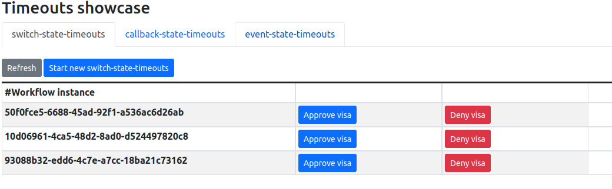

### Preparing your environment

1. Install [minikube](https://minikube.sigs.k8s.io/docs/start/)
2. Install Knative using the [quickstarts](https://knative.dev/docs/getting-started/) since a DNS will be configured for you.

> **NOTE:** Every time you restart your minikube installation, you must activate the knative profile, and be sure that you have enabled the minikube tunnel for this profile after minikube has started.
> You can do this by executing these commands:
> ```shell
> minikube start -p knative
> minikube tunnel -p knative
> ```

### Building the project

Once the minikube environment is running, open a terminal window, go to the serverless-workflow-timeouts-showcase directory, and execute these commands to be sure the generated images are stored in the minikube internal registry. 

```shell
eval $(minikube -p knative docker-env)

mvn clean package -Pknative
```

### Postgresql database setup

To deploy the postgresql database used by the timeouts showcase you must execute this command:

```shell
kubectl apply -f kubernetes/timeouts-showcase-database.yml

# After executing the command, you will see an output like this:

secret/timeouts-showcase-database created
deployment.apps/timeouts-showcase-database created
service/timeouts-showcase-database created
```

### Jobs Service with postgresql persistence deployment

To deploy the Jobs Service you must execute this command:

```shell
kubectl apply -f kubernetes/jobs-service-postgresql.yml

# After executing the command, you will see an output like this:

service/jobs-service-postgresql created
deployment.apps/jobs-service-postgresql created
trigger.eventing.knative.dev/jobs-service-postgresql-create-job-trigger created
trigger.eventing.knative.dev/jobs-service-postgresql-cancel-job-trigger created
sinkbinding.sources.knative.dev/jobs-service-postgresql-sb created
```

### Jobs Service logs (optional step)

To see the Jobs Service logs you can execute this procedure:

```shell
kubectl get pod | grep jobs-service-postgresql

# After executing the command, you will see an output like this:

jobs-service-postgresql-56d9668b4b-k4v87            1/1     Running   0             72s

# Note that it might take some time for the service to start, and the pod name can be different in your installation.

# To see the jobs service logs you can execute this command:

kubectl logs jobs-service-postgresql-56d9668b4b-k4v87

__  ____  __  _____   ___  __ ____  ______ 
 --/ __ \/ / / / _ | / _ \/ //_/ / / / __/ 
 -/ /_/ / /_/ / __ |/ , _/ ,< / /_/ /\ \   
--\___\_\____/_/ |_/_/|_/_/|_|\____/___/   
2022-08-18 10:34:47,902 jobs-service-postgresql-56d9668b4b-k4v87 INFO  [org.kie.kogito.jobs.service.json.JacksonConfiguration:-1] (main) Jackson customization initialized.
2022-08-18 10:34:48,544 jobs-service-postgresql-56d9668b4b-k4v87 INFO  [org.flywaydb.core.internal.license.VersionPrinter:-1] (main) Flyway Community Edition 8.5.13 by Redgate
2022-08-18 10:34:48,545 jobs-service-postgresql-56d9668b4b-k4v87 INFO  [org.flywaydb.core.internal.license.VersionPrinter:-1] (main) See what's new here: https://flywaydb.org/documentation/learnmore/releaseNotes#8.5.13
2022-08-18 10:34:48,545 jobs-service-postgresql-56d9668b4b-k4v87 INFO  [org.flywaydb.core.internal.license.VersionPrinter:-1] (main) 
2022-08-18 10:34:48,678 jobs-service-postgresql-56d9668b4b-k4v87 INFO  [org.flywaydb.core.internal.database.base.BaseDatabaseType:-1] (main) Database: jdbc:postgresql://timeouts-showcase-database:5432/postgres (PostgreSQL 13.4)
2022-08-18 10:34:48,727 jobs-service-postgresql-56d9668b4b-k4v87 INFO  [org.flywaydb.core.internal.command.DbMigrate:-1] (main) Current version of schema "public": 2.0.1
2022-08-18 10:34:48,728 jobs-service-postgresql-56d9668b4b-k4v87 INFO  [org.flywaydb.core.internal.command.DbMigrate:-1] (main) Schema "public" is up to date. No migration necessary.
2022-08-18 10:34:49,065 jobs-service-postgresql-56d9668b4b-k4v87 INFO  [io.quarkus:-1] (main) jobs-service-postgresql 2.0.0-SNAPSHOT on JVM (powered by Quarkus 2.11.2.Final) started in 2.040s. Listening on: http://0.0.0.0:8080
2022-08-18 10:34:49,065 jobs-service-postgresql-56d9668b4b-k4v87 INFO  [io.quarkus:-1] (main) Profile prod activated. 
2022-08-18 10:34:49,065 jobs-service-postgresql-56d9668b4b-k4v87 INFO  [io.quarkus:-1] (main) Installed features: [agroal, cdi, flyway, jdbc-postgresql, kafka-client, narayana-jta, oidc, reactive-pg-client, reactive-routes, resteasy, resteasy-jackson, security, smallrye-context-propagation, smallrye-fault-tolerance, smallrye-health, smallrye-openapi, smallrye-reactive-messaging, smallrye-reactive-messaging-http, smallrye-reactive-messaging-kafka, swagger-ui, vertx]
2022-08-18 10:34:49,241 jobs-service-postgresql-56d9668b4b-k4v87 INFO  [org.kie.kogito.jobs.service.scheduler.JobSchedulerManager:-1] (executor-thread-0) Loading scheduled jobs completed !
```

### Timeouts showcase service deployment

To deploy the example workflows you must execute these commands:

```shell
kubectl apply -f target/kubernetes/knative.yml

kubectl apply -f target/kubernetes/kogito.yml

# After executing the commands you will see an output like this:

service.serving.knative.dev/timeouts-showcase created

trigger.eventing.knative.dev/visa-denied-event-type-trigger-timeouts-showcase created
trigger.eventing.knative.dev/visa-approved-event-type-trigger-timeouts-showcase created
trigger.eventing.knative.dev/callback-event-type-trigger-timeouts-showcase created
sinkbinding.sources.knative.dev/sb-timeouts-showcase created

```

To get the URL to access the service you can execute this command:

```shell
kn service list | grep timeouts-showcase

# After executing the command you will see an output like this:

NAME                      URL                                                             LATEST                          AGE     CONDITIONS   READY   REASON
timeouts-showcase         http://timeouts-showcase.default.10.105.86.217.sslip.io         timeouts-showcase-00001         3m50s   3 OK / 3     True 
```

Note that the output above might be different in your installation, and the IP numbers in the URL can be different.

### Executing the `switch_state_timeouts` workflow using curl

To execute the following commands you must use the http://timeouts-showcase.default.10.105.86.217.sslip.io corresponding to your installation.

Execute the following command to create a new `switch_state_timeouts` workflow instance:

```shell
curl -X 'POST' \
  'http://timeouts-showcase.default.10.105.86.217.sslip.io/switch_state_timeouts' \
  -H 'accept: */*' \
  -H 'Content-Type: application/json' \
  -d '{}'

# The command will produce an output like this:

{"id":"2e8e1930-9bae-4d60-b364-6fbd61128f51","workflowdata":{}}
```

If you execute the following command during the first 30 seconds after the SW instance was created, you'll get the following results:
```shell
curl -X 'GET' 'http://timeouts-showcase.default.10.105.86.217.sslip.io/switch_state_timeouts'

# The command will produce an output like this, which indicates that the process is waiting for an event to arrive.

[{"id":"2e8e1930-9bae-4d60-b364-6fbd61128f51","workflowdata":{}}]
```

If you execute the previous command 30+ seconds after the SW instance was created, you'll get an empty array as 
result, which means that the SW has timed-out.
```shell
# empty array as result.
[]
```

You can execute the following command to create a new `callback_state_timeouts` workflow instance:

```shell
curl -X 'POST' \
  'http://timeouts-showcase.default.10.105.86.217.sslip.io/callback_state_timeouts' \
  -H 'accept: */*' \
  -H 'Content-Type: application/json' \
  -d '{}'
```

Similar to `switch_state_timeouts` you can wait for 30+ seconds to check the SW was timed-out.

Finally, you can execute the following command to create a new `event_state_timeous` workflow instance:

```shell
curl -X 'POST' \
  'http://timeouts-showcase.default.10.105.86.217.sslip.io/event_state_timeouts' \
  -H 'accept: */*' \
  -H 'Content-Type: application/json' \
  -d '{
  "workflowdata": {}
}'
```

You can also verify the timeouts functioning following this procedure:
```shell
kubectl get pod | grep timeouts-showcase

# The command above will produce an output like this, where timeouts-showcase-00001-deployment-56dcc74c77-jttv5 
# corresponds to the Pod executing the service.

timeouts-showcase-00001-deployment-56dcc74c77-jttv5         2/2     Running   0             10m
timeouts-showcase-database-55b6bc5c87-9xfnk                 1/1     Running   0             15m
```

Finally, you can execute the following command to see the logs corresponding to that Pod. And see the log traces
corresponding to the created and timed-out serverless workflow instance.

```shell
kubectl logs timeouts-showcase-00001-deployment-56dcc74c77-jttv5

# The command will produce an output like this, where you'll find the log traces produced by the switch-state-timeouts 
# workflow instance.

__  ____  __  _____   ___  __ ____  ______ 
 --/ __ \/ / / / _ | / _ \/ //_/ / / / __/ 
 -/ /_/ / /_/ / __ |/ , _/ ,< / /_/ /\ \   
--\___\_\____/_/ |_/_/|_/_/|_|\____/___/   
2022-08-17 14:48:37,821 INFO  [io.qua.sma.ope.run.OpenApiRecorder] (main) Default CORS properties will be used, please use 'quarkus.http.cors' properties instead
2022-08-17 14:48:38,040 INFO  [org.kie.kog.ser.eve.imp.AbstractMessageConsumer] (main) Consumer for callback_state_event_type started
2022-08-17 14:48:38,043 INFO  [org.kie.kog.add.qua.mes.com.QuarkusKogitoExtensionInitializer] (main) Registered Kogito CloudEvent extension
2022-08-17 14:48:38,046 INFO  [org.kie.kog.ser.eve.imp.AbstractMessageConsumer] (main) Consumer for visa_approved_event_type started
2022-08-17 14:48:38,048 INFO  [org.kie.kog.ser.eve.imp.AbstractMessageConsumer] (main) Consumer for visa_denied_event_type started
2022-08-17 14:48:38,170 INFO  [org.kie.kog.per.jdb.DDLRunner] (main) Dynamically creating process_instances table
2022-08-17 14:48:38,250 INFO  [org.kie.kog.per.jdb.GenericRepository] (main) DDL successfully done for ProcessInstance
2022-08-17 14:48:38,390 INFO  [io.quarkus] (main) timeouts-showcase 2.0.0-SNAPSHOT on JVM (powered by Quarkus 2.11.2.Final) started in 2.054s. Listening on: http://0.0.0.0:8080
2022-08-17 14:48:38,390 INFO  [io.quarkus] (main) Profile knative activated. 
2022-08-17 14:48:38,390 INFO  [io.quarkus] (main) Installed features: [agroal, cache, cdi, jackson-jq, jdbc-postgresql, kogito-addon-jobs-knative-eventing-extension, kogito-addon-knative-eventing-extension, kogito-addon-messaging-extension, kogito-addon-persistence-jdbc-extension, kogito-addon-process-management-extension, kogito-processes, kogito-serverless-workflow, kubernetes, narayana-jta, qute, reactive-routes, rest-client, rest-client-jackson, resteasy, resteasy-jackson, smallrye-context-propagation, smallrye-health, smallrye-openapi, smallrye-reactive-messaging, smallrye-reactive-messaging-http, swagger-ui, vertx]

switch-state-timeouts: 2e8e1930-9bae-4d60-b364-6fbd61128f51 has started.
switch-state-timeouts: 2e8e1930-9bae-4d60-b364-6fbd61128f51 has finalized. No decision was made. The switch state did not receive any event, and the timeout has overdue.
```

### Timeouts showcase UI
The timeouts showcase provides a simple UI that can be used to create workflow instances, and also send them the expected events.
To execute the UI you must:
1) Follow the steps described at the begining of this document to get the timeouts showcase running
2) Execute the following command to determine the URL of the timeouts showcase in your local environment:
```shell
kn service list 

# After executing the command you will see an output like this:

NAME                      URL                                                             LATEST                          AGE     CONDITIONS   READY   REASON
timeouts-showcase         http://timeouts-showcase.default.10.105.86.217.sslip.io         timeouts-showcase-00001         3m50s   3 OK / 3     True 
```
3) Open a browser window with the url above: http://timeouts-showcase.default.10.105.86.217.sslip.io

#### Switch-state-timeouts tab
In this tab, you can create and complete instances of the switch-sate-timeouts process.



#### Callback-state-timeouts tab
In this tab, you can create and complete instances of the callback-sate-timeouts process.


#### Event-state-timeouts tab
In this tab, you can create and complete instances of the event-sate-timeouts process.


> **NOTE:** Remember that example workflows are configured with timeouts, which means that, if you create a workflow instance
> and execute no action, when the timeout is met, if you refresh the data, the given instance won't be shown anymore. This last is perfectly fine, since the workflow might have finished because of the timeout overdue.
> 
> We recommend that you test the different workflows and actions one by one, at the same time that you query the timeouts-showcase logs to verify the traces generated by the workflows.

### Helper shell scripts

To remove the installed services from your minikube installation you can use the following script files provided in the `scripts` directory.


=== Running PostgreSQL and supporting services embedded
Additionally in this example, there is a maven profile `embedded` which adds dependencies to run PostgreSQL embedded with the application alongside
with Jobs Service and Data Index.
These services are bootstrapped as part of the workflow application in this way it is not required to run them externally.
____

*NOTE:* that this is only for development and testing proposes to make the deployment easier in a single application and should not be used in production.

____

[source,shell]
----
mvn clean install -Pembedded

or

mvn clean compile quarkus:dev -Pembedded

----


### Known issues

At the time of writing this guide, it was detected that if you stop, and start, your minikube installation, there are times when an initialization error like the one below is produced.

```shell
error execution phase addon/coredns: unable to create deployment: Internal error occurred: failed calling webhook "sinkbindings.webhook.sources.knative.dev": 
failed to call webhook: Post "https://eventing-webhook.knative-eventing.svc:443/sinkbindings?timeout=10s": dial tcp 10.97.131.18:443: connect: connection refused
```

This is a "minikube + knative quickstart plugin" initialization error, rather than a showcase issue. If this happens in your installation you must remove the knative profile from your minikube installation and repeat the showcase installation procedure.

```shell
# stop the minikube 
minikube stop -p knative

# remove the knative profile
minikube delete -p knative

# re-install the knative quickstart plugin
kn-quickstart minikube

# repeat the steps to install the showcase...
```