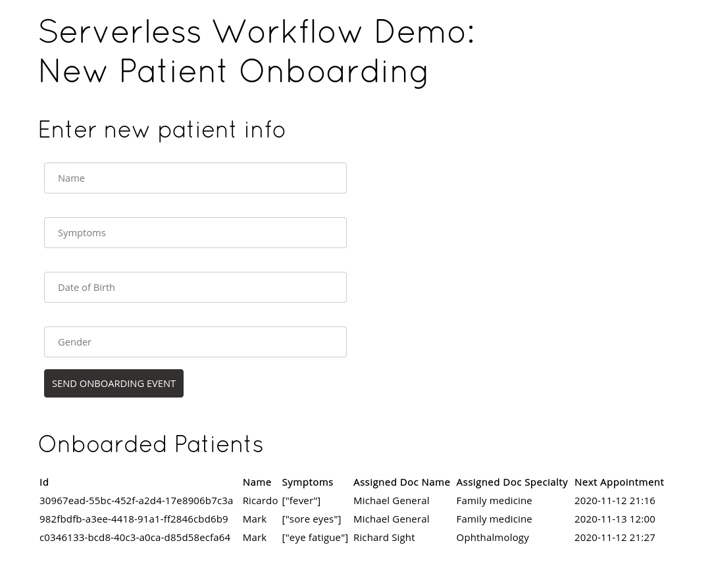

# Kogito Serverless Workflow - Patient Onboarding

## Description

In this example we will see how to use the [Serverless Workflow specification](https://github.com/serverlessworkflow/specification)
implementation on Kogito to orchestrate a sequence of REST calls in an Event-Driven architecture.

This use case is about onboarding a new patient in a hospital, and based on their symptom, the 
application will assign to the right expert. 

The workflow starts with a CloudEvent informing a new patient entry:

```json
{
   "id":"12345",
   "source":"/hospital/entry",
   "specversion":"1.0",
   "type":"new.patient.events",
   "data":{
      "name":"John",
      "dateOfBirth":"2017-08-15",
      "symptoms":[
         "seizures"
      ]
   }
}
```

The [workflow](src/main/resources/onbording.sw.json) will then call a sequence of REST services:

1. `StoreNewPatient` will store the patient in the internal database for later processing, generating a new ID for they
2. `AssignDoctorToPatient` service will run a set of [rules](https://docs.jboss.org/kogito/release/latest/html_single/#con-drl-rule-units_drl-rules) 
to determine which doctor this patient should be assigned based on their symptoms or general characteristics (children always go to Pediatrics, for example)
3. `SchedulePatientAppointment` will find a schedule for this patient based on the agenda of the doctor assigned

After executing the workflow, the appointments' data can be fetched using the `/onboarding/schedule/appointment` endpoint.

There's a nice web interface for you to try the example available in the root url (http://localhost:8080 for local environments):



Enter the data into the provided form to see the example in action! Date of Birth must be in `YYYY-MM-DD` format.

Also, there's the Swagger UI that can also be used to explore the APIs in this example: http://localhost:8080/swagger-ui/

## Installing and Running

### Prerequisites
 
You will need:
  - Java 11+ installed
  - Environment variable JAVA_HOME set accordingly
  - Maven 3.6.2+ installed

When using native image compilation, you will also need: 
  - [GraalVm](https://www.graalvm.org/downloads/) 20.2.0+ installed
  - Environment variable GRAALVM_HOME set accordingly
  - Note that GraalVM native image compilation typically requires other packages (glibc-devel, zlib-devel and gcc) to be installed too.  You also need 'native-image' installed in GraalVM (using 'gu install native-image'). Please refer to [GraalVM installation documentation](https://www.graalvm.org/docs/reference-manual/aot-compilation/#prerequisites) for more details.

### Compile and Run in Local Dev Mode

```text
mvn clean package quarkus:dev    
```

### Compile and Run in JVM mode

```text
mvn clean package 
java -jar target/serverless-workflow-functions-quarkus-runner.jar   
```

or on windows

```text
mvn clean package
java -jar target\serverless-workflow-functions-quarkus-runner.jar
```

### Compile and Run using Local Native Image
Note that this requires GRAALVM_HOME to point to a valid GraalVM installation

```text
mvn clean package -Pnative
```
  
To run the generated native executable, generated in `target/`, execute

```text
./target/serverless-workflow-functions-quarkus-runner.jar
```

## Deploying with Kogito Operator

In the [`operator`](operator) directory you'll find the custom resources needed to deploy this example on OpenShift or Kubernetes with the [Kogito Operator](https://docs.jboss.org/kogito/release/latest/html_single/#chap_kogito-deploying-on-openshift).

## Credits

- [Disease Prediction through Symptoms](https://www.kaggle.com/usamag123/disease-prediction-through-symptoms) dataset from Kagle
- [Tihomir Surdilovic](https://twitter.com/tsurdilo) for the nice UI