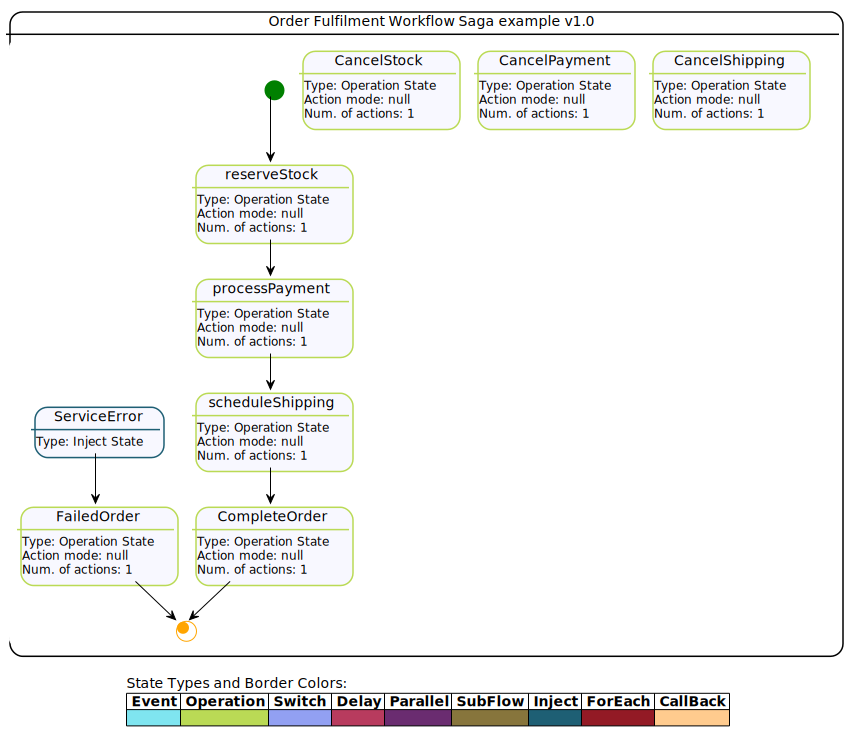

# Saga Serverless Workflow example with Quarkus

## Description

This is an example to demonstrate how to implement Saga pattern based on Serverless Workflow with Kogito. The proposed example is based
 on an Order Fulfillment process which consists in a sequence of steps, that could represent calls to external
  services, microservices, serverless functions, etc. More details can be found in [kie blog][https://blog.kie.org/2021/11/saga-pattern-with-processes-and-kogito-part-1.html].
  
  
  
 All steps, defined as states in the workflow, `stock`, `payment` and `shipping` should be executed to confirm an Order, if any of the
 steps fail, then a compensation for each completed step should be executed to undo the operation or to keep the
 process on a consistent state. For instance, the reserve stock, should cancel the stock reservation. The
 compensations for the steps are defined in the workflow using the `compensatedBy` property which indicates the state responsible to perform a compensation action.
 
  
 
The compensations can be triggered by a transition setting the property `compensate` to `true`, this transition can be declared in 
a state that represents and error in the workflow, in the order workflow example it is the `ServiceError` state. In general the error in a state can be declared 
with the property `onErrors` which may include a transition to a state that represents this error.
  
The functions to execute the steps and compensations in this example are implemented as using Java classes under
 the `src` of the project, for instance [StockService][/src/main/java/org/kie/kogito/StockService.java], for this example they are just mocking responses, but in a real use case they could be executing calls to external services, or any business logic. Other options are possible to declare these operations, 
   like OpenAPI, REST, or events. 
 
 The start point of Saga workflow is to submit a request to create a new Order with a given `orderId`, this could be
  any other payload that represents an `Order`, but for the sake of simplicity, in this example it will be
   based on the `id` that could be used as a correlation key to client starting the Saga workflow.
  
  The output of each step, is represented by a `Response` that contains a type, indicating <b>success</b> or <b>error
  </b> and the id of the resource that was invoked in the service, but this could be any kind of response depending on
   the requirement of each service, in case of error handling we can simply throw Java Exceptions from the service classes, 
   in this case, the error handling is triggered with the defined transitions in the workflow, in this example the transition is taget to the `ServiceError`state.

## Order Saga workflow

This is the Serverless Workflow that represents the Order Saga.



## Installing and Running

### Prerequisites

You will need:
  - Java 11+ installed
  - Environment variable JAVA_HOME set accordingly
  - Maven 3.6.2+ installed

When using native image compilation, you will also need:
  - [GraalVM 19.1.1](https://github.com/oracle/graal/releases/tag/vm-19.1.1) installed
  - Environment variable GRAALVM_HOME set accordingly
  - Note that GraalVM native image compilation typically requires other packages (glibc-devel, zlib-devel and gcc) to be installed too.  You also need 'native-image' installed in GraalVM (using 'gu install native-image'). Please refer to [GraalVM installation documentation](https://www.graalvm.org/docs/reference-manual/aot-compilation/#prerequisites) for more details.

### Compile and Run in Local Dev Mode

```
mvn clean compile quarkus:dev
```

### Package and Run in JVM mode

```
mvn clean package
java -jar target/quarkus-app/quarkus-run.jar
```

## OpenAPI (Swagger) documentation
[Specification at swagger.io](https://swagger.io/docs/specification/about/)

You can take a look at the [OpenAPI definition](http://localhost:8080/openapi?format=json) - automatically generated and included in this service - to determine all available operations exposed by this service. For easy readability you can visualize the OpenAPI definition file using a UI tool like for example available [Swagger UI](https://editor.swagger.io).

In addition, various clients to interact with this service can be easily generated using this OpenAPI definition.

When running in either Quarkus Development or Native mode, we also leverage the [Quarkus OpenAPI extension](https://quarkus.io/guides/openapi-swaggerui#use-swagger-ui-for-development) that exposes [Swagger UI](http://localhost:8080/swagger-ui/) that you can use to look at available REST endpoints and send test requests.

## Usage

Once the service is up and running, you can use the following examples to interact with the service. Note that rather than using the curl commands below, you can also use the [Swagger UI](http://localhost:8080/swagger-ui/) to send requests.

### Starting the Order Saga

#### POST /order_saga_error_workflow

Allows to start a new Order Saga with the given data:

Given data:

```json
{
  "workflowdata": {
   "orderId": "03e6cf79-3301-434b-b5e1-d6899b5639aa",
   "failService" : "none"
  }
}
```

Curl command (using the JSON object above):

```sh
curl -H "Content-Type: application/json" -X POST http://localhost:8080/order_saga_error_workflow -d '{"workflowdata": {"orderId": "03e6cf79-3301-434b-b5e1-d6899b5639aa","failService" : "none"}}'
```
The response for the request is returned with attributes representing the response of each step, either
 success or failure. The `orderResponse` attribute indicates if the order can be confirmed in case of success or
  canceled in case of error.

Response example:

```json
{
    "id": "3beb2fd7-1331-463e-83ca-e8cc7bd3a1d4",
    "workflowdata": {
        "orderId": "03e6cf79-3301-434b-b5e1-d6899b5639aa",
        "orderResponse": "SUCCESS"
    }
}
```

In the console executing the application you can check the log it with the executed steps.

```text
2021-12-09 16:00:20,948 INFO  [org.kie.kog.StockService] (executor-thread-0) Reserve Stock for order 03e6cf79-3301-434b-b5e1-d6899b5639aa
2021-12-09 16:00:20,954 INFO  [org.kie.kog.PaymentService] (executor-thread-0) Process Payment for order 03e6cf79-3301-434b-b5e1-d6899b5639aa
2021-12-09 16:00:20,956 INFO  [org.kie.kog.ShippingService] (executor-thread-0) Schedule Shipping for order 03e6cf79-3301-434b-b5e1-d6899b5639aa
2021-12-09 16:00:20,957 INFO  [org.kie.kog.OrderService] (executor-thread-0) Order Success for order 03e6cf79-3301-434b-b5e1-d6899b5639aa
```

#### Simulating errors to activate the compensation flows

To make testing the process easier it was introduced an optional attribute `failService` that indicates which service
 should respond with an error. The attribute is basically the simple class name of the service.

Example:

```json
{
  "workflowdata": {
   "orderId": "03e6cf79-3301-434b-b5e1-d6899b5639aa",
   "failService" : "ShippingService"
  }
}
```
Curl command (using the JSON object above):

```sh
                                                                                                        }
curl -H "Content-Type: application/json" -X POST http://localhost:8080/order_saga_error_workflow  -d '{"workflowdata": {"orderId": "03e6cf79-3301-434b-b5e1-d6899b5639aa","failService" : "ShippingService"}}' 
```

Response example:

```json
{
    "id": "bb8a2d83-41e0-4ed7-a67b-71c1ad49c705",
    "workflowdata": {
        "orderId": "03e6cf79-3301-434b-b5e1-d6899b5639aa",
        "failService": "ShippingService",
        "orderResponse": "FAILED"
    }
}
```

In the console executing the application you can check the log it with the executed steps.

```text
2021-12-09 16:02:22,075 INFO  [org.kie.kog.StockService] (executor-thread-0) Reserve Stock for order 03e6cf79-3301-434b-b5e1-d6899b5639aa
2021-12-09 16:02:22,077 INFO  [org.kie.kog.PaymentService] (executor-thread-0) Process Payment for order 03e6cf79-3301-434b-b5e1-d6899b5639aa
2021-12-09 16:02:22,079 INFO  [org.kie.kog.ShippingService] (executor-thread-0) Schedule Shipping for order 03e6cf79-3301-434b-b5e1-d6899b5639aa
2021-12-09 16:02:22,079 INFO  [org.kie.kog.MockService] (executor-thread-0) Error in ShippingService 
2021-12-09 16:02:22,090 INFO  [org.kie.kog.PaymentService] (executor-thread-0) Cancel Payment for payment 03e6cf79-3301-434b-b5e1-d6899b5639aa
2021-12-09 16:02:22,093 INFO  [org.kie.kog.StockService] (executor-thread-0) Cancel Stock for order 03e6cf79-3301-434b-b5e1-d6899b5639aa
2021-12-09 16:02:22,096 INFO  [org.kie.kog.OrderService] (executor-thread-0) Order Failed for order 03e6cf79-3301-434b-b5e1-d6899b5639aa
```

## Deploying with Kogito Operator

In the [`operator`](operator) directory you'll find the custom resources needed to deploy this example on OpenShift with the [Kogito Operator](https://docs.jboss.org/kogito/release/latest/html_single/#chap_kogito-deploying-on-openshift).

[https://blog.kie.org/2021/11/saga-pattern-with-processes-and-kogito-part-1.html]: https://blog.kie.org/2021/11/saga-pattern-with-processes-and-kogito-part-1.html