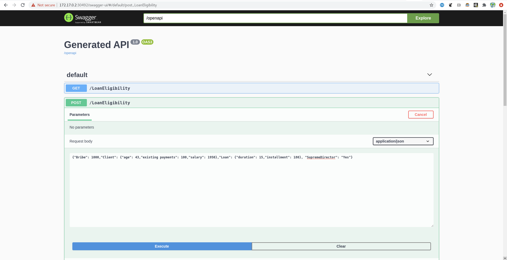

# Trusty demonstation

This is a demonstration of the trusty AI tracing capabilities. 

NOTE: In order to play with the demo, ensure that you are on the stable branch or on the branch of a specific release (for example the branch for the release `0.17` is `0.17.x`).
The `master` branch is aligned to the latest changes in all the repositories. This means that `master` might be using some new operator features not included in the release that we use in this demo: don't use it!

## Requirements

- docker version > 19.03.12
- minikube version  > 1.11.0
- java version > 1.9
- maven version > 3.6.3
- kubernetes version > 1.18

Note: also previous versions of `docker`, `minikube` and `kubernetes`  might work, but they were not tested. 

## Build your kogito runtime application

In this example, we will use the `dmn-tracing-quarkus` application that you can find in the root of this repository. This kogito application is using the `tracing-addon` so to export the tracing information that will be used by the trusty and explainability services for further analysis.

Navigate under the folder `kogito-examples/dmn-tracing-quarkus` and run 
```bash
mvn clean package -DskipTests
```

Now you need to have an account on a remote hub like `quay` or `dockerhub` for example. Assuming that you have an account on `quay` and you are using `docker`, build the image with 
```bash
docker build --tag quay.io/<your_namespace>/dmn-tracing-quarkus:1.0.0 .
```
replacing the string `<your_namespace>` with your namespace (i.e. your username).

Push the image
```bash
docker push quay.io/<your_namespace>/dmn-tracing-quarkus:1.0.0
```

## Deploy the infrastructure with minishift/kubernetes

Navigate back to the current directory where this `README.md` file is stored. 

The first step is to start your `minikube` cluster: 

```bash
minikube start
minikube addons enable ingress
minikube addons enable olm
```

Set the Kogito release version 

```bash
KOGITO_VERSION=1.0.0
```

and then download/unpack the kogito operator

```bash
wget https://github.com/kiegroup/kogito-cloud-operator/releases/download/v${KOGITO_VERSION}/kogito-cli-${KOGITO_VERSION}-linux-amd64.tar.gz
tar zxf kogito-cli-${KOGITO_VERSION}-linux-amd64.tar.gz
```

Create a new project called (for example) `trusty-demo` 

```bash 
PROJECT_NAME=trusty-demo
kubectl create namespace "$PROJECT_NAME"
```

Deploy the kogito operator
```bash
./kogito use-project "$PROJECT_NAME"
```

You should see that the `kogito-operator` has one pod running within some minutes: the command `kubectl get pods -n "trusty-demo"` should return something like 

```bash
NAME                             READY   STATUS    RESTARTS   AGE
kogito-operator-9f575f64-zp56t   1/1     Running   0          98s
```

Install the `kafka` and the `infinispan` operators with 

```bash
TARGET_DIR="."
STRIMZI_VERSION=0.17.0
INFINISPAN_VERSION=1.1.1.Final

echo "Installing Infinispan Operator"
kubectl apply -f "https://raw.githubusercontent.com/infinispan/infinispan-operator/${INFINISPAN_VERSION}/deploy/crd.yaml" -n ${PROJECT_NAME}
kubectl apply -f "https://raw.githubusercontent.com/infinispan/infinispan-operator/${INFINISPAN_VERSION}/deploy/rbac.yaml" -n ${PROJECT_NAME}
kubectl apply -f "https://raw.githubusercontent.com/infinispan/infinispan-operator/${INFINISPAN_VERSION}/deploy/operator.yaml" -n ${PROJECT_NAME}

wget "https://github.com/strimzi/strimzi-kafka-operator/releases/download/${STRIMZI_VERSION}/strimzi-${STRIMZI_VERSION}.tar.gz" -P "$TARGET_DIR/"
tar zxf "${TARGET_DIR}/strimzi-${STRIMZI_VERSION}.tar.gz" -C "$TARGET_DIR"
find strimzi-${STRIMZI_VERSION}/install/cluster-operator -name '*RoleBinding*.yaml' -type f -exec sed -i "s/namespace: .*/namespace: ${PROJECT_NAME}/" {} \;
kubectl apply -f strimzi-${STRIMZI_VERSION}/install/cluster-operator/ -n ${PROJECT_NAME}
```

Deploy a kafka instance and wait for it
```bash
kubectl apply -f resources/kafka.yaml -n ${PROJECT_NAME}
kubectl wait kafka/my-cluster --for=condition=Ready --timeout=300s -n ${PROJECT_NAME} 
```

Create the kafka topics
```bash
kubectl apply -f resources/kafka-topics.yaml -n ${PROJECT_NAME}
```

and the infinispan resource
```bash
kubectl apply -f resources/infinispan-minimal.yaml -n ${PROJECT_NAME}
```

Now extract the infinispan secrets with 
```bash
kubectl get secret example-infinispan-generated-secret -o jsonpath="{.data.identities\.yaml}" -n ${PROJECT_NAME} | base64 --decode
```

Take the `operator` name and password and calculate the `base64` encoding, and replace the keys `user` and `pass` in `resources/trusty-secrets.yaml` with the encoding. For example, if `operator` is the username and `mysecretpassword` is the password, then 
```bash
$ printf "operator" | base64
b3BlcmF0b3I=
printf "infinispanPassword" | base64
aW5maW5pc3BhblBhc3N3b3Jk
```

and the content of `resources/trusty-secrets.yaml` should look like the following
```yaml
apiVersion: v1
kind: Secret
metadata:
  name: kogito-external-infinispan-secret
type: Opaque
data:
  user: b3BlcmF0b3I= # base64 encoding of the string "operator"
  pass: aW5maW5pc3BhblBhc3N3b3Jk # base64 encoding of the string "infinispanPassword", replace with your infinispan password
```

Deploy the secret with 

```bash
kubectl apply -f resources/trusty-secrets.yaml -n ${PROJECT_NAME}
```

Get the ip address of the cluster with 
```bash
minikube ip
```

and replace the env variables `KOGITO_TRUSTY_ENDPOINT` and `KOGITO_TRUSTY_WS_URL` in the file `resources/trusty-ui.yaml`. For example, if the ip is `172.17.0.2`, then the content of the file should be 
```bash
apiVersion: app.kiegroup.org/v1beta1
kind: KogitoSupportingService
metadata:
  name: trusty-ui
spec:
  serviceType: TrustyUI
  replicas: 1
  image: quay.io/kiegroup/kogito-trusty-ui:1.0
  env:
    - name: KOGITO_TRUSTY_ENDPOINT
      value: http://172.17.0.2
    - name: KOGITO_TRUSTY_WS_URL
      value: ws://172.17.0.2
```

Modify the content of the file `resources/dmn-tracing-quarkus.yaml` with the information you used in the first section. The content should look like the following 

```yaml
apiVersion: app.kiegroup.org/v1beta1
kind: KogitoRuntime
metadata:
  name: dmn-tracing-quarkus
  labels:
    app: dmn-tracing-quarkus
spec:
  replicas: 1
  image: quay.io/<YOUR_NAMESPACE>/dmn-tracing-quarkus:2.0.0-snapshot # <---- replace with your image
  propertiesConfigMap: dmn-tracing-quarkus-config
  env:
    - name: KOGITO_SERVICE_URL
      value: http://dmn-tracing-quarkus:8080
    - name: ENABLE_EVENT
      value: 'true'
```

It's time to deploy all the resources with the commands
```bash
kubectl apply -f resources/trusty.yaml -n ${PROJECT_NAME}
kubectl apply -f resources/trusty-ingress.yaml -n ${PROJECT_NAME}
kubectl apply -f resources/trusty-ui.yaml -n ${PROJECT_NAME}
kubectl apply -f resources/explainability.yaml -n ${PROJECT_NAME}
kubectl apply -f resources/dmn-tracing-quarkus.yaml -n ${PROJECT_NAME}
```

Expose the Kogito runtime service with 

```bash
kubectl expose deployment dmn-tracing-quarkus -n ${PROJECT_NAME}  --type=NodePort --name=dmn-tracing-quarkus-np
minikube service dmn-tracing-quarkus-np -n ${PROJECT_NAME}
```

A new tab in your browser should be opened automatically. Navigate under the path `/swagger-ui` and execute a post request on the endpoint `LoanEligibility` with the following payload: 
```json
{"Bribe": 1000,"Client": {"age": 43,"existing payments": 100,"salary": 1950},"Loan": {"duration": 15,"installment": 180}, "SupremeDirector": "Yes"}
```



Expose the audit ui (alias trusty-ui) with 
```bash
kubectl expose deployment trusty-ui -n ${PROJECT_NAME}  --type=NodePort --name=trusty-ui-np
minikube service trusty-ui-np -n ${PROJECT_NAME}
```

And navigate through the decisions that have been taken by the kogito-runtime service. Enjoy!


